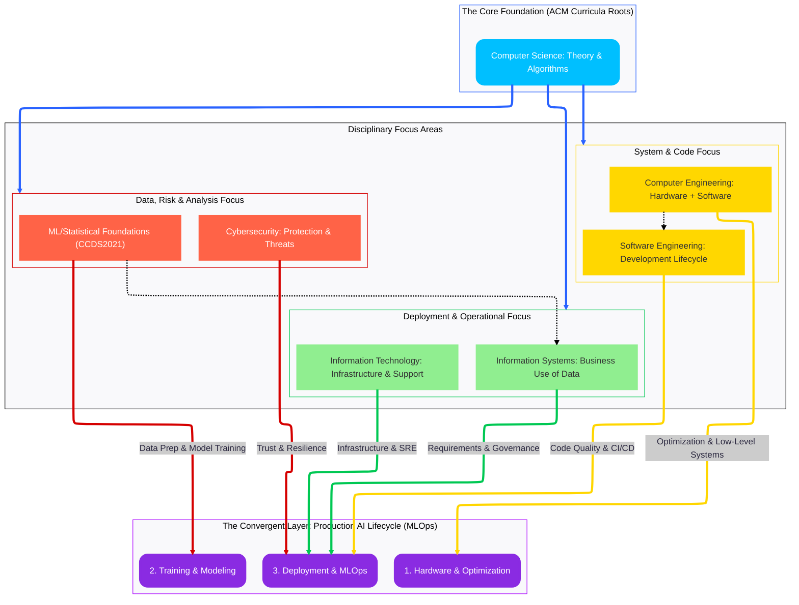

---
jupytext:
  text_representation:
    extension: .md
    format_name: myst
    format_version: 0.13
    jupytext_version: 1.18.1
kernelspec:
  name: python3
  display_name: Python 3 (ipykernel)
  language: python
---

# AI Systems Grounding in Computing Disciplines

+++

---

Owner: Vadim Rudakov, lefthand67@gmail.com  
Version: 0.2.3  
Birth: 2025-12-05  
Last Modified: 2026-01-11

---

+++

> INFO: *The handbook is optimized for environments supporting Mermaid.js diagrams. For static export, rasterized versions are available in Appendix A.*

This document maps the AI System Lifecycle to the foundational disciplines defined by the **ACM/IEEE Joint Task Force on Computing Curricula** (available at [https://www.acm.org/education/curricula-recommendations](https://www.acm.org/education/curricula-recommendations)). This provides a structured, globally-adopted context for the roles and required expertise within the generic AI Engineering team. AI Engineering is viewed here as an **emergent, convergent domain**, synthesizing principles from multiple computing disciplines.

+++

## The Foundational Computing Disciplines and Their Contribution to Production AI Systems

+++

The table below maintains the official ACM/IEEE Computing Curricula structure but reclassifies ACM's "Data Science" for terminological accuracy in a production context.

| Discipline | Latest Version | Target Audience/Focus Areas | Key Differences/Overlaps | AI/ML Implementation Examples |
| :--- | :--- | :--- | :--- | :--- |
| **Computer Engineering** | CE2016 | Undergraduate programs in Computer Engineering. | Focuses on **hardware-software integration**; crucial for specialized accelerator design. | [**FPGA/ASIC optimization**](/ai_system/1_execution/optimization_fpga_asic_hardware_acceleration_for_ai.md) for inference, [**CUDA kernel development**](/ai_system/1_execution/optimization_nvidia_gpu_cuda_nsight_and_systems_thinking.md), low-level memory management for HPC. |
| **Computer Science** | CS2023 | Undergraduate programs in Computer Science. | Broad foundational computing; emphasizes **theoretical aspects, algorithms, and complexity**. | **Algorithm design** for efficient sampling, **Time/Space complexity analysis** of inference, **Novel attention mechanism design**. |
| **Cybersecurity** | CSEC2017 | Post-secondary degree programs in Cybersecurity. | Focuses on **security competencies**; essential for robust, compliant MLOps deployment. | **Threat modeling** for MLOps pipelines, **Adversarial attack mitigation** (e.g., poisoning), secure API endpoint deployment. |
| **ML/Statistical Foundations**[^1] | CCDS2021 | Undergraduate programs with a data science focus. | Integrates computing with statistics; focuses on **analysis, modeling, and core ML principles**. | **Feature engineering**, **Exploratory Data Analysis (EDA)**, **Model selection/hyperparameter tuning**, designing evaluation metrics. |
| **Information Systems** | IS2020 | Undergraduate programs in Information Systems. | Emphasizes **business and system competencies**; organizational use of information. | **Data Governance** strategy, **Stakeholder management** for data access, **Explainability (XAI)** compliance reporting, **Business process modeling** around AI outputs. |
| **Information Technology** | IT2017 | Baccalaureate programs in Information Technology. | Focuses on practical **infrastructure and support**; vital for monitoring and platform maintenance. **(Requires MLOps/SRE augmentation)**. | **Cloud resource provisioning** (Terraform/CloudFormation), **Containerization** (Docker/Podman), **System monitoring** and alerting. |
| **Software Engineering** | SE2014 | Specific to the **software development lifecycle**; emphasizes engineering practices, design, and testing. **(Requires MLOps/SRE augmentation)**. | **Microservice design** for model serving, **Automated testing** (unit/load), **CI/CD pipeline construction** (GitOps), code quality standards. |

[^1]:
    *CCDS2021 provides a **competency model** for Data Science, not a full degree curriculum equivalent to CS or SE. In a production setting, this discipline is implemented as **Machine Learning Engineering (MLE)** for efficient deployment.*

## AI Systems Connection to the ACM Disciplines

The diagram shows AI Systems not as a separate branch, but as the **convergent product** of the foundational disciplines.

## Breakdown of AI Grounding (Production Context)

1.  **Hardware & Optimization (AIH)**

      * **Grounded in:** **Computer Engineering** (CE2016).
      * **Production Context:** Covers high-performance computing clusters and hardware-software co-design. This is where **systems thinking** and low-level optimization (memory, latency) are applied to specialized accelerators (GPUs, TPUs) for efficiency.

2.  **Training & Modeling (AIT)**

      * **Grounded in:** **ML/Statistical Foundations** (CCDS2021).
      * **Production Context:** The engineering application of these principles is **Machine Learning Engineering (MLE)**, focused on reproducible training, model versioning, bias mitigation, and data pipeline integrity.

3.  **Deployment & MLOps (AID)**

      * **Grounded in:** **Software Engineering** (SE2014), **Information Technology** (IT2017), and **Cybersecurity** (CSEC2017).
      * **Production Context:** This phase synthesizes multiple disciplines and **must be augmented by MLOps/SRE principles**, which go beyond the scope of older curricula. Adherence to standards like **ISO/IEC 23053 (AI Engineering Framework)** and **ISO/IEC 29148 (Requirements Engineering)** is mandatory.
          * **Software Engineering** handles model integration into scalable, robust microservices.
          * **Information Technology** handles the underlying cloud infrastructure, logging, and continuous performance monitoring (the "Ops" of MLOps).
          * **Cybersecurity** ensures compliance, integrity, and threat-response, crucial for a trusted service.

## Appendix A. Renderred Diagram

