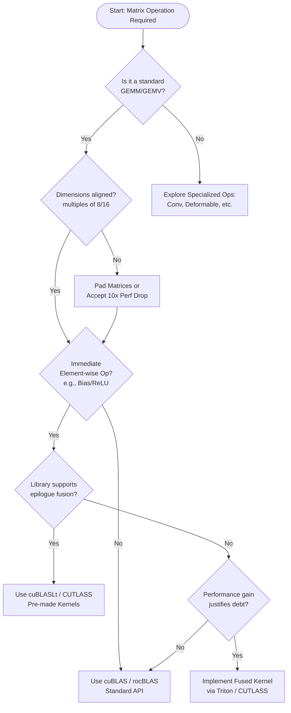

---
jupytext:
  text_representation:
    extension: .md
    format_name: myst
    format_version: 0.13
    jupytext_version: 1.18.1
kernelspec:
  name: python3
  display_name: Python 3 (ipykernel)
  language: python
---

# GEMM: The Engineering Standard

+++

---

Owner: Vadim Rudakov, lefthand67@gmail.com  
Version: 0.2.2  
Birth: 2025-12-27  
Last Modified: 2026-01-09

---

+++

This article defines **GEMM** as the foundational standard for HPC and Deep Learning. It contrasts GEMM’s high arithmetic intensity with memory-bound operations like GEMV, explaining how **tiling** and **Tensor Cores** optimize throughput. It highlights the crucial distinction between **Interface, API, and ABI** to ensure software portability. Finally, it maps GEMM to AI architectures, noting its role in Transformers and the efficiency of libraries like cuBLAS.

> INFO: *The handbook is optimized for environments supporting Mermaid.js diagrams. For static export, rasterized versions are available in Appendix C.*

+++

## **1. Mathematical Foundation**

+++

In High-Performance Computing (**HPC**), we use the **GEMM, General Matrix-Matrix Multiplication** routine defined by the **BLAS (Basic Linear Algebra Subprograms)** standard.

+++

### GEMV vs. GEMM: Understanding Dot Products and Pairwise Dot Products

+++

#### GEMV: The Dot Product

+++

In linear algebra and deep learning, a **dot product** (GEMV, General Matrix-Vector multiply) is an operation between two vectors of the same dimension, resulting in a single scalar:

```{math}
a \cdot b = \sum_{i=1}^{n} a_i b_i
```

When we speak of **matrix multiplication** {math}`C = AB`, we are indeed performing "pairwise dot products" between the **rows** of {math}`A`and the **columns** of {math}`B`.

+++

#### The Hadamard Distinction

+++

It is critical to distinguish this from the **Hadamard Product** {math}`A \odot B`, which is an element-wise multiplication between two matrices of the identical shape.

```python
import numpy as np

A = np.array([[1, 2], 
              [3, 4]])

B = np.array([[5, 6], 
              [7, 8]])

# Hadamard Product (Element-wise)
# Result: [[1*5, 2*6], [3*7, 4*8]]
print(A * B)

[[ 5 12]
 [21 32]]

# Matrix Multiplication (Dot Product)
# Result: [[(1*5 + 2*7), (1*6 + 2*8)], [(3*5 + 4*7), (3*6 + 4*8)]]
print(A @ B)

[[19 22]
 [43 50]]
```

+++

#### GEMM: Pairwise Dot Product

+++

GEMM, matrix multiplication, is a foundational linear algebra operation defined as:

```{math}
C = \alpha \cdot A \cdot B + \beta \cdot C
```

where:
- {math}`A \in \mathbb{R}^{m \times k}`, {math}`B \in \mathbb{R}^{k \times n}`, {math}`C \in \mathbb{R}^{m \times n}`
- {math}`\alpha, \beta` are scalar coefficients
    -{math}`\alpha` (Alpha): Scales the product of the matrices,
    - {math}`\beta` (Beta): Scales the existing values in {math}`C` (the "accumulator"),
    - This is why it’s perfect for ResNets—if {math}`\beta=1`, you are essentially performing {math}`C_{new} = AB + C_{old}`, which is the definition of a skip connection.
    - In Deep Learning, we often set {math}`\alpha=1` and {math}`\beta=1` to facilitate "residual" or "skip" connections).

The operation computes all **pairwise dot products** between rows of matrices {math}`A` and columns of {math}`B`.

Essentially, **pairwise dot products** is a way of describing the "all-vs-all" calculation that happens during matrix multiplication.

While a single dot product tells you the relationship between two specific vectors, pairwise dot products tell you the relationship between **every possible pair of vectors** from two different sets.

In the context of the GEMM formula {math}`C = A \cdot B`, think of matrix {math}`A` as a stack of horizontal rows and matrix {math}`B` as a collection of vertical columns.

1. **The Inputs:** Matrix {math}`A` has {math}`m` rows, and Matrix {math}`B` has {math}`n` columns.
2. **The Matching:** To find a specific value in the resulting matrix {math}`C`, you take one row from {math}`A` and "dot" it with one column from {math}`B`.
3. **The "Pairwise" Result:** Because you repeat this for every row combined with every column, you end up with {math}`m \times n` individual dot products.

If Matrix {math}`A` contains vectors {math}`\{a_1, a_2\}` and Matrix {math}`B` contains vectors {math}`\{b_1, b_2\}`, the **pairwise dot products** are:

```{math}
C = 
\begin{pmatrix}
a_1 \cdot b_1 & a_1 \cdot b_2 \\
a_2 \cdot b_1 & a_2 \cdot b_2
\end{pmatrix}
```

```{tip}
You’ll often hear this term when discussing **Attention Mechanisms** (like in Transformers). 

When a model calculates "Self-Attention," it is performing pairwise dot products between every word (vector) in a sentence and every other word in that same sentence to see how much they relate to one another.
```

**Summary Table**

| Concept | Operation | Definition | Result |
| --- | --- | --- | --- |
| **Dot Product** | {math}`a \cdot b = \sum_{i=1}^{n} a_i b_i`| Operation between 2 vectors. | A single number (scalar). |
| **Pairwise Dot Products** | {math}`AB`| Operation between 2 **sets** of vectors. | A matrix of numbers. |

See: 

1. [*Аржанцев И.В. Лекция 6. Операции над матрицами*](https://teach-in.ru/lecture/2018-09-29-Arzhantsev)

+++

### The Hardware-Native Residual: Mapping GEMM to Skip-Connections

+++

In modern Deep Learning, the GEMM formula $C = \alpha \cdot A \cdot B + \beta \cdot C$ is not just an abstract algebraic expression; it is the physical implementation of a **Residual Block**. 

As an engineer, you must recognize that "Skip Connections" (Residuals) are not merely logical arrows in a research paper—they are memory-resident accumulators optimized at the silicon level.

**"Skip Connections" (Residuals)** are often visualized as an "extra" path in neural network diagrams, but in high-performance engineering, they are simply an exploitation of the **$\beta \cdot C$** term in the GEMM formula.

+++

#### The Equation Mapping

+++

When we set $\alpha=1$ and $\beta=1$, the GEMM operation performs exactly what is required for a ResNet or Transformer sub-layer:

| Component | GEMM Term | Engineering Reality |
| :--- | :--- | :--- |
| **Input Feature Map** | $A$ | The activations from the previous layer ($X$), loaded into SRAM tiles. |
| **Weight Matrix** | $B$ | The learned kernel parameters ($W$). |
| **Skip Connection** | $\beta \cdot C$ | The "Identity" path. By setting $\beta=1$, the hardware uses the existing values in the output buffer $C$ as the shortcut. |
| **Fused Output** | $C_{new}$ | The final result: $\text{Layer}(X) + \text{Shortcut}$, computed without an extra memory pass. |

+++

#### Why This Matters: The Memory Wall

+++

Treating the "Addition" step as a separate operation (e.g., in a naive PyTorch custom kernel) introduces a massive performance penalty due to unnecessary Global Memory (VRAM) round-trips.

**1. Naive Implementation (Separate Kernels):**
* **Step 1:** `Matmul` computes $A \cdot B$ and writes the result to VRAM.
* **Step 2:** `Add` kernel reads the result from VRAM, reads the shortcut from VRAM, performs addition, and writes back to VRAM.
* **Cost:** 3 VRAM bandwidth trips.

**2. Hardware-Native Implementation (Fused GEMM):**
* **Step 1:** `GEMM` loads the shortcut into the **Accumulator Registers** initially ($\beta \cdot C$).
* **Step 2:** The product $A \cdot B$ is added directly to those registers before a single write-back.
* **Cost:** 1 VRAM bandwidth trip.

> **Engineering Insight:** Skip connections are computationally "free" not because the math is simple, but because the BLAS standard already reserved a slot for the "accumulator" matrix $C$. Utilizing the $\beta$ parameter is the primary way to bypass the GPU memory wall.

+++

## **2. BLAS:  The Hierarchy of Efficiency**

+++

**BLAS** (Basic Linear Algebra Subprograms) is a **specification** of routines like vector addition, dot products, and matrix multiplication, that other numerical libraries build on.

Multiple libraries implement this spec (e.g., OpenBLAS, Intel MKL, cuBLAS, rocBLAS), often with heavy architecture-specific optimization.

+++

### Arithmetic Intensity

+++

BLAS organizes operations into three levels based on **Arithmetic Intensity** — the ratio of math operations to memory access.

| Level | Name | Complexity | Bottleneck | AI Framework Context |
| :--- | :--- | :--- | :--- | :--- |
| **Level 1** | **Vector-Vector** | {math}`O(N)`| Memory Bandwidth | Activation functions (ReLU, Sigmoid). |
| **Level 2** | **GEMV** | {math}`O(N^2)`| Memory Bandwidth | RNN cell updates or single-batch inference. |
| **Level 3** | **GEMM** | {math}`O(N^3)`| **Compute Bound** | Batched Linear Layers (`nn.Linear`). |

+++

### The Data Reuse Principle

+++

While both GEMM and GEMV are {math}`O(N^3)` and {math}`O(N^2)` operations respectively, the key difference for GPUs is **arithmetic intensity**, not just big‑O complexity. GEMM performs {math}`O(N)` more floating‑point operations per element loaded than GEMV, so it does far more **work per byte moved** from memory.

On an NVIDIA A100, large, well‑tiled GEMM kernels can sustain more than 90% of the GPU’s theoretical peak FLOPS, whereas GEMV is typically memory‑bound and often achieves well under 10% of peak FLOPS.

GEMM repeatedly reuses matrix tiles that reside in registers and on‑chip caches, while GEMV has very little data reuse and spends most of its time waiting on DRAM bandwidth rather than executing arithmetic instructions.

+++

### Hardware Acceleration: Tensor Cores & Tiling

+++

Modern AI hardware is built specifically to accelerate GEMM using specialized circuits called **Tensor Cores**. These circuits perform a {math}`4 \times 4 \times 4` matrix-multiplication-accumulation in a single clock cycle.

* **Mixed Precision:** To maximize throughput, Tensor Cores typically use **FP16** or **BF16** for input data but perform accumulation in **FP32** to prevent the loss of numerical precision.
* **Tiling & SRAM:** Large matrices cannot fit into the GPU's fastest memory at once. Engineers use "Tiling" to break matrices into small blocks (e.g., {math}`128 \times 128` that fit perfectly into the **SRAM** (Shared Memory) of the GPU, minimizing trips to the slower global memory.

:::{tip} Vocabulary
**SRAM in GPU context**: While traditionally called *SRAM in CPU architectures*, GPU high-speed on-chip memory is termed "Shared Memory" (typically 96-192 KB per streaming multiprocessor). This memory is software-managed and critical for tiling strategies to avoid global memory bottlenecks.

**Tiling strategies**: The technique of partitioning large matrices into smaller blocks (tiles) that fit in fast on-chip memory. By loading tiles of A and B into shared memory, all threads can collaboratively compute portions of C while reusing data, dramatically reducing global memory accesses. Common tile sizes: 128×128 for A100, 256×64 for consumer GPUs.
:::

```{mermaid}
graph TD
    subgraph Global_Memory ["Global Memory (VRAM / DRAM)"]
        MA["Matrix A"]
        MB["Matrix B"]
        MC["Matrix C"]
    end

    subgraph GPU_SRAM ["GPU SM / Shared Memory"]
        TileA["Tile A (128×128)"]
        TileB["Tile B (128×128)"]
        C_buffer["C Tile Buffer"]
    end

    subgraph Compute_Core ["Tensor Cores (per Warp)"]
        FragA["Fragments A (16×16)"]
        FragB["Fragments B (16×16)"]
        FragC["Accumulator (FP32 in Registers)"]
        MMA["MMA (16×16×16)"]
        Precision["FP16/BF16 → FP32"]
    end

    MA -->|Cooperative Load| TileA
    MB -->|Cooperative Load| TileB
    MC -->|Load if C != 0| C_buffer

    TileA --> FragA
    TileB --> FragB
    C_buffer -->|Init FragC| FragC

    FragA --> MMA
    FragB --> MMA
    FragC <--> MMA
    MMA --> Precision

    FragC -->|Store| C_buffer
    C_buffer -->|Writeback| MC

    style Global_Memory fill:#f9f9f9,stroke:#333,stroke-dasharray: 5 5
    style GPU_SRAM fill:#e1f5fe,stroke:#01579b
    style Compute_Core fill:#fff3e0,stroke:#e65100
    style FragC fill:#c8e6c9,stroke:#2e7d32
```

+++

### The Precision-Performance Tradeoff

+++

When leveraging Tensor Cores for GEMM acceleration, engineers face a fundamental tradeoff between numerical precision and computational throughput. Modern hardware achieves its peak performance using reduced-precision formats:

| Format | Bit Width | Dynamic Range | Typical Use Case |
|--------|-----------|---------------|------------------|
| **FP64** | 64-bit | ~10³⁰⁸ | Scientific computing, numerical stability |
| **FP32** | 32-bit | ~10³⁸ | Standard training precision |
| **BF16** | 16-bit | ~10³⁸ (same exponent as FP32) | Training with minimal precision loss |
| **FP16** | 16-bit | ~10⁵ | Inference, memory-bound workloads |

**Numerical Stability Challenges:**
- **Underflow/Overflow**: FP16's limited range (±65,504) causes overflow in attention softmax calculations and underflow in gradient accumulation
- **Gradient Vanishing**: During training, small gradients in FP16 can underflow to zero, preventing model learning
- **Loss of Significance**: When adding small values to large accumulators (common in GEMM), FP16's 10-bit mantissa loses precision rapidly

**Mitigation Techniques:**
```python
# Loss Scaling (PyTorch example)
scaler = torch.cuda.amp.GradScaler()
with torch.cuda.amp.autocast(dtype=torch.bfloat16):
    outputs = model(inputs)
    loss = criterion(outputs, targets)
scaler.scale(loss).backward()  # Scale loss to prevent underflow
scaler.step(optimizer)
scaler.update()
```

- **Stochastic Rounding**: Instead of deterministic rounding, this technique probabilistically rounds values to maintain statistical accuracy over many operations (critical for low-precision training)
- **Master Weights**: Maintain a full-precision (FP32) copy of weights during training while performing forward/backward passes in BF16/FP16
- **Mixed Precision Accumulation**: Tensor Cores compute in FP16/BF16 but accumulate results in FP32 registers before final storage

**Training vs. Inference Tradeoffs:**
- **Training**: Requires numerical stability; BF16 is often preferred over FP16 due to identical exponent range to FP32
- **Inference**: Can tolerate more precision loss; INT8/INT4 quantization with GEMM-specific kernels provides 2-4x throughput improvement

> **Practical Insight**: In Llama-3 training, BF16 mixed precision achieved 2.8x faster throughput than FP32 with <0.1% final accuracy degradation, while pure FP16 training failed to converge due to gradient underflow.

+++

### Role in the ecosystem

+++

- Packages like LINPACK and LAPACK are written on top of BLAS so that vendors can optimize just the BLAS layer for each architecture.
- In GPU land, cuBLAS or rocBLAS are simply BLAS implementations targeting GPUs, giving you a familiar API but different underlying kernels.

See: 
1. [*Charles L. Lawson - the main Architect of BLAS*](https://history.siam.org/oralhistories/lawson.htm) - siam.org
2. [Matrix Multiplication Background User's Guide](https://docs.nvidia.com/deeplearning/performance/dl-performance-matrix-multiplication/index.html) - NVIDIA
3. [*BLAS operations introduction*](https://rocm.docs.amd.com/projects/rocBLAS/en/develop/conceptual/blas-operations-intro.html) - AMD
4. [*Basic Linear Algebra Subprograms*](https://help.imsl.com/fortran/6.0/math/default.htm?turl=basiclinearalgebrasubprograms.htm) - help.imsl.com

+++

## **3. Interface vs. API vs. ABI**

+++

In high-performance computing (HPC) and AI engineering, these three layers represent different levels of "binding." Understanding the distinction is critical for ensuring software portability and avoiding runtime memory corruption.

+++

### The Interface: The Semantic Contract

+++

An **Interface** is a formal, high-level specification of **capabilities**. It defines *what* a module can do without providing any machine code or implementation details.

* **Definition:** A set of function prototypes, type definitions, and mathematical semantics.
* **Technological Context:** In the BLAS ecosystem, the interface is a formal document. It specifies that a routine named `SGEMM` must perform a Single-precision General Matrix Multiply {math}`C = \alpha AB + \beta C`.
* **Key Attribute:** It is **language-agnostic** and **hardware-agnostic**. It exists as a "Standard" that vendors agree to follow.

+++

### The API: The Source-Level Contract

+++

An **Application Programming Interface (API)** is the **source-code representation** of an interface. It defines the syntax a developer uses to interact with the underlying logic.

* **Definition:** A set of header files (`.h`), modules, or classes that expose the Interface to a specific programming language.
* **Technological Context:**
    * **CBLAS:** The C-language API for the BLAS interface. It provides the function signature: `void cblas_sgemm(const enum CBLAS_ORDER Order, ...)`.
    * **cuBLAS API:** The CUDA-based API that allows a C++ developer to allocate GPU memory and launch GEMM kernels.
* **Binding Time:** **Compile-time.** If the API changes (e.g., a function signature is modified), the source code will fail to compile.

+++

### The ABI: The Binary-Level Contract

+++

An **Application Binary Interface (ABI)** is the **low-level, machine-code representation** of the interface. It defines how two compiled binary entities (e.g., your compiled Python interpreter and a shared `.so` or `.dll` library) interact at runtime.

**Definition:** 

It covers the "bits and bytes" of binary communication:
* **Calling Conventions:** Which CPU registers are used to pass parameters (e.g., System V AMD64 vs. Microsoft x64).
* **Data Alignment:** How structures are padded in memory (e.g., 4-byte vs. 8-byte alignment).
* **Symbol Name Mangling:** How the compiler encodes function names into the binary’s symbol table.

**Technological Context:** 

If you compile your application against **Intel MKL** but attempt to swap it at runtime for **OpenBLAS**, and the two libraries use different Fortran-to-C calling conventions (e.g., passing by reference vs. passing by value), the program will encounter a segmentation fault. This is an **ABI mismatch**.

**Binding Time:** 

Runtime / Link-time.

+++

### Historical Lessons: The Interface is the Asset

+++

The BLAS standard (originated c. 1972 by Lawson and Hanson at NASA JPL) proved that well-designed software interfaces can outlive the hardware they were written for.

**The USSR Lesson**

In the 1970s, Soviet engineers built amazing machines like the **BESM-6**. However, they often wrote their math code specifically for the "wiring" of the BESM-6.

When they tried to move to newer computers (like the ES EVM), they realized they couldn't just "copy-paste" their software. They had to spend years manually translating code because they hadn't used a **standard interface** (like BLAS) that worked across different machines.

> While Western engineering moved toward the modular BLAS interface—separating the mathematical logic from the silicon—Soviet code often remained "bespoke," or hyper-tuned to a specific machine. When the hardware reached its limit, the lack of an abstract interface made transitioning to new systems (like IBM clones) an arduous process.

**The Takeaway:** As an AI engineer, do not build monolithic, machine-specific code. Use **Interfaces** like BLAS to ensure your logic survives the next generation of AI accelerators.

+++

### Summary

+++

| Layer | Medium | Interaction Level | Binding Time | Example in AI Stack |
| :--- | :--- | :--- | :--- | :--- |
| **Interface** | Specification | **Logic & Semantics** | N/A (Standard) | The BLAS Specification. |
| **API** | Source Code / Headers | **Syntax & Types** | Compile-time | `import torch` or `#include <mkl.h>`. |
| **ABI** | Binary / Machine Code | **Memory & Registers** | Runtime / Link-time | The compiled `.so` file and the CPU's calling convention. |

A practical rule of thumb:
- Use “interface” when you talk about the boundary/shape between two modules or layers.
- Use “API” when that interface is intended to be consumed as a stable, documented contract by external code (your users, other teams, third parties).

Rule for Linux/data workflow: 
- Treat ABI as the "wire protocol" for binaries—test with `nm`, `readelf -s`, and static linking early to avoid runtime surprises in multi-lib setups.

+++

## **4. Decision Framework for AI Architects**

+++

Why GEMM Matters in Deep Learning & CUDA

+++

### Evolving GEMM Implementations

+++

Beyond traditional dense matrix multiplication, modern AI systems demand specialized GEMM variants optimized for emerging workloads and hardware architectures.

+++

#### Sparse GEMM for Large Language Models

+++

As model sizes grow, sparsity becomes critical for efficiency:
- **Structured Sparsity**: NVIDIA's Sparse Tensor Cores accelerate 2:4 sparsity patterns (2 non-zero values per 4 elements), providing 2x throughput for pruned models
- **Block-Sparse Attention**: Transformers like BigBird use block-sparse GEMM kernels that skip computation for attention masks, reducing complexity from O(N²) to O(N log N)
- **Runtime Sparsity Detection**: CUTLASS 3.0 introduces kernels that dynamically detect and exploit sparsity patterns during execution

```python
# PyTorch block-sparse attention (conceptual)
attention = torch.sparse.mm(Q, K.t())  # Sparse GEMM for attention scores
attention = attention.masked_fill(mask == 0, -1e9)  # Apply sparsity mask
output = torch.sparse.mm(attention.softmax(dim=-1), V)  # Second sparse GEMM
```

+++

#### Quantization-Aware GEMM

+++

Edge deployment requires extreme efficiency:
- **INT8 GEMM**: 4x memory reduction vs FP32, with symmetric/asymmetric quantization
- **INT4/INT2 Kernels**: Emerging on NVIDIA H100 and Apple Neural Engine, enabling 10B+ parameter models on mobile devices
- **Per-Channel Quantization**: Maintains accuracy by scaling factors per weight channel rather than globally

+++

#### Cross-Architecture Implementations

+++

Different hardware vendors optimize GEMM uniquely:

| Architecture | GEMM Acceleration | Key Features |
|--------------|-------------------|--------------|
| **NVIDIA Tensor Cores** | WMMA instructions | FP16/BF16/INT8 mixed precision, sparse acceleration |
| **AMD Matrix Cores** | MFMA instructions | BF16/INT8, CDNA3 architecture optimizations |
| **Google TPUs** | MXU (Matrix Multiply Unit) | Bfloat16 native support, systolic array design |
| **Apple Neural Engine** | AMX (Apple Matrix Coprocessor) | INT8/INT4, on-device sparsity exploitation |

:::{glossary}
WMMA
: Warp-level operations is a programming model where 32 threads (a **warp**) collaborate to perform matrix operations. See also "The Core Challenge: Speaking the GPU’s Language" in ["NVIDIA GPU Optimization: Accelerating AI with CUDA, Nsight, and Systems Thinking"](/1_execution/optimization_nvidia_gpu_cuda_nsight_and_systems_thinking.md).
: WMMA instructions allow a warp to compute a small matrix-multiply-accumulate (e.g., `16×16×16`) in registers without explicit shared memory coordination, enabling direct Tensor Core utilization.
:::

> **Industry Trend**: The MLPerf 4.0 benchmarks show that specialized GEMM implementations now drive >90% of performance differences between competing AI accelerators, making vendor-specific optimization critical for production systems.

+++

### Core Computational Unit

+++

Every dense layer in a neural network is a GEMM:
- Forward pass: {math}`\text{output} = XW^T` → GEMM with {math}`A = X`, {math}`B = W^T`
- Backward pass: {math}`\frac{\partial L}{\partial W} = \frac{\partial L}{\partial Z}^T X` → another GEMM

+++

### Hardware Optimization Target

+++

- Modern GPUs (like your RTX 4090) dedicate >80% of their die area to **tensor cores** and **GEMM-optimized CUDA cores**
- Libraries like cuBLAS and CUTLASS provide highly tuned GEMM kernels that exploit:
 - Memory coalescing
 - Shared memory tiling
 - Warp-level matrix operations (WMMA)

```{tip}
- cuBLAS is NVIDIA’s BLAS library for CUDA GPUs; it provides GEMM and other BLAS routines, implemented in highly tuned GPU kernels that use architecture-specific tricks and tensor cores,
- CUTLASS is a C++ template library of building blocks and GEMM kernels; it lets you compose and customize high‑performance GEMM implementations (tiling, data layouts, MMA instructions) rather than only calling a fixed black‑box API.
```

**Minimal cuBLAS/CUTLASS Code Example**

```cpp
// cuBLAS GEMM example (C++ API)
#include <cublas_v2.h>

void gemm_example(cublasHandle_t handle, 
                 float* d_A, float* d_B, float* d_C,
                 int m, int n, int k) {
    float alpha = 1.0f, beta = 0.0f;
    
    // C = α·A·B + β·C where:
    // A is m×k, B is k×n, C is m×n
    cublasSgemm(handle, 
               CUBLAS_OP_N,  // No transpose for A
               CUBLAS_OP_N,  // No transpose for B
               n,            // Columns of B and C
               m,            // Rows of A and C
               k,            // Columns of A, rows of B
               &alpha,       // Scaling factor for A·B
               d_B, n,       // Matrix B and its leading dimension
               d_A, k,       // Matrix A and its leading dimension  
               &beta,        // Scaling factor for C
               d_C, n);      // Matrix C and its leading dimension
}

// CUTLASS GEMM kernel configuration (simplified)
using Gemm = cutlass::gemm::device::Gemm<
  cutlass::half_t,               // Input type (FP16)
  cutlass::layout::RowMajor,     // Layout for A
  cutlass::half_t,               // Input type (FP16)
  cutlass::layout::ColumnMajor,  // Layout for B
  float,                         // Output type (FP32 accumulator)
  cutlass::layout::RowMajor,     // Layout for C
  cutlass::arch::OpClassTensorOp,// Use Tensor Cores
  cutlass::arch::Sm80            // Target A100 architecture
>;

// Configure threadblock tile size (128×128×32)
Gemm gemm_op;
gemm_op({m, n, k},      // Problem dimensions
        {d_A, lda},     // Matrix A and leading dimension
        {d_B, ldb},     // Matrix B and leading dimension
        {d_C, ldc},     // Matrix C and leading dimension
        {d_C, ldc});    // Output matrix
```

> **Key Insight**: cuBLAS provides a simple, black-box API ideal for production deployment, while CUTLASS exposes fine-grained control over tiling, pipeline stages, and memory layout—essential for research and fused kernel development. The choice depends on whether you prioritize development speed (cuBLAS) or peak performance (CUTLASS).

+++

### Mapping Theory to Production Frameworks

+++

In frameworks like **PyTorch**, your high-level code maps directly to these kernels:
1.  **Linear Layers:** `nn.Linear(in, out)` compiles to a **GEMM** operation under the hood.
2.  **Transformers:** The Self-Attention mechanism uses **three GEMM operations** {math}`Q, K, V` per attention head. The complexity is {math}`O(N^2 \cdot d`, where {math}`N` is sequence length and {math}`d` is embedding dimension.
3.  **Batched Operations:** We use **Batched GEMM** to process multiple sequences or attention heads in parallel, maximizing hardware utilization.

+++

## **5. Pitfalls and Technical Debt**

+++

In production AI engineering, the gap between a "working" GEMM call and an "optimal" one represents a significant source of hidden technical debt.

+++

### A. The "Black-Box" Performance Trap

+++

* **The Shape Bottleneck:** Calling GEMM with "unfriendly" dimensions (e.g., non-multiples of 8 or 16) can disqualify the kernel from using Tensor Cores, leading to a **10x performance cliff**. 
* **Memory Layout Mismatch:** BLAS's Fortran heritage defaults to **Column-Major** storage. Passing **Row-Major** data (standard in C++/Python) without explicit transposition flags (`CUBLAS_OP_T`) forces the library to perform internal copies, doubling memory overhead.
* **Underutilization:** For Small Language Models (SLMs) or small batch sizes, GEMM becomes memory-bound (approaching GEMV performance). Relying on heavy GEMM kernels for small workloads introduces unnecessary latency.

+++

### B. The ABI and Dependency Quagmire

+++

* **The Fortran Leak:** Because BLAS is a 50-year-old standard, it uses "Pass-by-Reference" and specific naming conventions (e.g., trailing underscores like `sgemm_`). 
* **Silent ABI Mismatches:** Swapping implementations (e.g., OpenBLAS for Intel MKL) at runtime via `LD_LIBRARY_PATH` can cause segmentation faults or—worse—silent data corruption if the calling conventions for complex numbers or character arguments differ.
* **Distribution Drift:** A Docker image built with `apt-get install libopenblas-dev` may perform 30% slower than one linked against a hand-tuned `mkl` or vendor-specific library, creating "phantom" performance regressions between dev and prod environments.

+++

### C. Architectural and Vendor Lock-in

+++

* **Proprietary Shims:** Heavy reliance on `cuBLAS` specific extensions (like `cublasLt`) makes porting to AMD (ROCm) or TPUs a massive refactoring task.
* **Abstraction Debt:** Treating `torch.matmul` as a magic box prevents engineers from identifying when **Kernel Fusion** (combining GEMM + Activation) is needed to save VRAM bandwidth.

+++

### Comparison: Implementation Debt vs. Efficiency

+++

| Pitfall | Impact | Detection Method | Mitigation |
| :--- | :--- | :--- | :--- |
| **Non-aligned shapes** | 5-10x throughput loss | NVIDIA Nsight Systems | Pad dimensions to multiples of 16. |
| **ABI Mismatch** | Segfault / Corruption | `ldd`, `nm -D`, `readelf` | Use static linking or strict RPATHs. |
| **Memory Bound GEMM** | High latency, low TFLOPS | Roofline Analysis | Increase batch size or use fused kernels. |
| **Vendor Lock-in** | Multi-cloud portability | Source code grep for `cublas` | Use CUTLASS or Triton for portability. |

+++

### Key Insight for AI Architects

+++

Understanding GEMM allows you to transcend "black-box" engineering. By analyzing the arithmetic intensity, you can:

1.  **Predict VRAM requirements:** {math}`\text{Bytes moved} \approx mn + mk + kn1.
2.  **Optimize Transformers:** Recognize that **Grouped-Query Attention (GQA)** is essentially a strategy to move from memory-bound GEMV-like operations toward compute-bound GEMM efficiency during inference.

+++

## **Appendix A. GEMM Production Readiness Checklist (PR Review Guide)**

+++

As a peer reviewer, use this checklist to audit any code involving linear algebra kernels or model definitions. These points target specific technical debt before it reaches the master branch.

+++

#### 1. Geometric & Hardware Alignment

+++

- [ ] **Alignment:** Are the matrix dimensions ($M, N, K$) multiples of 8 (for FP16) or 16 (for INT8)? 
    * *Why:* Misalignment disqualifies kernels from Tensor Core acceleration.
- [ ] **Padding:** If shapes are dynamic (e.g., variable sequence lengths), is there a strategy for padding to the nearest 64-bit boundary?

+++

#### 2. Memory & Layout Efficiency

+++

- [ ] **Majorness/Stride:** Does the layout (Row-Major vs. Column-Major) match the library's expectation? 
    * *Check:* Verify if `CUBLAS_OP_T` or `CUBLAS_OP_N` flags are used correctly to avoid redundant memory copies.
- [ ] **Fusion Potential:** Is there a GEMM followed immediately by an activation (ReLU) or Bias addition?
    * *Action:* Recommend using a fused kernel (e.g., `cublasLtMatmul`) to save a VRAM round-trip.

+++

#### 3. Numerical Stability & Precision

+++

- [ ] **Accumulator Precision:** Is the code performing $FP16 \times FP16$ multiplication with an **FP32** accumulator?
- [ ] **Range Check:** For FP16 inference, is there a safeguard or scaling factor to prevent overflow ($>65,504$)?

+++

#### 4. Dependency & ABI Integrity

+++

- [ ] **Implementation & Linking Strategy:** Is the library linked statically or via a specific RPATH? 
    * *Check:* Avoid relying on `/usr/lib/libblas.so` which may point to unoptimized generic implementations.
    * *Check:* Verify Fortran-to-C calling conventions (e.g., hidden length arguments for strings or 1-based indexing) for the specific BLAS provider to prevent silent memory corruption.
- [ ] **Thread Safety:** If calling from multi-threaded C++, is the BLAS handle (e.g., `cublasHandle_t`) thread-local?

+++

## **Appendix B. Decision Tree: Kernel Selection**

+++

Use this logic to determine when to stick to standard libraries versus implementing custom fused kernels.



+++

## **Appendix C. BLAS Hardware Implementation Graph**

+++


