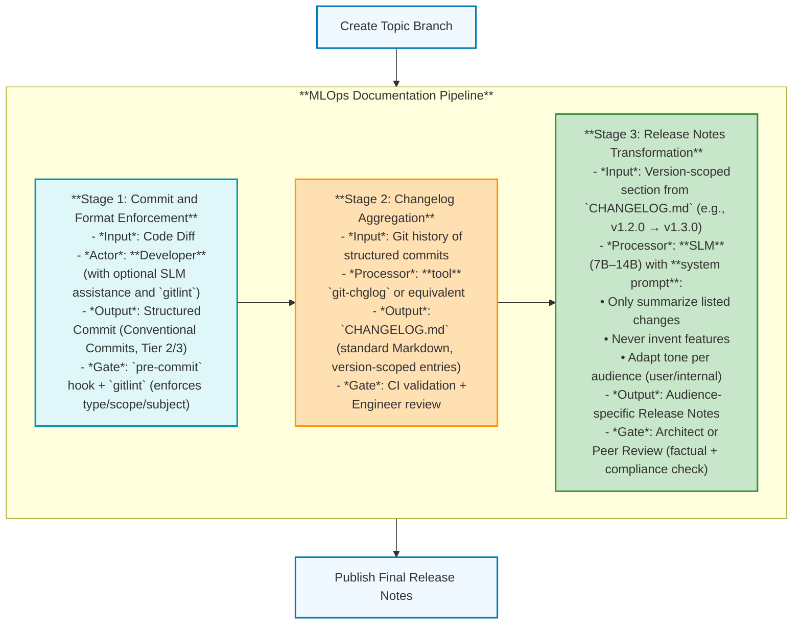

# Small LM-Backed Release Documentation Pipeline: Architecture

-----

Owner: Vadim Rudakov, lefthand67@gmail.com  
Version: 0.1.0  
Birth: 2025-12-01  
Last Modified: 2025-12-05

-----

> INFO: *The handbook is optimized for environments supporting Mermaid.js diagrams. For static export, rasterized versions are available in Appendix A.*

## 1. Introduction: Architecture Driven by Resource Constraint

This handbook defines the **specific technical architecture** we use to generate official project documentation (Changelogs, Release Notes) leveraging the local, resource-constrained **Small Language Models (SLMs)** (1B to 14B parameters).

The key distinction from larger, cloud-hosted LLMs (like GPT-4 or Gemini) is the **resource scarcity** typical of local, commodity AI engineering stacks (e.g., VRAM pools of **12GiB to 48GiB**). This necessitates a highly optimized, modular approach.

### The Core Principle: Decoupling $\to$ Efficiency

We implement a **Decoupled Documentation Pipeline**. This is the architectural standard. We explicitly avoid the common anti-pattern of passing massive, raw data (like a complete `git diff/log -p` output) to the SLM in one monolithic prompt. This anti-pattern causes VRAM saturation, OOM errors, and non-deterministic latency.

Instead, we shift the heavy lifting (parsing, filtering, aggregation) to lightweight, non-LLM tools and use the SLM *only* for the final, low-context, high-value step of **transformation and summarization**.

### Target Audience

This document is mandatory for all MLOps Engineers, Architects, and Senior Developers responsible for managing release automation and maintaining the local AI tooling stack (`aider`, `ollama`, HuggingFace).

## 2. The Staged Documentation Flow and Dependency

Our process is defined by **three distinct, independent stages**. The architecture's robustness is entirely predicated on the strict enforcement of the **Conventional Commit Standard** (defined in the *[Production Git Workflow: Standards](./production_git_workflow_standards.md)* handbook).

### 2.1 The Architectural Flow Diagram

The following diagram illustrates how the enforced commit standard is processed through the stages to produce the final release artifacts. Note that **Stage 1** is primarily a **Developer** task, but we are aimed to make it **SLM-assisted** stage also - generatin commit title and body using the small `git diff` file (**REMEMBER**: commits should be atomic and self-contained).

**Diagram Legend: MLOps Documentation Pipeline**

This diagram illustrates the end-to-end workflow for generating auditable, audience-appropriate release documentation in resource-constrained SLM environments. It enforces separation of concerns by assigning each stage to the most appropriate actor:

- **Stage 1 (Blue – Developer)**: Developers structure commits using Conventional Commits (Tier 2/3), optionally assisted by an SLMs or tools like `gitlint`. Enforcement occurs via pre-commit hooks.
- **Stage 2 (Orange – Deterministic Tooling)**: A standards-compliant, non-LLM tool (`git-chglog`) aggregates commits into a machine-readable `CHANGELOG.md`. Validated by CI and engineers.
- **Stage 3 (Green – SLM)**: A capable SLM (7B–14B), guided by engineered prompts, transforms raw changelog entries into tailored release notes (e.g., for users vs. internal teams). Requires architect or peer approval.
- **I/O Stages (Light Blue)**: Represent workflow boundaries—branch creation (input trigger) and final publication (output artifact).

**Design Principle**: Use the smallest effective component for each task
- human judgment for intent, 
- deterministic tools for structure, and 
- SLMs only where natural language adaptation is required. 

> **Avoid LLM overuse and ensures reproducibility.**

## 3. SLM Allocation and Resource Strategy

The core design choice is assigning the **smallest viable model** to the most frequent tasks. This ensures optimal **latency** and predictable, minimal **VRAM consumption** across  heterogeneous local stack.

### 3.1 Stage 1: Commit Message Generation

| Parameter | Specification | Rationale |
| :--- | :--- | :--- |
| **SLM Size** | **1 Billion to 3 Billion** | Task is highly constrained: adherence to a format and summarization of a small, local diff. **Minimal VRAM is required** for near-instant inference, supporting high-frequency use. |
| **Input Context** | Low. Single commit diff + the concise prompt template. | **Maximally low token count.** Prevents VRAM pressure during high-frequency development use. |
| **Tooling** | `aider` (CLI agent) in `/ask` mode and with `--no-git` and `--read-only` flags to prevent implicit context loading from the codebase. | The tool is used **only for drafting text output**, preventing code mutation and ensuring process idempotency. |

### 3.2 Stage 2: Changelog Aggregation (The Non-LLM Gate)

This stage is primarily handled by standard, non-LLM command-line tools. This is the **Critical Architectural Choice** that removes the complex, high-cost, and non-deterministic **context-saturation risk** entirely.

| Parameter | Specification | Rationale |
| :--- | :--- | :--- |
| **SLM Size** | **Not Used.** | **Computational Efficiency & Cost Avoidance.** Using an SLM for deterministic parsing is computationally inefficient. Lightweight, non-LLM tools execute this process near-instantly on the CPU, avoiding the VRAM load, latency, and token costs associated with even a short LLM prompt. |
| **Tooling** | `git-chglog` (or similar). | These tools use simple regex and parsing logic to reliably aggregate the structured commit history into the standard `CHANGELOG.md` format. |

### 3.3 Stage 3: Release Notes Transformation

This is the final, high-value task where the largest SLM is justified. The goal is to transform the *developer-focused* Markdown into an *audience-focused* narrative (e.g., executive summary, customer email).

| Parameter | Specification | Rationale |
| :--- | :--- | :--- |
| **SLM Size** | **7 Billion to 14 Billion** | Requires complex linguistic capabilities (tone, style, summarization, abstraction). The higher parameter count is necessary for quality, as the task is **less frequent** (only at release). |
| **Input Context** | **Low-to-Medium.** **Only** the relevant, clean section (e.g., the `## vX.Y.Z` block) from `CHANGELOG.md` is provided. | Context is short, clean, and pre-categorized. The prompt asks the SLM to act as a **text transformer**, not a complex parser. |
| **Prompt Focus** | **Instructional/Transformative Prompt.** | The prompt explicitly details the target audience (e.g., "Write this for a non-technical manager") and the required tone. |

## 4. Resource Pitfalls and Technical Debt

New engineers must understand the specific constraints that mandate this architecture. Deviating from these constraints *will* result in production failures.

### 4.1 Hidden Debt: Context Window Inflation

The most significant risk is a developer attempting to increase the SLM's context size by modifying the system prompt or adding unnecessary input data at **Stage 3**.

* **Risk:** Even a short, clean changelog list, if followed by an unnecessarily large or verbose system prompt, can push a mid-sized SLM over the edge, causing latency spikes or Out-of-Memory (OOM) errors.
* **Mitigation:** System prompts for SLMs **MUST** be highly compact, using JSON or constrained Markdown templates instead of verbose prose. All prompts must be **version-controlled alongside model configs** to prevent drift between prompt behavior and model quantization performance. 
  
> **Every token is a resource cost.**

### 4.2 The Anti-Pattern: Monolithic Processing

Avoid any attempt to use a single SLM (even the 14B model) for both raw code analysis (Stage 1) and final summarization (Stage 2/3) simultaneously.

**Why it Fails**: Combining raw diff analysis and release note generation in one SLM pass forces the model to juggle low-level syntactic noise and high-level semantic summarization. This leads to:
- **Loss of composability**: Violates the Unix philosophy—each stage should do one thing well.
- **Prompt instability**: Long, heterogeneous prompts (diffs + templates + instructions) cause attention dilution and hallucination.
- **Operational fragility**: Context lengths grow unpredictably with PR size; even 14B models with 4-bit quantization fail on >8K tokens under concurrent load.
- **Non-reproducibility**: Small diff changes cause large output variance due to attention reallocation.

**Empirical evidence**: In SLM pipelines, decoupling deterministic preprocessing (e.g., `git diff --name-only`, AST extraction) from LLM summarization reduces failure rate by 3–5× and improves cache hit ratio in CI.

### 4.3 Mandatory Human Audit Gates

The "Manual Review & Edit" steps are **MANDATORY AUDIT GATES** against SLM errors and parsing failures. They are not optional:

1.  **Stage 2 Audit:** Verify the non-LLM tool correctly grouped and categorized **all** relevant commits from the specified range.
2.  **Stage 3 Audit:** Verify the SLM-generated release notes accurately reflect the facts in the changelog and use the correct professional tone. **Do not trust the SLM's stylistic choices without review.**

### 4.4 Prompt injection via commit messages

A malicious or malformed commit body (e.g., containing` }} {{`") could break JSON-formatted system prompts in Stage 1 or 3, leading to prompt leakage or role confusion.

**Mitigation:** All commit message fields used as LLM input must be sanitized: (1) escape double quotes and braces, (2) truncate to max 200 chars per field, (3) validate against allow-list of Conventional Commit types. Never interpolate raw git log output directly into prompts.

## 5. Architectural Rationale: Monolithic vs. Decoupled

The choice of the **Decoupled Documentation Pipeline** is an architectural imperative driven by the **resource constraints** of the SLM stack. This decision ensures high performance, reliability, and low operational cost, directly contrasting the brittle and resource-heavy "Monolithic" anti-pattern.

### The Monolithic Anti-Pattern

The monolithic approach attempts to use a single large prompt to feed raw, unparsed data (e.g., hundreds of lines of `git diff -p`) directly into the SLM for processing and summarization.

### The Decoupled Solution (Our Standard)

We use lightweight tools to parse the structured **Conventional Commits** first, and only feed the clean, minimal context (i.e., the changelog entries) to the SLM for the final transformation step.

| Architectural Dimension | Monolithic Anti-Pattern (Raw Diff $\to$ LLM) | Decoupled Solution (Commit $\to$ Tool $\to$ LLM) |
| :--- | :--- | :--- |
| **SLM Role** | **Parser and Summarizer** (High-Cost Data Processing) | **Contextual Transformer** (Low-Cost Stylistic Adaptation) |
| **Input Context** | **Extremely High** (Raw diffs: hundreds of lines of code). | **Very Low** (Structured commit summaries: tens of lines of text). |
| **VRAM/RAM Load** | **Critical:** High risk of **Out-of-Memory (OOM)** error. $O(N^2)$ complexity on large $N$. | **Minimal:** Predictable, low-peak memory usage. |
| **Latency/Speed** | **High and Unpredictable** (Slow token generation). | **Fast and Predictable** (Rapid generation on short context). |
| **Failure Point** | **Brittle:** Single failure (OOM or prompt misinterpretation) breaks the entire release notes generation. | **Robust:** Failure in one stage is localized; the LLM stage is highly reliable due to clean input. |
| **Operational Cost** | **High** (GPU hours, retries, development complexity) | **Low** (CPU work + brief, predictable GPU burst) |
| **Applicability** | Only viable for large, cloud-hosted LLMs with massive memory pools. | **Mandatory** for resource-constrained local SLMs (1B-14B). |

## Appendix A. AI-Assisted Documentation Flow

