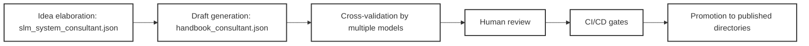

# About


---

Version: 0.3.5  
Birth: 2025-10-19  
Last Modified: 2026-01-24

---


This repository provides a **systematized, AI-engineered knowledge base** for building production-grade AI systems. It is the practical manifestation of a **hybrid methodology** that orchestrates capable **Large Language Models (LLM)** alongside local **Small Language Models (SLM)**.

All content is **generated, validated, and versioned** through a controlled Language Model (LM) workflow—treating documentation as executable, testable artifacts rather than static prose.

> **Mission**: To enable MLOps engineers and AI architects to construct **reliable, audit-ready** AI infrastructure. We prioritize a **hybrid approach**: using high-reasoning cloud LLMs for architecture and planning, while utilizing local SLMs for secure, resource-efficient coding and execution.


## What's new?

v2.2.0
* **Security**: Implemented automated API key detection and JSON validation scripts with CI integration.
* **Infrastructure**: Adopted Ansible and Molecule for idempotent configuration management (ADR 26009, 26010).
* **Organization**: Relocated research materials to `misc/research/` and centralized prompt consultants in Layer 3.

v2.1.0
* **AI Strategy**: Formalized the [**aidx Industrial AI Orchestration Framework**](/ai_system/4_orchestration/workflows/aidx_industrial_ai_orchestration_framework.ipynb), including specialized model selection for Architect vs. Editor phases. 
* **ADR Migration**: Transitioned to a new 2026 naming convention for ADRs and added a centralized index at `architecture/adr_index.md`. 
* **Connectivity**: Added comprehensive setup guides for utilizing high-performance LLMs via API keys within agentic workflows. 
* **Maintenance**: Enhanced repository stabilization through MyST-aware link validation and refined pre-commit hooks. 

v2.0.0 features:
- the migration of core layers into the `ai_system/` hierarchy and
- - the introduction of [hybrid LLM+SLM workflows](/tools/docs/ai_agents/04_connect_to_capable_llms_using_api_keys.ipynb) via Aider integration.


## Authorship & Methodology


My name is Vadim Rudakov, I am a **Systems Engineer and AI Methodology Architect** from Sverdlovsk oblast, Russia. This repository is a "practitioner-focused" engineering hub designed to solve a specific problem: the fragility of AI prototypes and the risk of institutional "tribal knowledge".

- **The Architect**: I design the knowledge-generation systems and validation protocols.
- **Hybrid Synergy**: By integrating tools like **Aider**, I utilize capable models (e.g., Gemini 3 Flash) as "Architects" to handle large context windows, while local models (e.g., Qwen 2.5 Coder) act as "Editors" to perform hardware-aware coding and testing on local GPUs.
- **Institutional Resilience**: I document systems so thoroughly that they survive staff turnover. When key members leave, the project doesn't collapse because the methodology is encoded in the system itself.

The repository is licensed under **GPLv3** for its core assets and **CC-BY-SA 4.0** for the article content.


## Coverage


Content is organized around the six layers of LLM systems:

1. **Execution & Optimization**: CPU/GPU hybrid pipelines, memory (VRAM/RAM) management, NVIDIA tuning
2. **Model Development**: SLM selection, tokenization, embedding, security
3. **Prompt Engineering**: Modular design, XML schemas, template lifecycle
4. **Orchestration**: RAG, workflow chaining, structured output control
5. **Context Management**: Vector stores, hybrid retrieval, indexing strategies
6. **Security & Quality**: Bias detection, access control, validation templates  (spread across all other layers)

All materials are **LM-generated**, then **cross-validated by multiple models**, and deeply **reviewed before promotion** from draft to final by me. The production of one handbook may take tens of manual and AI-backed iterations before I am ready to put it into the main branch, but I understand it can still have problems, so feel free to leave issues.


## Generation Workflow: Hybrid Orchestration


All content follows a reproducible pipeline mirroring software CI/CD, specifically leveraging hybrid LLM/SLM capabilities:

1. **Capable LLM step:**
    1. **Idea elaboration:** [local_ai_systems_consultant.json](/ai_system/3_prompts/consultants/local_ai_systems_consultant.json) helps to peer-review the ideas and solutions in the chat form to stress-test concepts before they're adopted as a methodological tool.
    1. **Draft generation**: [handbook_consultant.json](/ai_system/3_prompts/consultants/handbook_consultant.json) produces articles and diagrams.
    1. **Cross-validation:** Multiple models critique and refine outputs.
1. **Human review step:**
   - Final sanity check before promotion to published directories
1. **CI/CD:**
   - **Version control:** Every file is tracked, diffed, and tested like source code with the help of the pre-coomit hooks, GH actions, and local SLM.
  
> In this paradigm: prompts = source code, articles = build artifacts, reviews = QA gates.




## Repository Structure


The core part of the repository is the `ai_system` directory which introduces 5 layers of AI system. Read more about this approach in ["A Multi-Layered AI System Architecture"](/0_intro/a_multi_layered_ai_system_architecture.ipynb).

```text
.
├── 0_intro/                # Introductory material, high‑level overviews, background resources
├── ai_system/              # Core implementation of the six LLM‑system layers
│   ├── 1_execution/        # Latency control (<100ms), CUDA optimization, etc.
│   ├── 2_model/            # Model selection, adaptation, fine-tuning, etc.
│   ├── 3_prompts/          # Prompt-as-Infrastructure: formatting and transportation, GitOps versioning, etc.
│   ├── 4_orchestration/    # Wrokflow, agent specialization, etc.
│   ├── 5_context/          # RAG, knowledge bases, etc.
│   └── security/           # Centralized policy hub: adversarial threat modeling, RBAC, and OWASP LLM risk mitigationtools
├── architecture/           # Architectural decision records & post‑mortems
│   ├── adr/                # Formal ADR documents describing major design choices
│   └── post-mortems/       # Retrospectives on failures and lessons learned
├── misc/                   # Miscellaneous, non‑core work
│   ├── in_progress/        # Drafts, experiments, work‑in‑progress artifacts
│   └── pr/                 # Pull‑request notes, review checklists, temporary files
├── mlops/                  # MLOps‑focused tooling and pipelines
│   ├── ci_cd/              # CI/CD configs, GitHub Actions, quality‑gate scripts (broken‑link checks, Jupytext verification)
│   └── security/           # MLOps‑specific security tooling, secret‑scanning, compliance checks
├── research/               # Experimental research code & notebooks
│   └── slm_from_scratch/   # Tokenizers, model‑training loops, low‑level SLM experiments
└── tools/                  # Supporting utilities for the repo
    ├── docs/               # Documentation generation helpers, style guides, reference material
    ├── prompt_helpers/     # Prompt libraries, system‑prompt JSON files, validation scripts
    ├── scripts/            # General‑purpose automation (link checking, formatting, Jupytext sync, etc.)
    └── tests/              # Test suites for tools & research code
```


### Research & Foundations (`/research`)


While the core layers of this repository focus on the **systemic orchestration** of AI, the `research/` directory is dedicated to the **first principles** of Small Language Models. We treat the transition from a single neuron to a production-grade Transformer not as a "black box," but as a verifiable engineering stack.

In this repository, "Research" is not academic—it is **forensic**. By building the model from scratch:
1. **Security is Hardened**: We understand exactly how data flows through the weights, making it easier to identify points of failure for prompt injection or data leakage.
2. **Optimization is Precise**: Hardware-aware tuning (Layer 1) is more effective when you understand the computational graph of the model (Research Layer).
3. **Validation is Absolute**: We use manual gradient checks in research to ensure that our automated validation protocols in the MLOps layer are mathematically sound.


## Motivation: Sustainable AI Engineering


My goal is to build AI solutions maintainable as ordinary software. Every problem documented here was confronted while developing local SLM stacks under resource constraints. I share this repository to:

* **Prove Hybrid Viability**: Demonstrate that combining cloud-based reasoning with local SLM execution is the optimal path for production-grade reliability.
* **Hardened Security**: By understanding the computational graph of SLMs (Research Layer), we identify points of failure for prompt injection, data leakage, or resources utilization bottlenecks more precisely.
* **Efficiency through Systems**: Human-led, AI-accelerated process allows for the generation of audit-ready technical documentation in days rather than months.


## Contact Information


Vadim Rudakov, lefthand67@gmail.com
