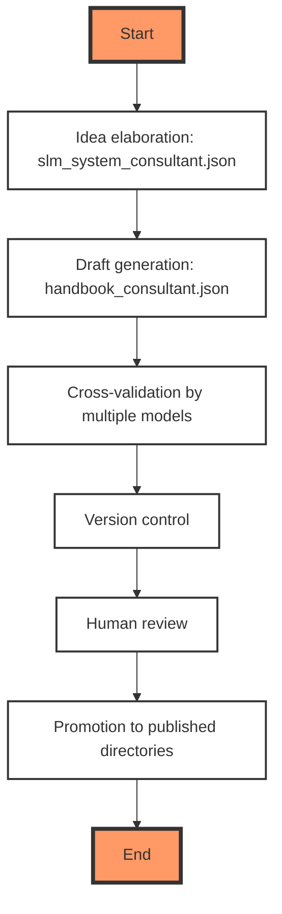

-----

Version: 1.4.0
Birth: 2025-10-19
Modified: 2025-12-27

-----

# About

This repository provides a **systematized, AI-engineered knowledge base** for building production-grade AI systems using **Small Language Models (SLMs)**. All content is **generated, validated, and versioned through a controlled Language Model (LM) workflow**—treated as code, not prose.

> **Mission**: Enable MLOps engineers and AI architects to construct **reliable, maintainable, and auditable** AI infrastructure by treating documentation as executable, testable artifacts.

This is not a prompt repository. It addresses the **full stack** required to deploy and sustain LM-powered systems: execution, model, orchestration, context, and security layers.

> NOTE! The .ipynb files and some .md files use [myst](https://mystmd.org/) syntax. GitHub does not render this syntax (yet), do not consider such snippets as bugs.

---

## Authorship & Licensing

This is a **practitioner-focused engineering repository**, not academic literature. Therefore:

- **No bibliographic references** are included.
- **Provenance is encoded** in system prompts (e.g., [`slm_system_consultant.json`](./helpers/ai_consultants/slm_system_consultant.json)), which capture reasoning patterns used during generation. These prompts are open for inspection and serve as traceable “concept lineage” artifacts.
- **I do not claim originality of ideas**—only of the **generation methodology**, **validation protocol**, and **structural design**.

> I am the architect of the knowledge-generation system. The ideas flow from public technical discourse; the synthesis, cross-validation, and organization are my engineered contribution.

The repository is licensed under **GPLv3** for its core assets—**directory structure, system prompts, validation rules, and generation pipelines**—which are **software artifacts**, not static documents. This enforces the *documentation-as-code* principle. The article content is licensed under **CC-BY-SA 4.0**.

---

## Coverage

Content is organized around the six layers of LLM systems:

1. **Execution & Optimization**: CPU/GPU hybrid pipelines, memory (VRAM/RAM) management, NVIDIA tuning
2. **Model Development**: SLM selection, tokenization, embedding, security hardening
3. **Prompt Engineering**: Modular design, XML schemas, template lifecycle
4. **Orchestration**: RAG, workflow chaining, structured output control
5. **Context Management**: Vector stores, hybrid retrieval, indexing strategies
6. **Security & Quality**: Bias detection, access control, validation templates  (spread across all other layers)

All materials are **LM-generated**, then **cross-validated by multiple models**, and deeply **reviewed before promotion** from draft to final by me. The production of one handbook may take tens of manual and AI-backed iterations before I am ready to put it into the main branch, but I understand it can still have problems, so feel free to leave issues.

---

## Repository Structure

```text
ai-systems-engineering/
├── 0_intro/               # Foundational principles & communication styles
│   ├── images/
│   │   └── ai_systems_grounding_in_computing_disciplines_diagram.png
│   ├── ai_further_reading.md
│   ├── ai_systems_grounding_in_computing_disciplines.md
│   └── ai_systems_multilayer_approach.md
├── 1_execution/          # Execution strategies and hardware-aware tuning
│   ├── images/
│   │   ├── blas_hardware_implementation.png
│   │   ├── complete_llm_inference_pipeline_diagram.png
│   │   ├── memory_pressure_timeline.png
│   │   └── vram_vs_ram_capacity.png
│   ├── security/
│   ├── algebra_gemm_engineering_standard.md
│   ├── hybrid_execution_and_kv_cache_offloading.md
│   ├── optimization_fpga_asic_hardware_acceleration_for_ai.md
│   └── optimization_nvidia_gpu_cuda_nsight_and_systems_thinking.md
├── 2_model/              # Model lifecycle: selection, security, embedding
│   ├── security/
│   ├── selection/
│   │   ├── laws_and_compliance/
│   │   ├── model_cards/
│   │   ├── choosing_model_size.md
│   │   └── models_list.md
│   ├── training/
│   │   ├── configurations/
│   │   ├── datasets/
│   │   ├── custom_tokenizer_and_embedding.md
│   │   └── embeddings_for_small_llms.md
│   └── validation/
│       └── bias_mitigation/
├── 3_infrastructure/     # Prompt modularity, templates, and management
│   └── prompts/
│       └── templates/
│           └── agent_prompts/
│               ├── business_analyst_templates/
│               └── general_prompts_templates/
├── 4_orchestration/      # Workflow engines, chaining
│   ├── frameworks/
│   ├── patterns/
│   │   ├── chain_of_thought/
│   │   ├── rag/
│   │   └── llm_usage_patterns.md
│   ├── security/
│   └── workflows/
│       ├── images/
│       │   ├── ai_assisted_doc_flow_1.png
│       │   └── gated_velocity_pipeline.png
│       ├── release_notes_generation/
│       │   ├── post-mortem_slm_non-determinism_in_commit_generation.md
│       │   └── slm_backed_release_documentation_pipeline_architecture.md
│       └── requirements_engineering/
│           ├── appendices_for_requirements_engineering_in_the_ai_era.md
│           └── requirements_engineering_in_the_ai_era_the_gated_velocity.md
├── 5_context/            # Retrieval, vector DBs
│   ├── knowledge_bases/
│   ├── retrieval/
│   ├── security/
│   └── vector_stores/
├── helpers/
│   ├── ai_consultants/
│   │   ├── handbook_consultant.json
│   │   └── slm_system_consultant.json
│   ├── scripts/
│   │   ├── format_string.py
│   │   ├── md_check_broken_links.py
│   │   └── README.md
│   └── website/
│       ├── nginx.conf
│       ├── play_nginx.yaml
│       ├── ReadMe.md
│       └── website_traefik.yml
├── in_progress/          # In-progress articles and drafts
│   ├── 00_intro/
│   │   ├── principles/
│   │   │   ├── ai_principles_00_intro.md
│   │   │   ├── ai_principles_01_quality_management.md
│   │   │   ├── ai_principles_02_tests.md
│   │   │   └── ai_principles_03_prompt_management.md
│   │   ├── prompt_engineering/
│   │   ├── tutorials/
│   │   │   └── prompt_engineering/
│   │   ├── coding_with_ai.md
│   │   ├── human_model_responsibilities.md
│   │   ├── LLM_Communication_Styles_and_Methods.md
│   │   ├── production_level_ai_systems.md
│   │   └── thoughts.md
│   ├── 01_execution/
│   │   ├── images/
│   │   │   ├── complete_llm_inference_pipeline_diagram.png
│   │   │   ├── memory_pressure_timeline.png
│   │   │   └── vram_vs_ram_capacity.png
│   │   ├── dsp_blocks_dedicated_hardware_for_ai_math.md
│   │   ├── hybrid_cpu_gpu_execution_case_studies.md
│   │   ├── intellectual_property_in_custom_silicon_design.md
│   │   └── plan_local_llm_infrastructure_and_optimization.md
│   ├── 02_model/
│   │   ├── model_inversion_attacks.md
│   │   └── securing_llms_a_practical_guide_for_new_engineers.md
│   ├── 03_prompt/
│   │   ├── filter_not_mix_your_prompts.md
│   │   ├── module_blocks_prompts_from_scratch_tutorial.md
│   │   ├── openai_prompt_template.md
│   │   ├── prompt_as_infrastructure.md
│   │   ├── prompt_management.md
│   │   ├── prompt_module_blocks_architecture_schema.md
│   │   ├── xml_examples.md
│   │   └── xml_md_capsule.md
│   ├── 04_orchestration/
│   │   ├── patterns/
│   │   │   └── spec_two_layer_context_strategy.md
│   │   ├── ai_orchestration_tools.md
│   │   ├── building_multi_agens_systems.md
│   │   ├── project_management_for_ai.md
│   │   ├── rd_pipeline_process.md
│   │   ├── structured_llm_output_formats_en.md
│   │   └── structured_llm_output_formats_ru.md
│   ├── 05_context/
│   │   └── rag_hybrid_retrieval.md
│   ├── appendices/
│   │   └── markdown/
│   │       └── local_markdown_rendering.md
│   ├── mlops/
│   │   ├── ai_tooling/
│   │   │   ├── changelog_prompts/
│   │   │   │   ├── changelog_prompt.json
│   │   │   │   └── readme.md
│   │   │   └── readme.md
│   │   ├── git_workflows/
│   │   │   ├── commit_changelog_tooling.md
│   │   │   ├── git_three_major_workflows.md
│   │   │   ├── production_git_workflow_examples.md
│   │   │   └── production_git_workflow_standards.md
│   │   ├── ai_error_handling.md
│   │   ├── ai_system_stack_versioning.md
│   │   ├── ansible_playbooks_development_draft.md
│   │   ├── deploy_version_controlled_prompts_en.md
│   │   ├── deploy_version_controlled_prompts_ru.md
│   │   ├── quality_control_templates.md
│   │   └── where_to_store_rendered_prompts.md
│   └── nginx.conf
├── mlops/                # Versioning, CI/CD, deployment guardrails
│   ├── ci_cd/
│   │   ├── validation_tests/
│   │   └── workflows/
│   └── security/
│       └── access_control/
├── pr/                   # Public Relations directory
│   ├── tg_channel_ai_learning/
│   │   ├── 2025_10_03_nsight_compute.md
│   │   ├── 2025_10_04_llm_security_problems.md
│   │   ├── 2025_10_05_ai_in_coding.md
│   │   ├── 2025_10_05_cs_fundamentals_for_cuda.md
│   │   ├── 2025_10_06_chats_workflows_agents.md
│   │   ├── 2025_10_07_eval_tests_importance.md
│   │   ├── 2025_10_07_what_mlops_is.md
│   │   ├── 2025_10_12_json_object_vs_array.md
│   │   ├── 2025_10_12_sgr_discussion.md
│   │   ├── 2025_10_18_llm_exchange_formats.md
│   │   ├── 2025_10_19_orchestration_tools.md
│   │   ├── 2025_10_26_embeddings_importance_for_small_llms.md
│   │   ├── 2025_10_27_custom_embedding_and_tokenizer.md
│   │   ├── 2025_10_30_why_rust_for_tokenizers.md
│   │   ├── 2025_10_31_python314_game_changer.md
│   │   ├── 2025_10_31_right_tool_for_right_layer.md
│   │   ├── 2025_11_18_ai_tools_for_cli.md
│   │   ├── 2025_11_18_v1_2_0_ai_engineering_book.md
│   │   ├── 2025_12_03_manifest.md
│   │   ├── 2025_12_03_release_notes_generation_pipeline.md
│   │   ├── 2025_12_04_stacked_diffs.md
│   │   ├── 2025_12_06_ai_engineering_is_convergence.md
│   │   ├── 2025_12_07_AI_for_Requirements_Engineering_Industry_adoption_and_Practitioner_perspectives.md
│   │   ├── 2025_12_07_emotionless_and_honesty.md
│   │   ├── 2025_12_09_slm_consultant_v0_11_1_update.md
│   │   ├── 2025_12_16_broken_links_checker.md
│   │   ├── 2025_12_2025_agents4science_conference_paper_digest_how_agents_are_doing_science_right_now.md
│   │   ├── 2025_12_20_rise_of_autonomous_ai_agents_in_scientific_research.md
│   │   ├── 2025_12_27_gemm_engineering_foundation_of_ai_and_high_performance_computing.md
│   │   └── 2025_12_27_v_1_4_0_ai_engineering_book.md
│   ├── Gemini_Generated_Image_ai_systems_engineer.png
│   ├── Gemini_Generated_Image_ai_systems_engineer_small.png
│   └── README.md
├── research/             # Research and development of Small Language Models
│   └── slm_from_scratch/
│       ├── 01_foundational_neurons_and_backprop/
│       │   └── 01_foundations.ipynb
│       ├── 02_tokenizer/
│       │   ├── 01_bpe_tokenizer.ipynb
│       │   ├── bpe_tokenizer.py
│       │   ├── bpe_tokenizer_t.py
│       │   ├── main.py
│       │   └── readme.md
│       ├── data/
│       │   ├── shakespeare_dataset/
│       │   │   ├── hamlet_plot.txt
│       │   │   └── text1.txt
│       │   └── shakespeare_dataset_test/
│       │       ├── hamlet.txt
│       │       └── otello.txt
│       ├── old/
│       │   ├── 01_computational_primitives_and_gradients/
│       │   │   ├── src/
│       │   │   │   ├── main.py
│       │   │   │   └── neuron.py
│       │   │   └── 01_computational_primitives_and_gradients.ipynb
│       │   ├── 03_transformer_block/
│       │   │   └── 02_transformer_block.ipynb
│       │   └── F_nn_from_scratch/
│       │       ├── src/
│       │       │   ├── main.py
│       │       │   └── neuron.py
│       │       └── foundation_f_neural_networks_from_scratch.ipynb
│       ├── CHANGELOG
│       ├── mentor_slm_from_scratch.json
│       └── README.md
├── security/
├── tools/                # Tooling stack: local LM runners, validators
│   ├── ai_agents/
│   │   ├── ai_tools_in_vim.md
│   │   └── handout_aider.md
│   └── languages/
│       ├── python314_parallelism_game_changer.md
│       ├── right_tool_for_right_layer.md
│       └── why_rust_for_tokenizers.md
├── CHANGELOG
├── LICENSE
├── LICENSE-CODE
├── LICENSE-DOCS
├── myst.yml
├── README.md
└── RELEASE_NOTES.md
```

### Research & Foundations (`/research`)

While the core layers of this repository focus on the **systemic orchestration** of AI, the `research/` directory is dedicated to the **first principles** of Small Language Models. We treat the transition from a single neuron to a production-grade Transformer not as a "black box," but as a verifiable engineering stack.

In this repository, "Research" is not academic—it is **forensic**. By building the model from scratch:
1. **Security is Hardened**: We understand exactly how data flows through the weights, making it easier to identify points of failure for prompt injection or data leakage.
2. **Optimization is Precise**: Hardware-aware tuning (Layer 1) is more effective when you understand the computational graph of the model (Research Layer).
3. **Validation is Absolute**: We use manual gradient checks in research to ensure that our automated validation protocols in the MLOps layer are mathematically sound.

#### SLM From Scratch

The primary initiative within this directory is the **bottom-up construction of SLM architectures**. This phase-based research ensures that every higher-level optimization (like KV-caching or Quantization) is grounded in a deep understanding of the underlying calculus.

### Public Relations directory

`pr` directory is the collection of the informational telegram posts. These posts should not be considered as authoritative or comprehensive documentation.

---

## Generation Workflow

All content follows a reproducible LM pipeline, mirroring software CI/CD:

1. **Idea elaboration:** [slm_system_consultant.json](./helpers/ai_consultants/slm_system_consultant.json) explores and stress-tests concepts
2. **Draft generation**: handbook_consultant.json produces articles, diagrams, and code
3. **Cross-validation:** Multiple models critique and refine outputs
4. **Version control:** Every file is tracked, diffed, and tested like source code
5. **Human review:** Final sanity check before promotion to published directories

> In this paradigm: prompts = source code, articles = build artifacts, reviews = QA gates.



---

## Motivation

My final goal is to build AI solutions that I can maintain as ordinary software, like a calculator. This goal - if achievable - can be achieved only with the strong methodology behind it. MLOps, Devsecops, models fine-tuning, context management, and so on. You can easily prototype almost anything
with the little help from AI, but the question is whether you can build a reliable, production level system.

Every problem documented here is one I’ve confronted while developing local SLM stacks under resource constraints. Since I learn by doing—and my primary collaborator is the AI itself—I share this repository publicly to:

- Invite technical critique on my understanding of AI systems
- Offer a methodologically consistent alternative to ad-hoc prompt hacking
- Demonstrate that documentation can be engineered, not just written
