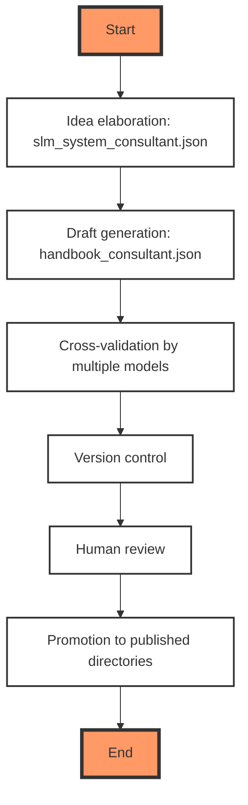

-----

Version: 0.1.0 (previous versions were not audited)  
Birth: 2025-10-19  
Modified: 2025-12-20

-----

# About

This repository provides a **systematized, AI-engineered knowledge base** for building production-grade AI systems using **Small Language Models (SLMs)**. All content is **generated, validated, and versioned through a controlled Language Model (LM) workflow**—treated as code, not prose.

> **Mission**: Enable MLOps engineers and AI architects to construct **reliable, maintainable, and auditable** AI infrastructure by treating documentation as executable, testable artifacts.

This is not a prompt repository. It addresses the **full stack** required to deploy and sustain LM-powered systems: execution, model, prompt, orchestration, context, and security layers.

---

## Authorship & Licensing

This is a **practitioner-focused engineering repository**, not academic literature. Therefore:

- **No bibliographic references** are included.
- **Provenance is encoded** in system prompts (e.g., [`slm_system_consultant.json`](./helpers/ai_consultants/slm_system_consultant.json)), which capture reasoning patterns used during generation. These prompts are open for inspection and serve as traceable “concept lineage” artifacts.
- **I do not claim originality of ideas**—only of the **generation methodology**, **validation protocol**, and **structural design**.

> I am the architect of the knowledge-generation system. The ideas flow from public technical discourse; the synthesis, cross-validation, and organization are my engineered contribution.

The repository is licensed under **GPLv3** because its core assets—**directory structure, system prompts, validation rules, and generation pipelines**—are **software artifacts**, not static documents. This enforces the *documentation-as-code* principle.

---

## Coverage

Content is organized around the six layers of LLM systems:

1. **Execution & Optimization**: CPU/GPU hybrid pipelines, memory (VRAM/RAM) management, NVIDIA tuning  
1. **Model Development**: SLM selection, tokenization, embedding, security hardening  
1. **Prompt Engineering**: Modular design, XML schemas, template lifecycle  
1. **Orchestration**: RAG, workflow chaining, structured output control  
1. **Context Management**: Vector stores, hybrid retrieval, indexing strategies  
1. **Security & Quality**: Bias detection, access control, validation templates  (spread across all other layers)

All materials are **LM-generated**, then **cross-validated by multiple models**, and deeply **reviewed before promotion** from draft to final by me. The production of one handbook may take tens of manual and AI-backed iterations before I am ready to put it into the main branch, but I understand it can still have problems, so feel free to leave issues. 

---

## Repository Structure

```text
ai-systems-engineering/
├── 0_intro/               # Foundational principles & communication styles
├── 1_execution/          # Execution strategies and hardware-aware tuning
├── 2_model/              # Model lifecycle: selection, security, embedding
├── 3_infrastructure            # Prompt modularity, templates, and management
├── 4_orchestration/      # Workflow engines, chaining
├── 5_context/            # Retrieval, vector DBs
├── helpers/
│   ├── ai_consultants/     # System prompts for AI-generated content
│   ├── scripts/            # Utility scripts for various tasks
│   └── website/            # Configuration files for the repo's website
├── mlops/                # Versioning, CI/CD, deployment guardrails
└── tools/                # Tooling stack: local LM runners, validators
```

`pr` directory is the collection of the informational telegram posts. These posts should not be considered as authoritative or comprehensive documentation.

---

## Generation Workflow

All content follows a **reproducible LM pipeline**, mirroring software CI/CD:

1. **Idea elaboration**: `slm_system_consultant.json` explores and stress-tests concepts  
2. **Draft generation**: `handbook_consultant.json` produces articles, diagrams, and code  
3. **Cross-validation**: Multiple models critique and refine outputs  
4. **Version control**: Every file is tracked, diffed, and tested like source code  
5. **Human review**: Final sanity check before promotion to published directories  

> In this paradigm: **prompts = source code**, **articles = build artifacts**, **reviews = QA gates**.



---

## Motivation

My final goal is to build AI solutions that I can maintain as ordinary software, like a calculator. This goal - if achievable - can be achieved only with the strong methodology behind it. MLOps, Devsecops, models fine-tuning, context management, and so on. You can easily prototype almost anything with the little help from AI, but the question is whether you can build a reliable, production level system. 

Every problem documented here is one I’ve confronted while developing **local SLM stacks under resource constraints**. Since I learn by doing—and my primary collaborator is the AI itself—I share this repository publicly to:

- Invite **technical critique** on my understanding of AI systems  
- Offer a **methodologically consistent** alternative to ad-hoc prompt hacking  
- Demonstrate that **documentation can be engineered**, not just written  

Feedback is welcome via issues or PRs. All contributions will undergo the same validation pipeline.

---

## Related Work

- [**llm_from_scratch_practice**](https://github.com/lefthand67/llm_from_scratch_practice): Companion repo where I build a ~100M-parameter SLM from first principles—guided by a Large LM mentor.

---

*Salute!*
