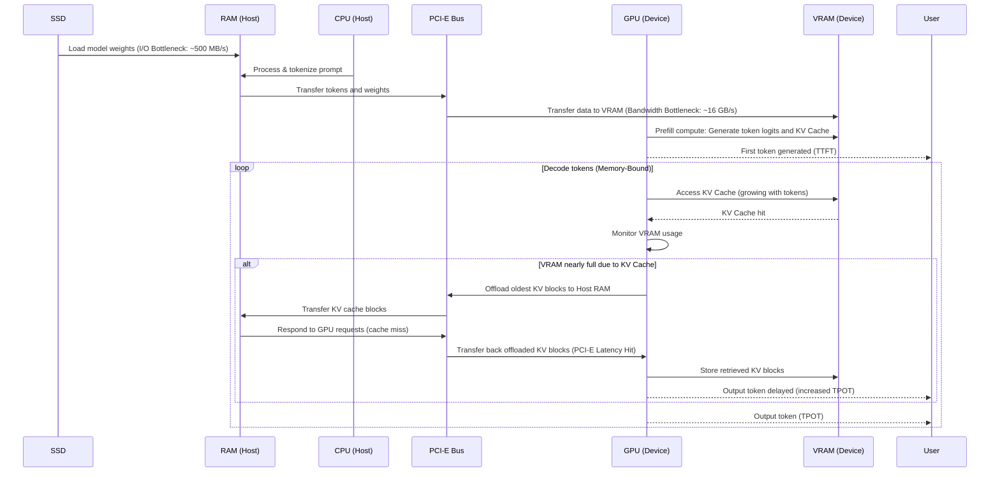

---
jupytext:
  text_representation:
    extension: .md
    format_name: myst
    format_version: 0.13
    jupytext_version: 1.18.1
kernelspec:
  name: python3
  display_name: Python 3 (ipykernel)
  language: python
---

# Local LLM Inference: A Practical Handbook for Hybrid Host/Device Execution and KV Cache Offloading

-----

Owner: Vadim Rudakov, lefthand67@gmail.com  
Version: 0.7.1  
Birth: 2025-11-23  
Modified: 2025-12-31

-----

> INFO: *The handbook is optimized for environments supporting Mermaid.js diagrams. For static export, rasterized versions are available in Appendix B.*

When a user hits "enter" after typing a prompt, the system triggers a complex collaboration between the **Host** (Central Processing Unit, **CPU**) and the **Device** (Graphics Processing Unit, **GPU**). This architecture is called **Hybrid Execution**.

Your job as an AI Engineer is to manage the trade-offs between CPU's vast memory capacity and GPU's raw speed. Where should your precious data live and be processed?

## 📘 Glossary of Acronyms

| Acronym | Full Name | Context/Role |
|:---|:---|:---|
| CPU | Central Processing Unit | Orchestrates processing, I/O, and pre/post tasks. |
| GPU | Graphics Processing Unit | Executes parallel matrix compute operations. |
| VRAM | Video RAM | High-speed memory on GPU; major capacity limit. |
| RAM | Random Access Memory | CPU system memory used for offloading. |
| Host | n/a | **Main system processor**, which is almost always the **CPU**, along with its associated system memory (RAM). It is the component that manages the entire system, initiates tasks, and handles the flow of data to and from the accelerator cards. |
| Device | n/a | A **parallel processing unit** or an **accelerator** used to offload computationally intensive tasks from the host.  It can be **GPUs**, **TPUs** (Tensor Processing Units), **FPGAs** (Field-Programmable Gate Arrays), or other custom AI chips. |
| KV Cache| Key-Value Cache | Stores attention **Key** and **Value** vectors for past tokens, eliminating re-computation in the **Self-Attention** layer. |
| FLOPS | Floating Point Operations Per Second | Theoretical peak compute throughput of a GPU. Rarely achieved in LLM inference due to memory bottlenecks. |
| TTFT | Time To First Token | Latency metric for Prefill phase, measures how long after supplying a prompt the first output token appears. |
| TPOT | Time Per Output Token | Latency metric for Decoding phase, quantifies how long it takes to generate each token after the first. |
| TPS | Tokens Per Second | Throughput metric during Decode phase. $$\text{TPS} = \frac{1}{\text{TPOT}}$$ |
| PCI-E | Peripheral Component Interconnect Express | High-speed CPU-GPU interconnect, bottleneck for offloading. |
| VRAM Bandwidth | GB/s data transfer rate between GPU cores and VRAM | Primary constraint for *both* Prefill (TTFT) and Decode (TPS) phases. |
| PagedAttention™ | vLLM's unified memory technique | Allows **non-contiguous KV cache blocks** to be stored efficiently, dramatically reducing memory fragmentation and maximizing throughput. (Requires datacenter GPUs) |
| Q4\_K\_M | Quantization Format | 4-bit quantization with per-channel scaling and K-means clustering (GGUF). |

-----

## 0. Key Metrics for Inference: Throughput vs. Latency Metrics

Performance metrics are often confused, yet understanding their distinctions is critical to optimizing Local LLM inference. Let's clarify the key terms engineers use to measure model responsiveness and speed.

### Key Metrics Overview

| Metric | What It Measures | Dominant Phase | Hardware Bottleneck | Relationship |
|:---|:---|:---|:---|:---|
| **Time To First Token (TTFT)**| Latency: time to generate the first token | Prefill | SSD speed, PCI-E bandwidth | Independent of TPS |
| **Time Per Output Token (TPOT)** | Latency: time to generate each subsequent token | Decode | GPU VRAM bandwidth | $$\text{TPOT} = \frac{1}{\text{TPS}}$$ |
| **Tokens Per Second (TPS)** | Throughput: tokens generated per second | Decode | GPU VRAM bandwidth | $$\text{TPS} = \frac{1}{\text{TPOT}}$$ |

### Definitions and Context

- **Latency (TTFT and TPOT)** measures the **delay experienced per event**:
    - **TTFT** quantifies the delay from input prompt submission to the very first output token, heavily influenced by SSD read speeds and data transfer bottlenecks.
    - **TPOT** captures the time it takes to generate each *additional* token, driven by VRAM memory bandwidth during sequential decoding.
- **Throughput (TPS)** measures how many tokens your model generates per second *after* the initial response starts. This reflects the model’s **sustained generation speed** during the **Decode Phase**. Higher TPS indicates faster completion and better scalability.

### Why This Distinction Matters

Optimizing local LLM inference is fundamentally a balancing act between **minimizing latency** and **maximizing throughput**:

- A **low TTFT** means the model starts responding quickly, which is crucial for user experience. But aggressively optimizing prompt loading (SSD/CPU) may waste GPU bandwidth later.
- A **high TPS** means the model can churn through tokens fast during long outputs, key for scalability and throughput. However, this often requires ample VRAM bandwidth and efficient memory management.
- **Crucially:** The hardware bottlenecks and computational patterns are distinct: **TTFT** relies on parallel computation and high I/O speed, whereas **TPS** relies on sequential computation and sustained VRAM bandwidth. Optimizing one does not automatically optimize the other.

> **Insight for Engineers:**
> When colleagues say “optimize TPS,” they mean reducing bandwidth bottlenecks during token generation. This is often achieved by managing the **KV Cache** effectively or applying **quantization** to reduce data size.

### Practical Example

Consider the **Mistral 7B model on an 8GB VRAM GPU with 32GB RAM**:

- A **TTFT of 0.5 seconds** means the initial prompt is processed rapidly — user sees a quick first response.
- A **TPS of $\sim 20$ tokens/sec** means the model generates subsequent tokens quickly, allowing smooth continuation.

However, these two goals can compete for resource allocation — optimizing for one may degrade the other, so thoughtful system tuning is necessary.

-----

## 1. The Local Inference Pipeline: A Guided Scenario

We will follow a typical prompt journey using the scenario: running a **Mistral 7B** model locally with a high-end CPU, 32GB system RAM, and a consumer 8GB VRAM GPU.

### 1.1 Phase 1: The Prefill (Fast, Parallel Compute)

The model processes the entire prompt in parallel during this phase, marked by high GPU utilization and measured as **Time To First Token (TTFT)**.

- **Goal:** Quickly process the input sequence to generate the first token and build the initial **Key-Value Cache (KV Cache)**.
- **Action:** The CPU tokenizes text and coordinates slow PCI-E transfers of weights/data to GPU. The GPU then executes parallel matrix multiplications.
- **Workflow Visualization:** Note the data transfer bottleneck across $\text{PCI-E}$ and the computational dominance of the $\text{GPU}$ cores. **(Refer to the detailed flow from SSD to VRAM in the Complete LLM Inference Pipeline Diagram in Section 3.)**

| Step | Dominant Role | Action | Primary Bottleneck |
|:---|:---|:---|:---|
| 1. Cold Start / I/O | **Host (CPU)** | Load weights from SSD to system RAM | SSD sequential read speed |
| 2. Preprocessing | **Host (CPU)** | Tokenize prompt, prepare tensors, transfer | PCI-E bandwidth (Host$\rightarrow$Device) |
| 3. Compute & Cache | **Device (GPU)** | Matrix multiplies, builds KV Cache | VRAM bandwidth, Device FLOPS $\dagger$ |

$\dagger$ *GPU compute (FLOPS) is rarely the true bottleneck. Real-world Prefill is **memory-bound** by VRAM bandwidth feeding data to cores. See Appendix A for more information.*

### 1.2 Phase 2: The Decode (Sequential Memory Access)

#### Latency: Time Per Output Token (TPOT)

After the first token is generated, subsequent tokens are created one at a time referencing the expanding KV Cache. The loop is bandwidth-bound and measured by **Time Per Output Token (TPOT)**.

- **Goal:** Efficiently generate tokens referencing the conversation's entire history in the KV Cache.
- **Action:** GPU fetches weights and KV Cache repeatedly from VRAM as the cache grows linearly.
- **KV Cache Growth & Offload Trigger:**

```mermaid
flowchart TB
    subgraph DEVICE_VRAM["DEVICE (GPU) VRAM (8GB)"]
        KV_Cache["KV Cache (grows with tokens)"]
        Weights["Model Weights (static)"]
    end

    DEVICE_VRAM -->|Linear growth| MemoryAlert{"VRAM > 95% full?"}
    MemoryAlert -->|Yes| Offload["Offload oldest KV blocks → HOST RAM"]
    MemoryAlert -->|No| Continue["Continue in VRAM"]

    subgraph HOST_RAM["HOST (CPU) RAM (32GB)"]
        OffloadedBlocks["Offloaded KV Blocks (compressed)"]
    end

    Offload --> HOST_RAM

    style DEVICE_VRAM stroke:#FF5722,stroke-width:2px
    style HOST_RAM stroke:#2196F3,stroke-width:2px
```

#### Throughput: Tokens Per Second (TPS)

**Tokens Per Second (TPS)** is the standard performance metric used to measure the **throughput** or **speed** of an LLM serving engine. It is the reciprocal of TPOT, or $$\text{TPS} = \frac{1}{\text{TPOT}}$$.

-----

## 2. Memory Pressure: The KV Cache and Hybrid Execution Bottlenecks

### 2.1 The Key-Value (KV) Cache: The VRAM Killer

The KV Cache stores attention vectors for past tokens, significantly reducing computations but consuming high-speed Device VRAM.

| KV Cache Characteristic | Engineering Challenge |
|:---|:---|
| **Linear Growth** | Cache size grows linearly with conversation length. |
| **VRAM Limit** | Cache saturation (e.g., 8GB VRAM) causes stalls or crashes. (Saturation means **VRAM is fully allocated**, forcing data eviction or page faults.) |

**Memory Pressure Timeline:**

```mermaid
graph LR
    A[0 tokens: 25 TPS] --> B[4000 tokens: 20 TPS]
    B --> C[4500 tokens: 10 TPS]
    C --> D[5000 tokens: 6 TPS]
    D --> E[7000 tokens: 3 TPS]
    style A stroke:#4CAF50,stroke-width:4px
    style B stroke:#4CAF50,stroke-width:4px
    style C stroke:#FF9800,stroke-width:4px
    style D stroke:#F44336,stroke-width:4px
    style E stroke:#F44336,stroke-width:4px
    classDef green fill:#C8E6C9,stroke:#4CAF50
    classDef orange fill:#FFCCBC,stroke:#FF9800
    classDef red fill:#FFCDD2,stroke:#F44336
    class A,B green
    class C orange
    class D,E red
```

> **🔥 Critical Pitfall:** Exceeding 4,000 tokens on 8GB VRAM stalls or crashes inference without aggressive memory management.

### 2.2 Why the KV Cache Grows Linearly

The Key-Value (KV) Cache is a critical optimization for **Transformer-based models** (like Large Language Models).

#### The Need for Caching

- **Without the KV Cache:** When a model generates a new token (say, the 100th token), the **self-attention** mechanism needs to look at *all* previous 99 tokens to maintain context. To do this efficiently, it calculates **Key (K) and Value (V) vectors** for every token. Without caching, to generate the 101st token, the model would have to re-calculate the K and V vectors for all 100 preceding tokens, which is a massive waste of computation.
- The original computational cost for generating a sequence grows **quadratically** ($O(N^2)$) with the sequence length ($N$), making long-form generation prohibitively slow.

#### How Caching Causes Growth

- **With the KV Cache:** When the model generates a new token, it calculates its K and V vectors *only once* and then **stores (caches) them** in the Device's VRAM.
- To generate the next token, the model simply **retrieves** all the previously cached K and V pairs and **concatenates** the new K and V pairs to the existing cache.
- Crucially, the model needs to store the K and V pairs for **every single token** in the sequence (both the input prompt and the generated output) to accurately compute the attention for the next token.
- Because a new set of K and V vectors is added for every new token, the total size of the cache grows **linearly** ($O(N)$) with the length of the conversation (sequence length, $N$).

#### The VRAM Bottleneck

The issue arises because VRAM is a **finite, expensive resource**.

- The KV Cache must be stored in **VRAM** (high-speed GPU memory) to ensure the model can access the data quickly enough for real-time generation.
- The total memory consumed by the cache is proportional to:
    $$\text{Cache Size} \propto \text{Number of Layers} \times \text{Sequence Length} \times \text{Head Dimension}^2$$
- As the diagram illustrates:
    1.  **Initial Phase (e.g., 0 to 4000 tokens):** The cache size is manageable, and the model maintains high TPS (25 to 20 TPS).
    2.  **Memory Pressure (e.g., 4500 tokens):** As the cache consumes more VRAM, the system approaches the memory limit. This triggers **aggressive memory management**, often requiring the GPU to move data around, which is slower, leading to a drop in TPS (20 to 10 TPS).
    3.  **VRAM Saturation (e.g., 5000+ tokens):** The Device runs out of VRAM. This can lead to **swapping** (moving data to slower Host RAM) or, in the worst case, **stalls** (where the Device is waiting for memory access) or **crashes** (if the system cannot handle the memory allocation requests), causing the TPS to plummet (10 to 3 TPS).

In short, the problem is a **fundamental trade-off**: the **linear growth** of the cache (essential for fast $O(N)$ generation) eventually clashes with the **fixed limit** of the Device's VRAM (which is required for high-speed operation).

### 2.3 KV Cache Offloading: The Hybrid Solution

Hybrid execution frameworks like `llama.cpp` offload KV Cache blocks to Host RAM when VRAM fills.

- **The Solution:** Page older KV Cache parts from Device VRAM to Host RAM (32GB).
- **Trade-off:** Access latency increases due to PCI-E transfers causing **$5\times - 10\times$ decrease in decoding speed (TPS)**.

**Offloading Event Workflow:**

When the Device needs an offloaded block (**cache miss**), the data must be retrieved from $\text{RAM}$, crossing the **PCI-E Bus** twice. This retrieval process adds significant latency.

*(For a step-by-step visualization of this PCI-E Latency Hit, refer to the conditional block in the **Complete LLM Inference Pipeline Diagram** in Section 3.)*

| Bottleneck | Symptom/Error | Cause | **Actionable Troubleshooting** |
|:---|:---|:---|:---|
| **Prefill Latency** | High **TTFT** ($>1.5\text{s}$ for 512-token prompt) | Slow SSD I/O **or** PCI-E bottleneck during weight transfer | 1. Upgrade to NVMe Gen4 SSD 2. Ensure GPU in x16 PCI-E slot 3. Pin process to isolated CPU cores [→ Deep Dive: OS Tuning] |
| **Decode Throughput** | Low **TPS** ($<15$ tokens/sec for Mistral-7B) | **VRAM bandwidth saturation** during KV Cache access (memory-bound ops) | 1. Apply **Q4\_K\_M quantization** 2. Reduce context window to 2K tokens 3. Enable *partial* KV cache offloading [→ Deep Dive: Quantization Trade-offs] |
| **Memory Crash** | Fatal VRAM error at $\sim 4\text{K}$ tokens | **KV Cache $>$ VRAM capacity** (e.g., 4.2GB cache on 8GB VRAM GPU) | 1. **Enable KV cache offloading** 2. Set `--cache-offload-percentage 70` 3. Monitor VRAM usage pre-crash [→ Deep Dive: Memory Management] |

> **💡 Interactive Checkpoint:**
> Logs show:
>
> 1. TTFT excellent ($0.5\text{s}$)
> 2. After 3 mins, TPS drops from 20 to 3.  
>    Can you identify the cause? (*Answer at the end.*)

-----

## 3. Complete LLM Inference Pipeline Diagram

This sequence diagram illustrates the complete process of Large Language Model (LLM) inference on a single-GPU system, from model loading to iterative token generation, explicitly highlighting critical **performance bottlenecks** and the hybrid execution logic.

This structured analysis serves as the key to the diagram, explicitly linking each stage of the pipeline to its governing performance metric, hardware driver, and primary bottleneck.

| Phase/Event | Driver | Performance Metric | Bottleneck & Implication |
|:---|:---|:---|:---|
| **Phase I: Prefill** | Model loading, Prompt processing, Initial KV Cache build. | **TTFT** (Time To First Token) | Primarily **I/O Bottlenecks**: SSD sequential read speed and the **PCI-E Bandwidth** (**Host RAM** $\rightarrow$ **Device VRAM**) during initial weight and prompt transfer. |
| **Phase II: Decode (Steady State)** | Iterative token generation, $\text{KV Cache}$ read/write. | **TPOT** (Time Per Output Token) & **TPS** | **VRAM Bandwidth** saturation. The speed is limited by how quickly the **Device** can access the growing $\text{KV Cache}$ in its local high-speed memory. |
| **Conditional: Offloading** | $\text{KV Cache}$ size exceeds available $\text{VRAM}$ capacity (e.g., $>8\text{GB}$). | **Latency Spike** (High $\text{TPOT}$) | **PCI-E Latency Hit**: Offloaded blocks must be retrieved from slower **Host RAM** across the $\text{PCI-E}$ bus, adding a significant delay ($5\times$ to $10\times$ penalty) to the token generation loop. |
| **Hybrid Benefit** | Utilizing vast **Host RAM** (e.g., $32\text{GB}$) to extend context. | **Maximum Context Length** | Enables context windows far exceeding $\text{VRAM}$ capacity (e.g., $16\text{K}$ tokens), trading sustained high $\text{TPS}$ for the ability to handle long conversations. |

-----

## 4. Frameworks: The Hybrid Execution Engines

Real-world hybrid execution depends on **inference kernels** that optimize Host/Device coordination. Key players in 2025:

| Framework | Hybrid Execution Superpower | Critical Limitation | Mistral-7B (8GB VRAM) Tip |
|:---|:---|:---|:---|
| **llama.cpp** | **KV cache offloading** + Host/Device layer splitting | High Host (CPU) overhead during paging | `n_gpu_layers=40` + `--split-mode row` |
| **vLLM** | PagedAttention™ (unified Device VRAM / Host RAM cache) | Requires NVIDIA datacenter Devices | ❌ Not consumer-Device compatible |
| **HuggingFace TGI** | Speculative decoding + pipeline parallelism | No Host offload support | Use only with 16GB+ Device VRAM |

**llama.cpp Hybrid Methods Explained**

For local deployments, `llama.cpp` uses two distinct methods for hybrid execution:

1. **KV Cache Offloading:** The process of moving the conversation state (the growing KV Cache) from Device VRAM to Host RAM to extend the maximum context length beyond the Device's memory limit. This primarily manages *memory capacity*.
2. **Layer Splitting:** The most effective hybrid technique for load balancing, which assigns the computation for the model's **lower layers** (compute-heavy) to the Device (GPU), while the **upper layers** (memory-intensive) are strategically placed on the Host (CPU) (using Host RAM). This manages *computational load* and *Device VRAM capacity* simultaneously.

**💡 Battle-Tested Insight**:

For **local deployments** (our scenario), **llama.cpp** is the *only* framework that reliably handles KV cache offloading on consumer Devices (GPUs). Its **GGUF quantization support** (Q4\_K\_M) and **CUDA graph capture** make it the de facto standard for sub-24GB Device VRAM setups.

-----

## 5. Quantization: The Enabler for Local LLMs

Quantization is the process of reducing the precision of the model's weights (e.g., from 16-bit to 4-bit integers), which dramatically cuts the model's VRAM footprint and memory bandwidth requirement.

### Trade-offs of Quantization

| Aspect | Description | Impact |
|:---|:---|:---|
| **Model Size** | Reduces weight size by $4\times$ (from 16-bit to 4-bit). | **Critical:** Allows models to fit into limited VRAM (e.g., Mistral 7B $\approx 14\text{GB}$ FP16 $\rightarrow \approx 4.5\text{GB}$ Q4\_K\_M). |
| **Inference Speed** | Reduces the size of the data moved over the VRAM bus. | **Positive:** Increases effective VRAM bandwidth, leading to higher **TPS** during the Decode phase. |
| **Accuracy** | Loss of precision can introduce small errors. | **Minor:** Modern formats (e.g., Q4\_K\_M, Q5\_K\_S) mitigate this, with negligible quality drop for many tasks. |

### The Power of GGUF (Q4\_K\_M)

The `llama.cpp` framework's **GGUF** format is the standard for local LLM quantization. The **Q4\_K\_M** variant uses advanced techniques (like per-channel scaling and K-means clustering) to achieve high compression with minimal accuracy loss.

| Model | Original Size (FP16) | Q4\_K\_M Size (GGUF) | VRAM Saved |
|:---|:---|:---|:---|
| Mistral 7B | 14 GB | 4.4 GB | 68.5% |

> **Engineering Mandate:** Always deploy the highest practical quantization (e.g., Q4\_K\_M or Q5\_K\_M) before resorting to full KV Cache offloading, as quantization is a **global speed optimization**, whereas offloading is a **localized latency penalty.**

-----

## Key Takeaways for the AI Engineer

1. **TTFT vs. TPOT:** TTFT is CPU/SSD latency; TPOT is GPU/VRAM bandwidth.
2. **Bandwidth over FLOPs:** Decode speed depends more on memory bandwidth than raw compute.
3. **Quantization First:** Use GGUF to reduce memory footprint and boost effective VRAM bandwidth.
4. **Hybrid Execution is Necessary:** Must configure **KV Cache offloading** (for context length) and/or **Layer Splitting** (for model fit) for large models or long contexts on consumer hardware.

> **✅ Checkpoint Answer:** TTFT confirms Prefill ran well. TPS drop signals **KV Cache Offloading** is active, with slow PCI-E reads causing up to $10\times$ latency.

-----

## Appendix A: Deep Dive on Compute vs. Bandwidth

**GPU FLOPS Decoded: Theoretical Peak vs. Real World**

**FLOPS** (Floating Point Operations Per Second) measures a GPU’s *theoretical peak* compute throughput for matrix math. **However, LLM inference rarely saturates FLOPS** due to memory constraints.

**⚠️ Critical Reality Check:**

In *actual* LLM workloads:

- **VRAM bandwidth** (not FLOPS) limits speed 95% of the time.
- FLOPS utilization rarely exceeds $30\% - 40\%$ due to memory stalls.
- Quantized models (INT4) further reduce FLOPS utilization by $60\% - 70\%$ because the integer operations bypass the high-speed floating-point units.

**💡 When FLOPS *Actually* Matters:**

Only when **all** these conditions are met:

1. Weights **fully pre-loaded** in VRAM (no PCI-E transfers during prefill).
2. Prompt length **$> 1,024$ tokens** (sufficient parallelism).
3. Using **FP16/BF16 precision** (no quantization).
4. **Optimized kernels** (e.g., FlashAttention-2).

**Example: The RTX 4090 ($83 \text{ TFLOPS } \text{FP}16$)**

The $83 \text{ TFLOPS}$ FP16 rating for an RTX 4090 is a *peak theoretical number*, useful for comparing raw potential—but **not a predictor of LLM inference speed** in real deployments. This number is achievable only under ideal conditions (dense matrices, perfect memory access) that modern LLM workloads (sparse, memory-bound attention layers) rarely meet.

**Real-world LLM inference** on an RTX 4090 typically achieves **$< 25 \text{ TFLOPS}$ effective throughput**—often much lower during decode due to memory-bound behavior.

**Key Takeaway**: The Prefill phase is **memory-bound (VRAM bandwidth)**, *not* compute-bound. Optimizing TTFT requires maximizing VRAM bandwidth utilization and ensuring weights are pre-loaded.

## Appendix B. Static Diagrams

### 1. Complete LLM Inference Pipeline Diagram

### 2. KV Cache Growth & Offload Trigger Diagram

### 3. Memory Pressure Timeline

