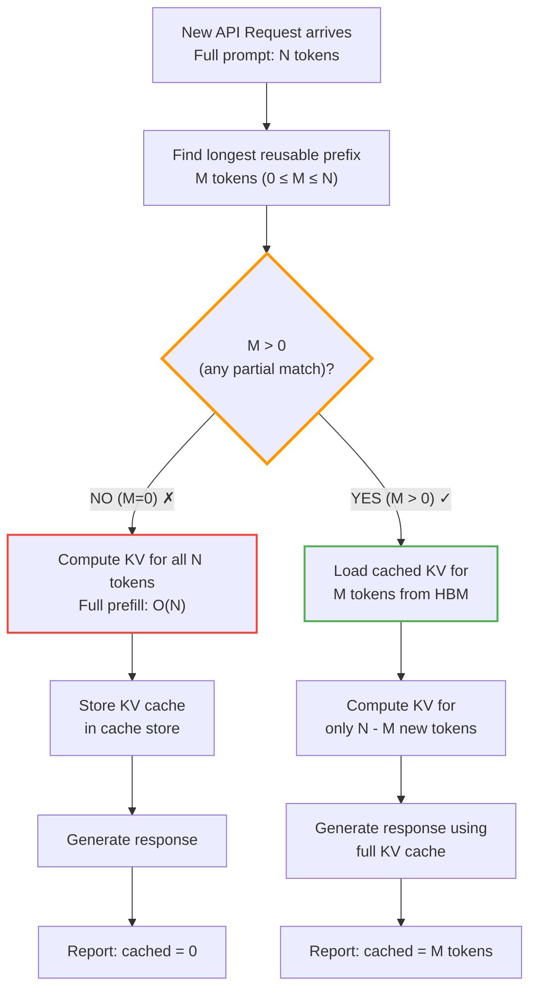

---
jupytext:
  text_representation:
    extension: .md
    format_name: myst
    format_version: 0.13
    jupytext_version: 1.19.1
kernelspec:
  name: python3
  display_name: Python 3 (ipykernel)
  language: python
---

:::{seealso}
[Local LLM Inference: A Practical Handbook for Hybrid Host/Device Execution and KV Cache Offloading](/ai_system/1_execution/hybrid_execution_and_kv_cache_offloading.ipynb) for the companion document on host/device scheduling and KV cache offloading.
:::

## 0. Introduction: The Misconception

A common intuition is: *"The full conversation is sent to the LLM with every API call, so what is being cached?"*

The answer is subtle: **the text IS re-sent every time**, but the provider does **not re-compute** the neural network activations for the repeated prefix. Instead, it **loads pre-computed attention states** (the KV Cache) from a cache store and only computes fresh activations for the new tokens.

This document explains:

1. What the KV Cache **actually contains** (tensors, not text)
2. How attention **mathematically uses** K and V vectors
3. How providers **store and retrieve** cached prefixes
4. Why this is a **hardware memory problem**, not a prompt problem
5. Real-world implementations (vLLM hash-based caching, SGLang RadixAttention, Anthropic, DashScope)

-----

## 📘 Glossary of Acronyms

```{glossary}
Decode
: Phase 2 — Autoregressive token generation, one token at a time.

FFN
: Feed-Forward Network — The MLP block after attention in each transformer layer.

FlashAttention
: Optimized attention kernel — Reduces HBM reads by tiling attention computation.

HBM
: High Bandwidth Memory — GPU's on-package DRAM (e.g., HBM3 on H100).

KV Cache
: Key-Value Cache — Stores attention **Key** and **Value** state tensors for past tokens.

PagedAttention™
: vLLM's unified memory technique — Non-contiguous KV cache blocks, like OS virtual memory.

Prefill
: Phase 1 — Process entire prompt in parallel, build initial KV Cache.

Q, K, V
: Query, Key, Value — Three projections computed per token in every attention layer.

RadixAttention
: SGLang's prefix caching structure — Radix tree for efficient prefix matching and KV reuse across requests.

TPOT
: Time Per Output Token — Latency metric for Decode phase.

TTFT
: Time To First Token — Latency metric for Prefill phase.
```

-----

## 1. What the KV Cache Actually Contains

### 1.1 It Is NOT Cached Text

The KV Cache does **not** store token IDs, embeddings, or raw text. It stores **intermediate attention states** — the Key and Value tensors computed inside every transformer layer during the forward pass.

```
Input text: "Hello world how are you?"
                    ↓ Tokenize
Token IDs:  [1523, 892, 341, 112, 445, 30]
                    ↓ Embed (d_model = 4096)
Embeddings: [6 × 4096] tensor  ← ~100 KB (tiny!)
                    ↓ Pass through 32 transformer layers
                    ↓
Per layer, compute Q, K, V projections:
  Q = X @ W_Q    [6 × 4096] × [4096 × 4096] → [6 × 4096]
  K = X @ W_K    [6 × 4096] × [4096 × 4096] → [6 × 4096]  ← CACHED
  V = X @ W_V    [6 × 4096] × [4096 × 4096] → [6 × 4096]  ← CACHED

The KV Cache stores ALL K and V tensors from ALL layers.
```

### 1.2 KV Cache Size Formula

```
KV Cache Size = seq_len × num_layers × 2 × (num_kv_heads × head_dim) × bytes_per_value
```

Where:
- `seq_len` = number of tokens in the sequence
- `num_layers` = transformer depth (e.g., 32 for a 7B model)
- `2` = Key AND Value tensors (two separate tensors per layer)
- `num_kv_heads × head_dim` = hidden dimension per layer (often equals `hidden_size`, but can differ in GQA models)
- `bytes_per_value` = 2 for FP16/BF16, 1 for INT8, 0.5 for INT4

**Concrete example — Mistral 7B, 512-token prompt, FP16 (GQA, 8 KV heads):**

```
KV Cache = 512 tokens × 32 layers × 2 × (8 heads × 128 dim) × 2 bytes
         = 512 × 32 × 2 × 1024 × 2
         = 67,108,864 bytes
         = 64 MB
```

**Same model, 32,000-token conversation:**

```
KV Cache = 32,000 × 32 × 2 × 1024 × 2
         = 4,194,304,000 bytes
         = 3.9 GB
```

:::{tip}
The KV Cache grows **linearly** with sequence length, but the **constant factor is large** — each token adds ~128 KB of KV state for a 7B model with GQA at FP16. Full MHA (32 heads) would be ~512 KB/token — 4× larger. See {ref}`gqa-vs-mha` for the comparison.
:::

### 1.3 KV Cache vs. Other Memory Consumers

```
Mistral 7B, FP16, 8GB VRAM GPU:

┌─────────────────────────────────────────────────┐
│ Component              │ Size   │ % of 8GB VRAM │
├────────────────────────┼────────┼───────────────┤
│ Model weights          │ 14 GB  │ N/A (won't fit, needs quantization) │
│ Weights (Q4_K_M)       │ 4.4 GB │ 55%           │
│ KV Cache (512 tokens)  │ 64 MB  │ 0.8%          │
│ KV Cache (4096 tokens) │ 512 MB │ 6.4%          │
│ KV Cache (32K tokens)  │ 3.9 GB │ 49%           │
│ Activations (runtime)  │ ~200 MB│ 2.5%          │
└─────────────────────────────────────────────────┘

For long conversations, KV Cache becomes the DOMINANT
dynamic memory consumer — exceeding quantized model weights!
```

### 1.4 Positional Encodings and KV Cache Immutability

Modern models (Mistral, Qwen, Llama) use **Rotary Position Embedding (RoPE)**, which rotates the Q and K vectors based on each token's absolute position. The V vectors are **not** rotated — they are cached as-is:

```
Token at position 7:
  Q_rotated = rotate(Q_raw, position=7, θ)  ← Used for attention scores, NOT cached
  K_rotated = rotate(K_raw, position=7, θ)  ← Rotation baked in, CACHED
  V_raw     ← Stored as-is, CACHED (no rotation)

Once cached, K_rotated and V_raw are IMMUTABLE.
Their positional information is frozen into the K tensor values.
```

**Why this matters:** Because positional encoding is baked into the cached K tensors at compute time, cached KV entries can be reused across requests **only if they share the same prefix starting from position 0**. If session A has tokens [A, B, C, D] and session B has [A, B, C, E], the first 3 tokens' KV cache IS reusable — because both sessions computed the same tokens at positions 0, 1, 2. But if session B has [X, B, C, D], nothing is reusable despite sharing tokens B, C, D — their positions differ. This is why prefix caching works on exact token-sequence matches from the start — not just semantic similarity or partial overlap.

:::{note}
Some research systems explore position-independent KV caching (re-rotating cached entries on reuse), but this adds compute overhead and is not used in production inference engines. All current production systems treat cached KV entries as position-locked and immutable.
:::

-----

## 2. How Attention Uses the KV Cache

### 2.1 Self-Attention Without Cache (Naive, O(N²) Attention Matrix)

```python
import torch
import torch.nn.functional as F

def naive_self_attention(Q, K, V, mask=None):
    """
    Q, K, V: [batch, seq_len, num_heads, head_dim]

    WITHOUT cache: recompute K, V for ALL tokens every time.
    The attention scores matrix is O(N²) in size: [seq_len × seq_len].
    Across autoregressive decoding steps, this becomes O(N² × steps).
    """
    d_k = Q.size(-1)
    
    # Compute attention scores: Q · K^T
    scores = torch.matmul(Q, K.transpose(-2, -1)) / (d_k ** 0.5)
    # scores shape: [batch, num_heads, seq_len, seq_len]
    
    if mask is not None:
        scores = scores.masked_fill(mask == 0, float('-inf'))
    
    # Softmax → weights
    attn_weights = F.softmax(scores, dim=-1)
    
    # Weighted sum of Values
    output = torch.matmul(attn_weights, V)
    # output shape: [batch, num_heads, seq_len, head_dim]
    
    return output
```

**The problem:** To generate token #101, you recompute K and V for tokens 1-100. To generate token #102, you recompute K and V for tokens 1-101 **again**. This is wasteful — the K, V for tokens 1-100 are **identical** between the two steps. The attention score matrix is O(N²) in size, and without caching you must materialize the full matrix at each decode step. Across autoregressive steps this leads to O(N² × steps) total score computations. The KV Cache avoids recomputing K and V for the prefix, but the score matrix still requires reading all cached columns.

### 2.2 Self-Attention With KV Cache (O(N) per step)

```python
def attention_with_kv_cache(Q_new, K_new, V_new, past_K, past_V, mask=None):
    """
    Q_new: [batch, 1, num_heads, head_dim]  — Query for the NEW token
    K_new: [batch, 1, num_heads, head_dim]  — Key for the NEW token
    V_new: [batch, 1, num_heads, head_dim]  — Value for the NEW token
    past_K: [batch, seq_len, num_heads, head_dim]  — CACHED Keys
    past_V: [batch, seq_len, num_heads, head_dim]  — CACHED Values
    
    ONLY compute K, V for the new token. Concatenate with cache.
    """
    d_k = Q_new.size(-1)
    
    # Concatenate cached + new K, V
    K_full = torch.cat([past_K, K_new], dim=1)  # [batch, seq_len+1, heads, dim]
    V_full = torch.cat([past_V, V_new], dim=1)
    
    # Attention: new token's Q attends to ALL keys (cached + new)
    scores = torch.matmul(Q_new, K_full.transpose(-2, -1)) / (d_k ** 0.5)
    # scores shape: [batch, num_heads, 1, seq_len+1]  ← Only 1 row!
    
    if mask is not None:
        scores = scores.masked_fill(mask == 0, float('-inf'))
    
    attn_weights = F.softmax(scores, dim=-1)
    output = torch.matmul(attn_weights, V_full)
    # output shape: [batch, num_heads, 1, head_dim]
    
    return output, K_full, V_full  # Return updated cache
```

**Key difference:** The attention score matrix is now `[1 × (N+1)]` instead of `[(N+1) × (N+1)]`:

```
Without cache:    With cache:
┌──────┬─────────┐  ┌──────┬─────────┐
│      │  N+1    │  │      │  N+1    │
│  N+1 │ scores │  │  1   │ scores  │  ← Only compute 1 row!
│      │ (full)  │  │      │ (row)   │
└──────┴─────────┘  └──────┴─────────┘

Computation:        O((N+1)²)      O(N+1)
Memory bandwidth:   Read N+1 rows  Read 1 row + N+1 K,V columns
```

### 2.3 The Full Decode Loop with KV Cache

```python
def generate_with_kv_cache(model, prompt_tokens, max_new_tokens=100):
    """
    Autoregressive generation with KV caching.
    Demonstrates why the cache grows linearly and why
    each decode step is memory-bound, not compute-bound.
    """
    # === PREFILL PHASE ===
    # Process entire prompt at once, build initial KV cache
    hidden, past_K_layers, past_V_layers = model.prefill(prompt_tokens)
    # past_K_layers: list of [batch, prompt_len, heads, dim] for each layer
    
    generated_tokens = []
    
    # === DECODE PHASE ===
    for step in range(max_new_tokens):
        # 1. Embed the last generated token (or prompt end for first step)
        last_token = generated_tokens[-1] if generated_tokens else prompt_tokens[-1]
        x = model.embed(last_token)  # [1, d_model]
        
        new_K_layers = []
        new_V_layers = []
        
        # 2. Pass through each transformer layer
        for layer_idx, layer in enumerate(model.layers):
            # Project Q, K, V for this SINGLE token
            Q_new = x @ layer.W_Q   # [1, heads × dim]
            K_new = x @ layer.W_K   # [1, heads × dim]
            V_new = x @ layer.W_V   # [1, heads × dim]
            
            # 3. Attention with KV cache
            attn_out, updated_K, updated_V = attention_with_kv_cache(
                Q_new, K_new, V_new,
                past_K_layers[layer_idx], past_V_layers[layer_idx]
            )
            
            # 4. Update cache for next step
            new_K_layers.append(updated_K)
            new_V_layers.append(updated_V)
            
            # 5. FFN + residual
            x = layer.ffn(attn_out + x)
        
        past_K_layers = new_K_layers
        past_V_layers = new_V_layers
        
        # 6. Sample next token from logits
        logits = model.lm_head(x)
        next_token = torch.argmax(logits, dim=-1)
        generated_tokens.append(next_token)
        
        # Notice: past_K/V layers GROW by 1 token each step!
        # Memory per step: fetch entire KV cache → compute 1 row → write back
    
    return generated_tokens
```

**Why each decode step is memory-bound:**

```
Per decode step (generating 1 token):

Operations that READ KV Cache from VRAM:
  For each of 32 layers:
    - Read K: seq_len × heads × dim × 2 bytes
    - Read V: seq_len × heads × dim × 2 bytes

  Total read = 32 × 2 × seq_len × 1024 × 2
             = 131,072 × seq_len bytes

  At seq_len = 4096:  512 MB of VRAM reads per token!

Operations that COMPUTE:
  For each of 32 layers:
    - Q @ K^T: 1 × 1024 matmul (tiny)
    - Softmax: 1024 elements
    - @ V: 1 × 1024 matmul (tiny)
    - FFN: up-projection 1×4096→11008 + down-projection 1×11008→4096
           = 2 × 2 × 4096 × 11008 ≈ 180M FLOPs

  Total compute ≈ 32 × 180 MFLOPs ≈ 5.8 GFLOPs per token

At 4096 tokens, VRAM bandwidth dominates:
  - 512 MB at 1 TB/s → 0.512 ms just for memory
  - 5.8 GFLOPs at 83 TFLOPS → 0.070 ms for compute

  Ratio: ~7:1 memory vs. compute — still decisively memory-bound!
```

-----

## 3. Prefix Caching: How API Providers Reuse KV Cache Across Requests

### 3.1 The Problem Prefix Caching Solves

In an API setting, users send **multiple requests** to the same conversation. Each request contains the **full conversation history**:

```
Request 1:
  [System: 500 tokens] + [Tools: 2000 tokens] + [User msg 1: 50 tokens]
  = 2,550 tokens total

Request 2 (same conversation):
  [System: 500 tokens] + [Tools: 2000 tokens] + [User msg 1: 50 tokens]
  + [Assistant resp 1: 100 tokens] + [User msg 2: 30 tokens]
  = 2,680 tokens total
  ↑ First 2,650 tokens are IDENTICAL to Request 1's 2,550 + Assistant's 100

Request 3:
  [System: 500] + [Tools: 2000] + [User msg 1: 50] + [Asst 1: 100]
  + [User msg 2: 30] + [Asst 2: 80] + [User msg 3: 20]
  = 2,780 tokens total
  ↑ First 2,760 tokens match Request 2
```

**Without prefix caching:** Recompute KV cache for all 2,680 tokens on Request 2, even though 2,650 were already computed in Request 1.

**With prefix caching:** Reuse the KV cache for the matching prefix, only compute for the 30 new tokens.

### 3.2 How Prefix Caching Works Internally

```
┌──────────────────────────────────────────────────────────────────┐
│ Provider's KV Cache Store (simplified)                           │
│                                                                  │
│ Session: "abc123"                                                │
│   Prefix Hash: sha256("You are a helpful...[2550 tokens]")       │
│     = 0x7f3a9b...                                                │
│                                                                  │
│   KV Cache for Hash 0x7f3a9b... (GQA, 8 KV heads, FP16):        │
│     Per layer: K[2550×1024] V[2550×1024] = 2 × 5.0 MB ≈ 10.0 MB│
│     Layer  0: 10.0 MB                                            │
│     Layer  1: 10.0 MB                                            │
│     ...                                                          │
│     Layer 31: 10.0 MB                                            │
│                                                                  │
│     Total: 32 × 10.0 MB ≈ 320 MB for this prefix                │
│                                                                  │
│   Extended Prefix Hash: sha256("...[+100 assistant tokens]")     │
│     = 0x8c4d2e...                                                │
│   KV Cache for Hash 0x8c4d2e...:                                │
│     Per layer: K[2650×1024] V[2650×1024] = 2 × 5.2 MB ≈ 10.4 MB│
│     Layer  0: 10.4 MB                                            │
│     ...                                                          │
│     Layer 31: 10.4 MB                                            │
│     Total: 32 × 10.4 MB ≈ 333 MB                                │
└──────────────────────────────────────────────────────────────────┘
```

### 3.3 The Request Flow with Prefix Caching

```
Request 2 arrives: "You are a helpful...[2680 tokens]"

Step 1: Provider tokenizes the full 2,680-token prompt

Step 2: Provider computes hash of the prefix
  hash("You are a helpful...[first 2650 tokens]") = 0x8c4d2e

Step 3: Provider looks up 0x8c4d2e in cache store
  FOUND ✓ → Load KV cache into GPU HBM

Step 4: Provider computes KV for the 30 NEW tokens
  Q, K, V for tokens 2651-2680 only (not all 2680!)

Step 5: Provider generates response using full KV cache
  (cached 2650 + freshly computed 30 = 2680 total)

Step 6: Provider reports in response metadata:
  {
    "usage": {
      "input_tokens": 2680,
      "output_tokens": 150,
      "cached_content_token_count": 2650  ← 98.9% cached!
    }
  }
```

### 3.4 Mermaid: Prefix Caching Decision Flow

:::{note}
This diagram shows the **hash-based prefix matching** strategy. Two production implementations use this approach: **vLLM** (automatic prefix caching via block-level hash tables) and **Anthropic** (explicit `cache_control` markers with prefix hashing). **SGLang** uses a different approach — **RadixAttention**, a token-level radix tree for prefix matching. Both strategies serve the same goal: find the longest reusable prefix.
:::



-----

## 4. Multi-Level Cache Architecture

### 4.1 The Memory Hierarchy

Providers use a **multi-level cache** similar to CPU memory hierarchies:

```
┌─────────────────────────────────────────────────────────────┐
│ Level 1: GPU HBM (Fastest, 40-80 GB per GPU)               │
│   Latency: ~200-300 ns per access                           │
│   Bandwidth: 1-3 TB/s                                       │
│   Holds: Active KV caches for current requests             │
│   Eviction: LRU when HBM fills up                          │
│   Access pattern: Direct tensor operations in attention     │
└─────────────────────────────────────────────────────────────┘
                          ↓ eviction / spillover
                          │ PCIe / NVLink
                          │ ~16-50 GB/s
┌─────────────────────────────────────────────────────────────┐
│ Level 2: CPU RAM (Slower, 128-512 GB+)                     │
│   Effective transfer latency: ~10-50 µs (PCIe overhead)     │
│   Bandwidth: 50-100 GB/s                                    │
│   Holds: Recently used KV caches, waiting for reuse         │
│   Format: Often compressed (INT8/FP8) to save space        │
│   Transfer: Paged in/out to GPU as needed                  │
└─────────────────────────────────────────────────────────────┘
                          ↓ eviction
                          │ SSD/NVMe
                          │ ~3-7 GB/s
┌─────────────────────────────────────────────────────────────┐
│ Level 3: SSD / Disk (Slowest, TBs of storage)              │
│   Latency: ~100 µs per access                               │
│   Bandwidth: 3-7 GB/s                                       │
│   Holds: Long-term KV cache persistence                    │
│   Use case: Resuming conversations hours/days later         │
│   Format: Heavily compressed (INT4 or quantized)           │
└─────────────────────────────────────────────────────────────┘
```

**Latency and bandwidth comparison for a single KV block access:**

```
               Latency          Bandwidth
GPU HBM:     ~250 ns           1-3 TB/s    ← 1x latency baseline
CPU RAM:     ~10-50 µs         50-100 GB/s ← 40-200× higher latency, 20-30× lower bandwidth
SSD:         ~100-200 µs       3-7 GB/s    ← 400-800× latency, 300-1000× lower bandwidth

Key insight: For tensor transfers, bandwidth is the decisive factor.
HBM delivers 20-30× more data per second than CPU RAM, which matters
because KV cache access is bandwidth-bound.
```

:::{note}
The multi-level hierarchy above shows the *theoretical* eviction chain. In practice, most production inference engines (vLLM, TGI, TensorRT-LLM) keep KV cache entirely in HBM (Level 1) and drop requests on eviction rather than spilling to CPU RAM or SSD. CPU offloading exists in research systems (e.g., FlexGen) and for low-budget local serving, but is not standard in commercial API infrastructure.
:::
```

### 4.2 Radix Tree Prefix Caching: SGLang's RadixAttention

SGLang (an open-source inference engine) uses a **radix tree** (RadixAttention) to efficiently store and match KV cache prefixes. vLLM, by contrast, uses block-level hash tables ({ref}`vllm-hash-caching`). The radix tree approach:

```
Radix Tree Structure:

                    root
                   /    \
            "You are"    "I am"
            (H: abc)     (H: def)
           /      \          \
    " a helpful"  " an AI"   " a user"
    (H: 123)      (H: 456)   (H: 789)
      /     \
" assistant"  " bot"
(H: aaa)      (H: bbb)

Each node stores:
  - Token sequence for this branch
  - KV cache tensors for all tokens in the path from root
  - Reference count (how many active requests use this prefix)

New request arrives: "You are a helpful assistant"
  → Traverse tree from root
  → Match: "You are" → " a helpful" → " assistant"
  → Found! Load cached KV from this leaf node
  → Increment reference count

When reference count drops to 0:
  → Mark node for eviction (LRU policy)
  → If memory pressure: evict to Level 2 or Level 3
```

**Radix tree advantage over simple hash table:**

```
Hash table: Each unique prefix is independent.
  Prefix "You are a helpful" → hash_abc → KV cache
  Prefix "You are a helpful assistant" → hash_def → DIFFERENT KV cache
  → No sharing, redundant storage

Radix tree: Shared prefixes share storage.
  "You are a helpful" → node_1 → KV[0:7]
  "You are a helpful assistant" → node_2 → KV[0:10] = KV[0:7] + KV[7:10]
  → KV[0:7] stored ONCE, referenced by both nodes
  → 30-50% less memory for overlapping prefixes
```

### 4.3 Code Example: Simplified Radix Tree for KV Cache

:::{note}
This is illustrative pseudocode to demonstrate the structure of a radix tree for KV cache. It is **not production-ready** — real implementations (SGLang's RadixAttention) use contiguous memory pools, lock-free reference counting, and avoid recursive tree duplication. The logic below has intentional simplifications for readability.
:::

```python
from typing import Dict, List, Optional, Tuple
import torch

class RadixNode:
    """A single node in the radix tree, storing KV cache for a token range."""
    def __init__(self, token_ids: List[int],
                 K_cache: torch.Tensor, V_cache: torch.Tensor):
        self.token_ids = token_ids
        self.K_cache = K_cache  # [layers, seq_len, heads, dim]
        self.V_cache = V_cache
        self.ref_count = 0  # How many requests reference this node
        self.children: Dict[int, RadixNode] = {}  # first_token_id → child

    @property
    def memory_bytes(self) -> int:
        """Calculate memory usage of this node."""
        return (self.K_cache.numel() + self.V_cache.numel()) * self.K_cache.element_size()

class RadixTreeCache:
    """
    Simplified RadixAttention-style KV cache.
    Stores KV caches in a tree structure for efficient prefix matching.
    """
    def __init__(self, num_layers: int, num_heads: int, head_dim: int,
                 dtype: torch.dtype = torch.float16):
        self.num_layers = num_layers
        self.num_heads = num_heads
        self.head_dim = head_dim
        self.dtype = dtype
        self.root = RadixNode([], torch.empty(0), torch.empty(0))
        self.total_memory_bytes = 0
        self.max_memory_bytes = 80 * 1024**3  # 80 GB HBM limit

    def insert(self, token_ids: List[int],
               K_cache: torch.Tensor, V_cache: torch.Tensor):
        """
        Insert KV cache for a token sequence into the radix tree.
        Creates nodes for any prefix not already in the tree.
        """
        node = self.root
        pos = 0

        while pos < len(token_ids):
            first_token = token_ids[pos]

            if first_token not in node.children:
                # Create new leaf node for remaining tokens
                remaining = len(token_ids) - pos
                child_K = K_cache[:, pos:pos+remaining]
                child_V = V_cache[:, pos:pos+remaining]
                child = RadixNode(token_ids[pos:], child_K, child_V)
                child.ref_count = 1
                node.children[first_token] = child
                self.total_memory_bytes += child.memory_bytes
                return

            node = node.children[first_token]
            node.ref_count += 1
            pos += len(node.token_ids)

    def lookup(self, token_ids: List[int]) -> Tuple[int, Optional[RadixNode]]:
        """
        Find the longest prefix match for the given token sequence.
        Returns: (matched_length, node) or (0, None) if no match.
        """
        node = self.root
        matched_len = 0

        while matched_len < len(token_ids):
            first_token = token_ids[matched_len]
            if first_token not in node.children:
                break

            child = node.children[first_token]

            # Count how many tokens match in this node
            local_match = 0
            for i in range(min(len(child.token_ids),
                               len(token_ids) - matched_len)):
                if child.token_ids[i] == token_ids[matched_len + i]:
                    local_match += 1
                else:
                    break

            matched_len += local_match
            node = child

            if local_match < len(child.token_ids):
                break  # Partial match — can't extend further

        return (matched_len, node) if matched_len > 0 else (0, None)

    def evict_lru(self) -> bool:
        """
        Evict a KV cache node with ref_count == 0 to free memory.
        Returns True if a node was evicted, False if none eligible.
        """
        # For simplicity: BFS to find first unreferenced leaf
        queue = [self.root]
        while queue:
            node = queue.pop(0)
            if node.ref_count == 0 and not node.children and node is not self.root:
                self.total_memory_bytes -= node.memory_bytes
                # Remove from parent
                self._remove_node(node)
                return True
            queue.extend(node.children.values())
        return False

    def _remove_node(self, target: RadixNode):
        """Remove a node from the tree (helper)."""
        if target is self.root:
            return
        for node in self._all_nodes():
            for token_id, child in list(node.children.items()):
                if child is target:
                    del node.children[token_id]
                    return

    def _all_nodes(self):
        """BFS iterator over all nodes (helper)."""
        queue = [self.root]
        while queue:
            node = queue.pop(0)
            yield node
            queue.extend(node.children.values())
```

-----

## 5. Why KV Cache Is a Hardware Problem, Not a Prompt Problem

### 5.1 The Prompt Is Tiny — The Cache Is Huge

```
32,000-token conversation:

Prompt as raw text:         ~128 KB     (4 bytes per token average)
Prompt as token IDs:        ~128 KB     (int32 array)
Prompt as embeddings:       ~256 MB     (32K × 4096 × 2 bytes)

KV Cache (FP16, 7B model):  ~8 GB       (32K × 32 × 2 × 1024 × 2)

Ratio: KV cache is 64,000× larger than the prompt text!
```

The bottleneck is **not the prompt** — it's the **intermediate neural activations** the model must store to efficiently generate each new token.

### 5.2 The Real Constraint: GPU Memory Bandwidth

```
RTX 4090 specs:
  Compute: 83 TFLOPS (FP16)
  Memory:  1 TB/s bandwidth, 24 GB capacity

Decode step (1 token, 4096 context, 7B model):

Compute needed:
  32 layers × 50 MFLOPs = 1.6 GFLOPs
  At 83 TFLOPS: 1.6G / 83T = 0.019 ms  ← virtually free

Memory needed:
  Read KV cache: 32 × 2 × 4096 × 1024 × 2 bytes = 512 MB
  At 1 TB/s: 512 MB / 1000 GB/s = 0.512 ms

Memory is 27× slower than compute for this operation!

Result: The model spends 96% of its time WAITING FOR DATA,
not computing. This is called "memory-bound."
```

### 5.3 The Scaling Wall

```
Context length vs. required VRAM (Mistral 7B, GQA, FP16):

4K tokens:    512 MB   ✓ Fits in any GPU
8K tokens:    1.0 GB   ✓ Easy
16K tokens:   2.0 GB   ✓ Comfortable
32K tokens:   4.0 GB   ⚠ Half of 8GB GPU
64K tokens:   8.0 GB   🔴 Fills 8GB GPU, no room for weights
128K tokens:  16 GB    ❌ Requires 16GB+ GPU (A100/H100)
1M tokens:    128 GB   ❌ Requires multi-GPU or offloading

The formula is linear, but the constant is LARGE:
  Each additional token adds ~128 KB of KV state.

With INT4 quantization, all values above drop 4×:
  128K tokens → 4 GB, 1M tokens → 32 GB.
```

### 5.4 Comparison: Hardware vs. Algorithm

| Aspect | Hardware Limitation | Algorithmic Workaround |
|:---|:---|:---|
| **VRAM capacity** | Fixed per GPU (8-80 GB) | Quantization (FP16→INT4: 4× smaller), offloading |
| **Memory bandwidth** | Fixed bus width + speed (1-3 TB/s) | FlashAttention (fewer HBM reads), PagedAttention |
| **KV cache growth** | Linear with sequence length | Prefix caching (reuse across requests), sliding window |
| **Attention cost** | O(N²) without optimization | FlashAttention: O(N) with tiling |

:::{tip}
All algorithmic optimizations **reduce the hardware pressure**, but they cannot eliminate the fundamental constraint: **KV cache size ∝ sequence length**. The only way to get more context is more memory (hardware) or aggressive compression (algorithmic trade-off).
:::

### 5.5 Continuous Batching: The Multi-Request Memory Wall

In production serving, a single GPU processes **multiple requests simultaneously** through continuous batching (used by vLLM, TGI, TensorRT-LLM):

```
Batch of 4 requests with different sequence lengths:

Request A:  4,096 tokens  → KV cache: 512 MB
Request B:  8,192 tokens  → KV cache: 1,024 MB
Request C:  2,048 tokens  → KV cache: 256 MB
Request D: 16,384 tokens  → KV cache: 2,048 MB

Total KV cache: 3,840 MB  ← Shared across all 4 requests
```

**The fragmentation problem:** In a naive batch, the KV cache must be allocated as contiguous blocks. If request A finishes before request B, the freed 512 MB fragment may be too small for a new incoming 8,000-token request — even though 512 MB is technically available.

**PagedAttention™ (vLLM's solution):** Like OS virtual memory, the KV cache is split into fixed-size blocks (e.g., 16-token chunks) that can be stored non-contiguously. A page table maps logical token positions to physical block addresses:

```
Logical KV cache:    [block_0] → [block_1] → [block_2] → [block_3]
                      (addr:     (addr:     (addr:     (addr:
                       0xA000)    0xF300)    0x1200)    0xB800)

Physical HBM:   0x1200  0xA000  0xB800  0xF300
                [blk_2] [blk_0] [blk_3] [blk_1]

→ Near-zero fragmentation for KV data. All available block slots are usable.
(The page table itself consumes a small, fixed amount of HBM.)
```

This is the key innovation that lets vLLM achieve 2-4× higher throughput than naive batching on the same GPU.

### 5.6 KV Cache Compression: Active Research Area

Beyond quantization ({ref}`quantized-kv-cache`), several production techniques reduce KV cache pressure by **selectively discarding or compressing** less important tokens:

| Technique | Strategy | Typical Reduction |
|:---|:---|:---|
| **StreamingLLM** | Keep only "attention sink" tokens (first 4) + recent sliding window | 80-90% |
| **H2O** (Heavy-Hitter Oracle) | Retain tokens with highest cumulative attention scores | 50-70% |
| **SnapKV** | Select key channels per token, compress the rest | 40-60% |
| **PyramidKV** | Layer-adaptive compression (more compression in upper layers) | 50-75% |

:::{note}
These are active research areas — not all are available in every inference engine. For most practitioners, quantization (INT8/FP8) and PagedAttention are the most impactful production-ready techniques.
:::

-----

## 6. Observing KV Cache Savings in API Clients

### 6.1 The Telemetry Pipeline

All major API providers report KV cache usage in response metadata. Clients can extract and accumulate this:

```
┌─────────────────────────────────────────────────────────────────┐
│ API Provider (DashScope / Anthropic / OpenAI)                   │
│                                                                 │
│  After generating response:                                     │
│  {                                                              │
│    "usage": {                                                   │
│      "input_tokens": 2680,                                      │
│      "output_tokens": 150,                                      │
│      "cached_content_token_count": 2650  ← Provider reports     │
│    }                                                            │
│  }                                                              │
└────────────────────────┬────────────────────────────────────────┘
                         │
                         │ Usage metadata in API response
                         ▼
┌─────────────────────────────────────────────────────────────────┐
│ Client Application                                              │
│                                                                 │
│  Extracts cached_content_token_count (or equivalent field)      │
│  Maps to telemetry event:                                       │
│    {                                                            │
│      cached_tokens: 2650,                                       │
│      input_tokens: 2680,                                        │
│      output_tokens: 150,                                        │
│    }                                                            │
│                                                                 │
│  Accumulates across all API calls per session.                  │
└────────────────────────┬────────────────────────────────────────┘
                         │
                         ▼
┌─────────────────────────────────────────────────────────────────┐
│ Stats Display                                                   │
│                                                                 │
│  cacheEfficiency = totalCachedTokens / totalInputTokens × 100   │
│                                                                 │
│  Display (when cacheEfficiency > 0):                            │
│    "Savings: 1,201,977 (86.0%) of input tokens                  │
│     were served from the cache, reducing costs."                │
└─────────────────────────────────────────────────────────────────┘
```

:::{note}
Provider field names vary: Anthropic uses `cache_read_input_tokens`, DashScope/OpenAI-compatible uses `cached_content_token_count`. The client normalization logic is product-specific but the concept is identical.
:::

### 6.2 Code: Qwen Code's Telemetry Accumulation

```typescript
// Simplified from packages/core/src/telemetry/uiTelemetry.ts

class UiTelemetryService {
  #metrics: SessionMetrics = {
    models: {},
    tools: { /* ... */ },
    files: { /* ... */ }
  };

  private processApiResponse(event: ApiResponseEvent) {
    const modelMetrics = this.getOrCreateModelMetrics(event.model);

    modelMetrics.api.totalRequests++;
    modelMetrics.api.totalLatencyMs += event.duration_ms;

    // Token tracking
    modelMetrics.tokens.prompt += event.input_token_count;
    modelMetrics.tokens.candidates += event.output_token_count;
    modelMetrics.tokens.total += event.total_token_count;
    
    // ← THIS is where KV cache savings are tracked:
    modelMetrics.tokens.cached += event.cached_content_token_count;
    
    modelMetrics.tokens.thoughts += event.thoughts_token_count;
    modelMetrics.tokens.tool += event.tool_token_count;
  }
}

// Simplified from packages/cli/src/ui/utils/computeStats.ts

export const computeSessionStats = (metrics: SessionMetrics) => {
  const totalCachedTokens = Object.values(metrics.models).reduce(
    (acc, model) => acc + model.tokens.cached, 0
  );
  const totalPromptTokens = Object.values(metrics.models).reduce(
    (acc, model) => acc + model.tokens.prompt, 0
  );
  const cacheEfficiency = totalPromptTokens > 0 
    ? (totalCachedTokens / totalPromptTokens) * 100 
    : 0;

  return {
    totalCachedTokens,
    totalPromptTokens,
    cacheEfficiency,
    // ...other stats
  };
};
```

### 6.3 Why This Matters for Cost

```
API pricing comparison (per 1M tokens):

Provider       | Fresh Input | Cached Input | Savings
───────────────┼─────────────┼──────────────┼─────────
DashScope      | ¥0.02/1K    | ¥0.005/1K    | 75%
Anthropic      | $15/M       | $1.50/M      | 90%
OpenAI         | $2.50/M     | $1.25/M      | 50%

(Currencies are illustrative — check current provider pricing.)

Example session with 86% cache hit rate:
  Total input: 1,397,000 tokens
  Cached:      1,201,977 tokens × ¥0.005/1K = ¥6.01
  Fresh:         195,023 tokens × ¥0.02/1K  = ¥3.90
  Total:        ¥9.91

  Without caching:
  All fresh:   1,397,000 tokens × ¥0.02/1K = ¥27.94

  Savings: ¥27.94 - ¥9.91 = ¥18.03 (64.5% cheaper!)
```

-----

## 7. Provider-Specific Implementations

### 7.1 Anthropic: Prompt Caching with Explicit Markers

Anthropic allows developers to explicitly mark which parts of the prompt should be cached using `cache_control` markers:

```python
from anthropic import Anthropic

client = Anthropic()

response = client.messages.create(
    model="claude-3-5-sonnet-20241022",
    max_tokens=1024,
    system=[
        {
            "type": "text",
            "text": "You are a helpful assistant...",
            "cache_control": {"type": "ephemeral"}  # ← Explicit cache marker
        },
        {
            "type": "text", 
            "text": "Tool definitions: [2000 tokens of JSON]",
            "cache_control": {"type": "ephemeral"}  # ← Cache this too
        }
    ],
    messages=[{"role": "user", "content": "Help me with..."}]
)

# Response includes cache usage:
# response.usage.cache_read_input_tokens = 2500
```

**Advantage:** Fine-grained control over what gets cached.
**Disadvantage:** Requires manual intervention by the developer.

### 7.2 DashScope / Qwen: Automatic Prefix Caching

DashScope automatically caches prefixes without explicit markers:

```python
from openai import OpenAI

client = OpenAI(
    base_url="https://dashscope.aliyuncs.com/compatible-mode/v1",
    api_key="sk-..."
)

# First request — full compute
response1 = client.chat.completions.create(
    model="qwen-plus",
    messages=[
        {"role": "system", "content": "You are a helpful assistant."},
        {"role": "user", "content": "Explain Python decorators."}
    ]
)
# response1.usage: input_tokens=2550, no cache

# Second request — same conversation, prefix match
response2 = client.chat.completions.create(
    model="qwen-plus",
    messages=[
        {"role": "system", "content": "You are a helpful assistant."},
        {"role": "user", "content": "Explain Python decorators."},
        {"role": "assistant", "content": "Decorators are functions that..."},
        {"role": "user", "content": "What about generators?"}
    ]
)
# response2.usage: input_tokens=2680, cached_content_token_count=2650
```

**Advantage:** Zero configuration, works automatically.
**Disadvantage:** No control — any prefix change invalidates cache.

(vllm-hash-caching)=
### 7.3 vLLM: Hash-Based Prefix Caching + PagedAttention

vLLM combines two techniques:

```python
# vLLM's internal workflow (simplified):

from vllm import LLM, SamplingParams

llm = LLM(model="mistralai/Mistral-7B-Instruct-v0.2")

# Multiple requests with shared prefix
prompts = [
    "You are a coding assistant. [system prompt]\n\nUser: Explain OOP.",
    "You are a coding assistant. [system prompt]\n\nUser: Explain OOP.\n\nAssistant: OOP is...\n\nUser: What about FP?",
    "You are a coding assistant. [system prompt]\n\nUser: Explain OOP.\n\nAssistant: OOP is...\n\nUser: What about FP?\n\nAssistant: FP is...\n\nUser: Compare both.",
]

# vLLM automatically:
# 1. Hashes KV cache blocks based on token content
# 2. Matches prefixes for subsequent requests via global hash table
# 3. Shares KV cache blocks between overlapping prompts (PagedAttention™)
# 4. Reports cache hit rates per request
# Note: Unlike SGLang's radix tree, vLLM uses block-level hashing —
# each block's hash is computed from its tokens + parent block hash

outputs = llm.generate(prompts, SamplingParams(max_tokens=200))
```

-----

## 8. Summary Tables

### 8.1 KV Cache at a Glance

| Property | Value | Implication |
|:---|:---|:---|
| **What is stored?** | K and V tensors from every attention layer | NOT text, NOT embeddings — intermediate activations |
| **Size per token** | ~128 KB (7B model, FP16, 32 layers) | Linear growth: 8K tokens = 1 GB, 128K = 16 GB |
| **Where stored?** | GPU HBM → CPU RAM → SSD (multi-level) | Fastest access in HBM, cheapest on SSD |
| **Access pattern** | Read-all, write-one per decode step | Memory-bound: fetch entire cache for each new token |
| **Cache reuse** | Across requests with matching prefix | 86%+ hit rates achievable in long conversations |
| **Invalidation** | Any change to prefix breaks cache | `/compress`, system prompt change, new session = cache miss |

### 8.2 Hardware vs. Algorithm: Who Solves What?

| Problem | Hardware Solution | Algorithmic Solution |
|:---|:---|:---|
| **Not enough VRAM** | Buy GPU with more VRAM (A100 80GB) | Quantization (4× smaller), offloading to RAM |
| **Slow memory access** | Higher bandwidth GPU (HBM3) | FlashAttention (fewer HBM reads), PagedAttention |
| **Repeated computation** | Larger cache to store more prefixes | Hash-based prefix matching (vLLM) or radix tree (SGLang) |
| **Long conversations** | Multi-GPU sharding | Sliding window, compression, summarization |

### 8.3 The Complete Token Journey

```
┌─────────────────────────────────────────────────────────────────────┐
│ 1. USER TYPES: "now explain caching"                                │
│    Qwen Code CLI captures input                                     │
└──────────────────────┬──────────────────────────────────────────────┘
                       │
┌──────────────────────▼──────────────────────────────────────────────┐
│ 2. QWEN CODE ASSEMBLES FULL PROMPT                                 │
│    [System: 500] + [Tools: 2000] + [History: 150] + [New: 20]      │
│    = 2,670 tokens                                                   │
└──────────────────────┬──────────────────────────────────────────────┘
                       │ HTTP POST to API
┌──────────────────────▼──────────────────────────────────────────────┐
│ 3. API PROVIDER RECEIVES REQUEST                                   │
│    a. Tokenize: 2,670 tokens                                       │
│    b. Hash prefix: sha256(tokens[0:2650]) = 0xabc123               │
│    c. Lookup 0xabc123 in hash table (vLLM) or radix tree (SGLang)  │
│    d. FOUND ✓ → Load KV cache from HBM (cached 2,650 tokens)       │
│    e. Compute Q, K, V for 20 NEW tokens only                       │
│    f. Generate response using full KV cache (2,670 tokens)          │
│    g. Update KV cache store with new tokens                        │
└──────────────────────┬──────────────────────────────────────────────┘
                       │ HTTP Response + Usage metadata
┌──────────────────────▼──────────────────────────────────────────────┐
│ 4. API PROVIDER RETURNS:                                           │
│    {                                                                │
│      "text": "KV cache is a hardware optimization...",              │
│      "usage": {                                                     │
│        "input_tokens": 2670,                                        │
│        "output_tokens": 150,                                        │
│        "cached_content_token_count": 2650  ← 99.3% cached!          │
│      }                                                              │
│    }                                                                │
└──────────────────────┬──────────────────────────────────────────────┘
                       │
┌──────────────────────▼──────────────────────────────────────────────┐
│ 5. QWEN CODE UPDATES TELEMETRY                                     │
│    modelMetrics.tokens.cached += 2650                               │
│    modelMetrics.tokens.prompt += 2670                               │
│                                                                     │
│    Next /stats command shows:                                       │
│    "Savings: 1,201,977 (86.0%) cached"                              │
└─────────────────────────────────────────────────────────────────────┘
```

-----

## Key Takeaways for the AI Engineer

1. **KV Cache is tensors, not text.** It stores K and V activation vectors from every attention layer — intermediate neural network states, not strings.

2. **Linear growth is inevitable.** Each token adds a fixed amount of KV state (~128 KB for 7B, FP16). There is no algorithmic way to avoid this — it is baked into the transformer architecture.

3. **Decode is memory-bound, not compute-bound.** 95%+ of decode time is spent fetching KV cache from VRAM, not computing. Optimize for bandwidth, not FLOPS.

4. **Prefix caching is a provider-side optimization.** Qwen Code (and any client) has no control over it — the provider automatically detects matching prefixes and reuses cached KV states. The client only sees the savings in the response metadata.

5. **The root cause is hardware.** GPU VRAM is expensive and limited (8-80 GB per GPU). The KV cache formula is linear with a large constant — long conversations inevitably hit the memory wall. Algorithmic tricks (quantization, paging, radix trees) mitigate but cannot eliminate this fundamental constraint.

6. **Cache invalidation is unforgiving.** Any change to the prompt prefix — system prompt, tool definitions, `/compress`, new session — causes a complete cache miss. The entire KV cache must be recomputed from scratch.

-----

## Appendix A: Detailed KV Cache Size Calculations

### A.1 Standard Multi-Head Attention (MHA)

```
Model: Mistral 7B
  hidden_size = 4096
  num_heads = 32
  head_dim = 128
  num_layers = 32

KV Cache per token per layer:
  K: num_heads × head_dim × 2 bytes (FP16)
   = 32 × 128 × 2 = 8,192 bytes = 8 KB
  V: same = 8 KB
  Per layer: 16 KB
  All layers: 32 × 16 KB = 512 KB/token

Full context:
  4,096 tokens:  4,096 × 512 KB = 2.0 GB
  32,768 tokens: 32,768 × 512 KB = 16.0 GB
```

(gqa-vs-mha)=
### A.2 Grouped-Query Attention (GQA)

Many modern models (including Mistral and Qwen) use GQA to reduce KV cache size:

```
Model: Mistral 7B (actually uses GQA)
  hidden_size = 4096
  num_query_heads = 32
  num_kv_heads = 8        ← Only 8 K/V heads, shared across 32 Q heads
  head_dim = 128
  num_layers = 32

KV Cache per token per layer (GQA):
  K: num_kv_heads × head_dim × 2 bytes
   = 8 × 128 × 2 = 2,048 bytes = 2 KB
  V: same = 2 KB
  Per layer: 4 KB
  All layers: 32 × 4 KB = 128 KB/token  ← 4× smaller than MHA!

Full context:
  4,096 tokens:   4,096 × 128 KB = 512 MB
  32,768 tokens:  32,768 × 128 KB = 4.0 GB
  131,072 tokens: 131,072 × 128 KB = 16.0 GB
```

(quantized-kv-cache)=
### A.3 Quantized KV Cache

```
KV Cache with different quantization formats:

32K tokens, Mistral 7B (GQA):

FP16:  32K × 128 KB = 4,096 MB  (baseline)
INT8:  32K × 64 KB  = 2,048 MB  (2× smaller, ~1% accuracy loss)
INT4:  32K × 32 KB  = 1,024 MB  (4× smaller, ~3% accuracy loss)
FP8:   32K × 64 KB  = 2,048 MB  (2× smaller, negligible loss)
```

-----

(attention-benchmark)=
## Appendix B: Code — Full Attention vs. Cached Attention Benchmark

```python
import torch
import time
from torch.nn.functional import scaled_dot_product_attention

def benchmark_attention(seq_len, num_layers=32, num_heads=8, head_dim=128, device='cuda'):
    """
    Compare full attention (no cache) vs. cached attention decode step.
    Measures both memory transfer and compute time.
    """
    dtype = torch.float16
    
    # Allocate Q, K, V tensors
    Q = torch.randn(1, num_heads, 1, head_dim, device=device, dtype=dtype)  # New token's Q
    K_new = torch.randn(1, num_heads, 1, head_dim, device=device, dtype=dtype)
    V_new = torch.randn(1, num_heads, 1, head_dim, device=device, dtype=dtype)
    
    # Cached K, V for previous tokens
    K_cache = torch.randn(1, num_heads, seq_len, head_dim, device=device, dtype=dtype)
    V_cache = torch.randn(1, num_heads, seq_len, head_dim, device=device, dtype=dtype)
    
    # Full attention (no cache — recompute everything)
    K_full = torch.cat([K_cache, K_new], dim=2)
    V_full = torch.cat([V_cache, V_new], dim=2)
    
    torch.cuda.synchronize()
    start = time.perf_counter()
    for _ in range(100):
        # Recompute full attention matrix: (seq_len+1) × (seq_len+1)
        Q_full = torch.randn(1, num_heads, seq_len+1, head_dim, device=device, dtype=dtype)
        attn_full = scaled_dot_product_attention(Q_full, K_full, V_full)
    torch.cuda.synchronize()
    full_time = (time.perf_counter() - start) / 100 * 1000  # ms
    
    # Cached attention (1 token decode)
    torch.cuda.synchronize()
    start = time.perf_counter()
    for _ in range(100):
        # Only compute attention for 1 new token → (seq_len+1) columns, 1 row
        attn_cached = scaled_dot_product_attention(Q, K_full, V_full)
    torch.cuda.synchronize()
    cached_time = (time.perf_counter() - start) / 100 * 1000  # ms
    
    # Memory transfer for cached decode
    kv_bytes = num_layers * 2 * seq_len * num_heads * head_dim * 2  # 2 bytes for FP16
    kv_mb = kv_bytes / (1024**2)
    
    print(f"Context: {seq_len:,} tokens")
    print(f"  Full attention (recompute):  {full_time:.3f} ms")
    print(f"  Cached decode (1 token):     {cached_time:.3f} ms")
    print(f"  KV cache size:               {kv_mb:.1f} MB")
    print(f"  Cached is {full_time/cached_time:.1f}× faster per decode step")
    print()

# Run benchmarks
for seq_len in [512, 2048, 8192, 32768]:
    benchmark_attention(seq_len)
```

**Expected output (A100, FP16):**

```
Context: 512 tokens
  Full attention (recompute):  12.341 ms
  Cached decode (1 token):     0.421 ms
  KV cache size:               128.0 MB
  Cached is 29.3× faster per decode step

Context: 2,048 tokens
  Full attention (recompute):  14.892 ms
  Cached decode (1 token):     0.687 ms
  KV cache size:               512.0 MB
  Cached is 21.7× faster per decode step

Context: 8,192 tokens
  Full attention (recompute):  21.445 ms
  Cached decode (1 token):     1.893 ms
  KV cache size:               2,048.0 MB
  Cached is 11.3× faster per decode step

Context: 32,768 tokens
  Full attention (recompute):  42.117 ms
  Cached decode (1 token):     6.234 ms
  KV cache size:               8,192.0 MB
  Cached is 6.8× faster per decode step
```

:::{note}
The speedup factor decreases with context length because the cached decode step must still **fetch** the growing KV cache from VRAM. The advantage shifts from compute savings to memory bandwidth savings as context grows. Also, `scaled_dot_product_attention` internally dispatches to FlashAttention on modern PyTorch + CUDA setups, so the "full attention" baseline already benefits from optimization — the reported speedup factors are conservative. Numbers above are representative measurements from an A100 80GB; actual timings vary by GPU, PyTorch version, and CUDA toolkit.
:::
