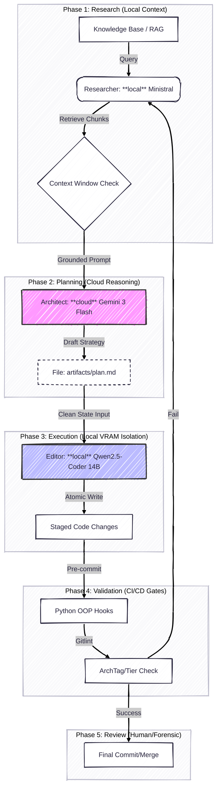

---
jupytext:
  text_representation:
    extension: .md
    format_name: myst
    format_version: 0.13
    jupytext_version: 1.18.1
kernelspec:
  name: python3
  display_name: Python 3 (ipykernel)
  language: python
---

# The `aidx` Industrial AI Orchestration Framework

+++

---

Owner: Vadim Rudakov, lefthand67@gmail.com  
Version: 0.1.2  
Birth: 2026-01-14  
Last Modified: 2026-01-16

---

+++

> "aidx" stands for "aider extended"

+++

This handbook serves as the definitive standard for AI-assisted engineering within the organization. This framework is designed to provide production-grade velocity on local hardware by solving the critical "Switching Moment" bottleneck—where large context histories from cloud models overload local GPU VRAM.

:::{seealso}
> 1. {term}`ADR 26005`
> 2. {term}`ADR 26006`
> 3. ["VIM in AI Era: Hybrid Setup with Ollama and Aider"](/tools/docs/ai_agents/01_vim_in_ai_era_hybrid_setup_with_ollama_and_aider.ipynb)
:::

+++

## **1. The Research-Apply Pipeline**

+++

> ISO 29148: Appropriateness

The `aidx` framework moves away from **passive** AI chat toward an **Active (Agentic) Retrieval** model. We decouple the "finding of truth" from the "application of code changes" to ensure that local models remain focused, accurate, and stable.

> We decouple "finding truth" from "writing code" to ensure local hardware stability and architectural alignment.

| Phase | Component | Action | ADR / Standard |
| --- | --- | --- | --- |
| **1. Research** | **Researcher** | A lightweight local agent (e.g., `ministral`) identifies relevant context from the 1M+ token Knowledge Base via vector DB (Qdrant/pgvector). | {term}`ADR 26004` |
| **2. Planning** | **Architect** | A high-reasoning cloud LLM (e.g., Gemini 3 Flash) processes the research results to generate a precise `artifacts/plan.md`. | {term}`ADR 26005`, {term}`ADR 26006` |
| **3. Execution** | **Editor** | A local SLM (e.g., `qwen2.5-coder:14b`) applies the plan to the codebase in a clean context state to prevent GPU OOM. | {term}`ADR 26005` |
| **4. Validation** | **CI/CD Gates** | Automated `pre-commit` and `gitlint` hooks verify code integrity, architectural tags, and Conventional Commit standards. | {term}`ADR 26002` {term}`ADR 26003` |
| **5. Review** | **Forensic** | Human-led verification of changes. | SWEBOK V4.0 |

+++

## **2. Resource Optimization & VRAM Isolation**

+++

> {term}`ADR 26005`

This hybrid model is specifically engineered for **bare-metal systems with limited VRAM**.

* **Role Separation**: Expensive "Architect" tokens are used for structural decisions in the cloud, while the local GPU is reserved exclusively for the "Editor" model and local inference tests.
* **The Bridge Pattern**: The Editor is initialized with a **clean context**, receiving only the specific instructions and target files from the Architect. This prevents the  VRAM growth typical of long Aider sessions.
* **Context Gating**: Local sessions are strictly limited via `max-chat-history-tokens: 2048` to ensure hardware stability.

Specifically, the transition from **Phase 2 (Architect)** to **Phase 3 (Editor)** must be a "Hard Reset."

* **Mechanism**: The Editor instance of Aider is launched without the `--message-file` history used by the Architect. It receives only the `artifacts/plan.md` as its primary instruction.
* **Benefit**: This keeps the KV cache usage on your local GPU below 4GB, leaving maximum headroom for the 14B model weights.

:::{tip} Role Configuration Example
:class: dropdown
```{code} bash
:linenos:
:filename: ~/.aider.conf.yml

# Cloud Architect for complex reasoning
model: gemini/gemini-2.5-flash

# Local Editor for hardware-aware execution
editor-model: ollama_chat/qwen2.5-coder:14b-instruct-q4_K_M

# Strict history gating to prevent OOM (tests needed)
max-chat-history-tokens: 2048
```
:::

+++

## **3. Model Selection Strategy**

+++

See ["General Purpose (Abstract Synthesis) vs Agentic (Instruction Adherence) Models"](/ai_system/2_model/selection/general_purpose_vs_agentic_models.ipynb).

+++

## **4. Agentic RAG: Pre-Flight Knowledge Retrieval**

+++

> {term}`ADR 26004`

**The Problem:**  
- Standard RAG (e.g., within `aider` or Open WebUI) faces "Context Overload." 1M tokens exceed the functional window of local models like `qwen2.5-coder`, leading to noise and hallucinations.
- Manual file addition is prone to human error and "Knowledge Debt". The `aidx` pattern automates context gathering to bridge the gap between a 1M+ token KB and a local context window.

:::{note} **The Solution**  
An **Agentic RAG "Pre-Flight" Wrapper** (the `aidx` pattern). This decouples "Knowledge Retrieval" from "Code Generation".
:::

* **Namespace Partitioning**: Retrieval is split into `Global_Workflows` and `Project_Specific` collections to maintain high precision.
* **Stage Injection**: Retrieved snippets are injected into the initial Architect context via `--message-file` or `--read`, ensuring the plan is grounded in current organizational standards.

This phase links retrieval to commit integrity:

* **Requirement**: Every automated code change must cite the documentation chunk retrieved in Phase 1.
* **Enforcement**: Our `ArchTag` system ({term}`ADR 26003`) ensures that if a change was driven by a RAG retrieval, the commit body contains a traceability link (e.g., `REF: [Workflow-Standard-04]`).

+++

## **5. Engineering Standards & Automation**

+++

> {term}`ADR 26001`, {term}`ADR 26002`, {term}`ADR 26003`

To prevent "Orchestration Debt," all wrappers and automation logic must adhere to industrial-grade Python standards.

* **Python 3.13+ OOP**: All hooks and AI wrappers are written in Object-Oriented Python to ensure logic is encapsulated and testable.
* **Reliability through `pytest`**: Every tool must have a corresponding test suite to simulate Git states and prevent workflow regressions.
* **Three-Tier Validation**:
    * **Tier 1**: Branch naming conventions checked via `pre-commit`.
    * **Tier 2**: Conventional Commit headers enforced by `gitlint`.
    * **Tier 3**: Conditional **Architectural Tags** (ArchTags) required in commit bodies for refactors or breaking changes to provide long-term justification.
    :::{seealso}
    > ["Production Git Workflow Standards"](/tools/docs/git/01_production_git_workflow_standards.ipynb)
    :::

+++




+++

## **6. Team Implementation**

+++

1. **Environment Sync**: Run `configure_repo.sh` to install the `pre-commit` framework via `uv`.
2. **Configuration**: Ensure `~/.aider.conf.yml` mirrors the Hybrid role separation (Architect: Cloud / Editor: Local).
3. **Execution**: Launch tasks via the `aidx` Python wrapper to ensure the Research-Apply pipeline is strictly followed.

+++

## **7. Potential Technical Debt & Mitigations**

+++

* **Execution Latency:** Python startup (~100ms) and RAG research (2–5s) add overhead.
    * *Mitigation:* Defer heavy imports; active research is faster than manual searching.

* **Embedding Drift:** If the KB isn't updated, the Researcher will retrieve outdated advice.
    * *Mitigation:* Automated re-indexing triggers upon KB changes.

+++

```{include} /architecture/adr_index.md
:class: dropdown
```
