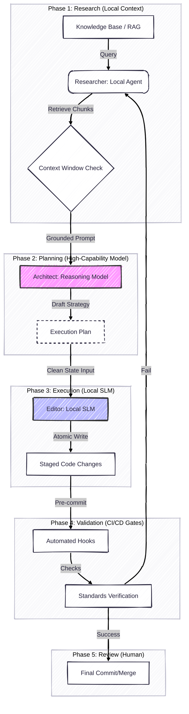

---
jupytext:
  text_representation:
    extension: .md
    format_name: myst
    format_version: 0.13
    jupytext_version: 1.19.0
kernelspec:
  name: python3
  display_name: Python 3 (ipykernel)
  language: python
---

---
title: "Multi-Phase AI Pipeline: Decoupling Research from Code Generation"
author: Vadim Rudakov, rudakow.wadim@gmail.com
date: 2026-02-16
options:
  version: 1.0.0
  birth: 2026-01-14
---

+++

This article documents a tool-agnostic **Research-Apply pipeline** for AI-assisted engineering. The core principle: decouple "finding truth" (knowledge retrieval) from "writing code" (code generation) to ensure local hardware stability and architectural alignment.

+++

## **1. The Research-Apply Pipeline**

> ISO 29148: Appropriateness

The pipeline moves away from **passive** AI chat toward an **Active (Agentic) Retrieval** model. We decouple "finding truth" from "writing code" so that local models remain focused, accurate, and stable.

| Phase | Role | Action |
| --- | --- | --- |
| **1. Research** | **Researcher** | A lightweight local agent identifies relevant context from a large Knowledge Base via vector DB or retrieval mechanism. |
| **2. Planning** | **Architect** | A high-reasoning model (cloud or large local) processes the research results to generate a precise execution plan. |
| **3. Execution** | **Editor** | A local SLM applies the plan to the codebase in a clean context state, preventing GPU OOM. |
| **4. Validation** | **CI/CD Gates** | Automated hooks verify code integrity, architectural tags, and commit standards. |
| **5. Review** | **Forensic** | Human-led verification of changes. |

+++

### Why Five Phases?

Each phase exists for a specific reason:

- **Research** grounds the subsequent reasoning in actual project knowledge, not model hallucination
- **Planning** leverages high-capability models for structural decisions (architecture, design)
- **Execution** uses efficient local models for the mechanical act of code modification
- **Validation** provides automated safety nets that catch regressions immediately
- **Review** ensures human oversight on all changes

The key insight is the **hard boundary between Planning and Execution**: the Editor must start with a **clean context**, receiving only the plan and target files from the Architect. This prevents the unbounded [VRAM/context growth](/ai_system/1_execution/hybrid_execution_and_kv_cache_offloading.ipynb) typical of long interactive sessions.

+++

## **2. Namespace Partitioning for RAG**

**The Problem:**
Standard RAG faces "Context Overload" when a Knowledge Base exceeds the functional context window of local models. Retrieving from a flat, undifferentiated collection introduces noise and reduces precision.

**The Solution:**
Following the same separation-of-concerns principle as the [Hub-and-Spoke Ecosystem Architecture](/architecture/adr/adr_26020_hub_spoke_ecosystem_documentation.md), split retrieval into **namespaced collections** to maintain high precision:

| Namespace | Contents | Use Case |
| --- | --- | --- |
| `Global_Workflows` | Organization-wide standards, ADRs, engineering policies | Ensuring compliance with cross-project conventions |
| `Project_Specific` | Project documentation, API specs, domain knowledge | Grounding in the specific codebase being modified |

This partitioning ensures that:

- **Precision stays high**: Queries hit the relevant namespace rather than searching all documents
- **Context budget is preserved**: Only the most relevant chunks from each namespace are injected into the Architect's prompt
- **Traceability is maintained**: Every automated code change can cite the documentation chunk that drove it (e.g., `REF: [Workflow-Standard-04]`)

+++

### Stage Injection Pattern

Retrieved snippets are injected into the Architect context during the Planning phase, before plan generation begins:

1. **Query both namespaces** with the task description
2. **Rank and filter** chunks by relevance score
3. **Inject** the top-k chunks into the Architect's system prompt or context window
4. **Cite** sources in the generated plan for downstream traceability

This "pre-flight" retrieval ensures the plan is grounded in current organizational standards rather than stale model knowledge.

+++

## **3. Pipeline Visualization**

+++

## **4. Implementation Considerations**

- **Model selection is independent of the pipeline**: Any combination of cloud/local models can fill the Researcher, Architect, and Editor roles — see ["General Purpose vs Agentic Models"](/ai_system/2_model/selection/general_purpose_vs_agentic_models.ipynb) for selection criteria. The pipeline pattern remains the same.
- **The hard reset between Planning and Execution is non-negotiable**: The Editor must start with a clean context to maintain VRAM stability on constrained hardware.
- **Namespace partitioning scales**: Additional namespaces (e.g., `Security_Policies`, `API_Contracts`) can be added as the Knowledge Base grows.

:::{seealso}
- ["Hybrid Execution and KV Cache Offloading"](/ai_system/1_execution/hybrid_execution_and_kv_cache_offloading.ipynb) — VRAM mechanics and KV cache growth during inference
- ["Choosing Model Size"](/ai_system/2_model/selection/choosing_model_size.ipynb) — VRAM budgeting and quantization trade-offs
:::
