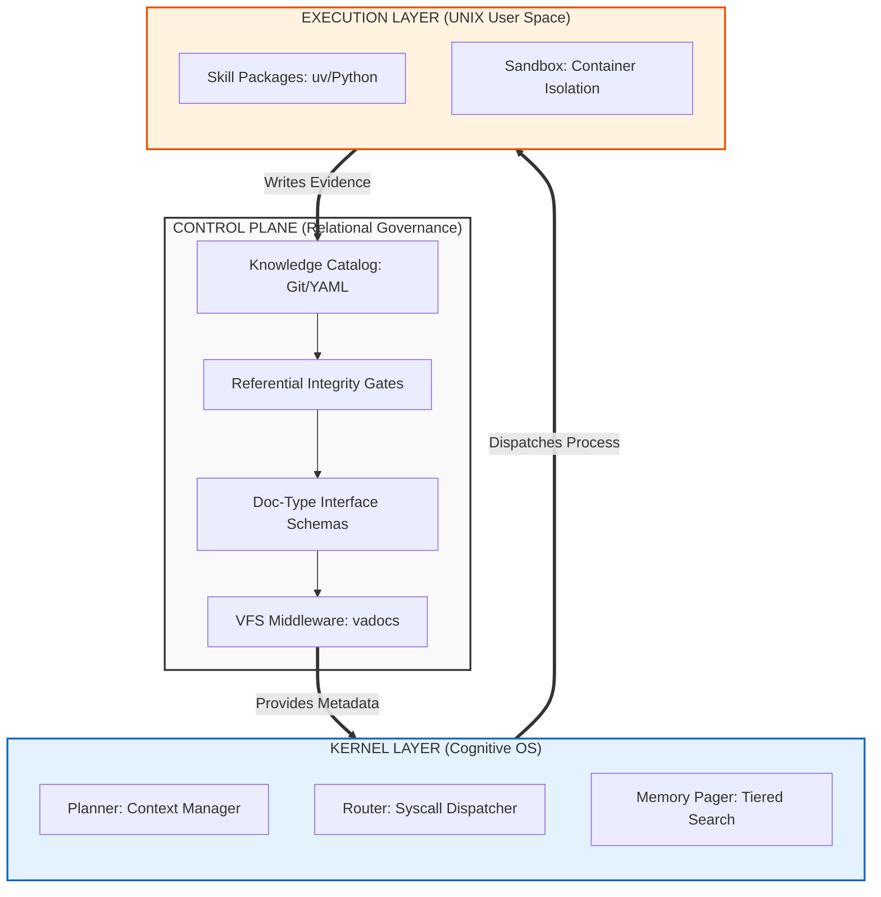
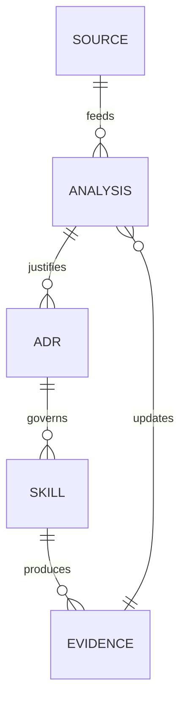
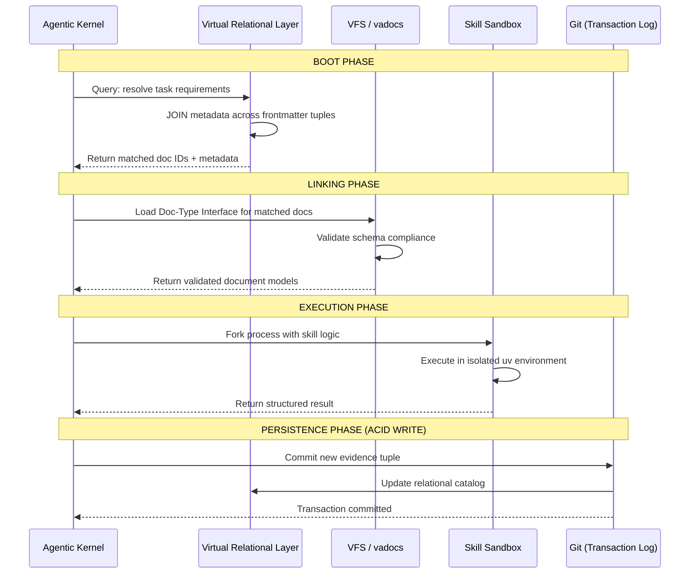
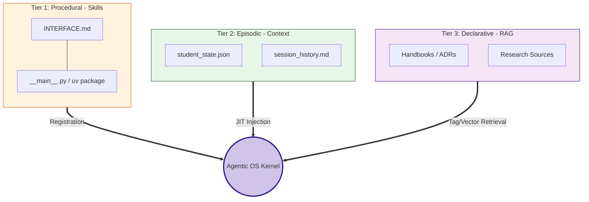

# A-26005: Agentic OS Filesystem Architecture: Document Types, VFS, and Virtual Relational Layer

## Problem Statement

The repository has 13 distinct document types but only 4 have formal interfaces (schema + validation + lifecycle). The remaining 9 exist by convention, not by contract. This creates the "Architectural Orphanage" problem (first identified in S-26004): documents outside governed decision-making cannot be reliably discovered, filtered, or validated — by humans or AI agents.

ADR-26035 established the Evidence taxonomy (Decisions / Evidence / Governance) and proved it works with 4 analyses, 5 formal sources, and a working validation script. But the taxonomy only covers architecture-related documents. Content notebooks, script instructions, guides, plans, and promotional posts remain untyped. There is no uniform interface that defines what "a document type" is across the repo.

The Agentic OS model (A-26002, S-26005) positions documentation as the file system of an AI-native operating system. In UNIX, every file has a type and metadata (the inode). In this system, every document should have a type and metadata (YAML frontmatter). The gap: UNIX has a VFS layer that provides a uniform interface across all file types. This repo has no equivalent — each validation script implements its own type-specific logic with no shared abstraction.

Beyond the typing gap, there is a **relational integrity gap**. Documents reference each other — analyses cite sources (`sources: [S-26004]`), ADRs produce artifacts (`produces: [ADR-26035]`). These are foreign key relationships, but no validation enforces them. A source ID can be typo'd, a referenced ADR can be deleted, and no CI gate catches it. The knowledge base has referential links but no referential integrity.

There is also an **integration gap**. The Agentic OS model (A-26002) describes three layers — Control Plane (governance), Kernel (cognitive processing), Execution (sandboxed skills) — but the filesystem architecture that ties them together is not formalized. The document type system sits at the intersection of all three layers: governance defines types, the kernel queries types for routing, and execution produces new typed documents. Without a unified filesystem design, these layers cannot interoperate reliably.

This analysis applies two theoretical foundations — **UNIX system design** and **Codd's relational theory** — as blueprints to design the Agentic OS filesystem architecture, with Document Type Interfaces as the VFS layer and a Virtual Relational Layer (VRL) providing referential integrity over Git/YAML.

**Interim artifact caveat.** This analysis is itself an interim artifact. The Agentic OS methodology is under active revision — ADRs, the evidence pipeline, and the document type taxonomy are all subject to redesign as the OS architecture crystallizes. The structures described here should be understood as the current best model, not a final specification. The focus is on **interfaces** (stable contracts) rather than **implementations** (which will evolve).

## Key Insights

### The Documentation Landscape — 13 Types, 4 Governed

| # | Type | Location | Validation | Interface Level |
|---|------|----------|------------|-----------------|
| 1 | ADR | `architecture/adr/` | `check_adr.py` | Full (schema + sections + lifecycle) |
| 2 | Analysis | `evidence/analyses/` | `check_evidence.py` | Full |
| 3 | Retrospective | `evidence/retrospective/` | `check_evidence.py` | Full |
| 4 | Source | `evidence/sources/` | `check_evidence.py` | Full |
| 5 | Notebook | `ai_system/*/` | `jupytext_sync/verify` | Partial (Jupytext + naming) |
| 6 | Script Instruction | `tools/docs/scripts_instructions/` | `check_script_suite.py` | Partial (existence only) |
| 7 | Git Workflow Guide | `tools/docs/git/` | link checks only | None |
| 8 | Manifesto | `architecture/` | none | None |
| 9 | Telegram Post | `misc/pr/` | none | None |
| 10 | Plan | `misc/plan/` | none | None |
| 11 | Tech Debt Register | `misc/plan/techdebt.md` | none | None |
| 12 | Package Spec | `architecture/packages/` | none | None |
| 13 | Prompt (JSON) | `ai_system/3_prompts/consultants/` | `check_json_files.py` (syntax) | None |

Types 1-4 are the "governed" types — they have schema, validation, and lifecycle. Types 5-6 have partial interfaces (Jupytext enforcement, naming conventions). Types 7-13 are "untyped" — they exist by convention, not by contract.

### Industry Convergence — The 4-6 Base Types

Across DITA (OASIS), Diataxis, ISO 26514, Google, and GitLab CTRT, a stable set of 4-6 base types emerges:

| Semantic Role | DITA | Diataxis | ISO 26514 | Google | GitLab CTRT |
|--------------|------|----------|-----------|--------|-------------|
| "What is it?" | Concept | Explanation | Conceptual | Conceptual | Concept |
| "How do I do it?" | Task | How-to Guide | Instructional | — | Task |
| "Teach me" | — | Tutorial | — | Tutorial | Tutorial |
| "Look it up" | Reference | Reference | Reference | Reference | Reference |
| "Fix a problem" | Troubleshooting | — | Troubleshooting | — | Troubleshooting |
| "Why decided?" | — | — | — | Design Doc | — |

The "Design Doc" gap: none of the standard taxonomies have a first-class type for architectural decisions. ADRs (Michael Nygard, 2011) fill this gap. This repo's ADR system is an innovation relative to documentation standards.

### DITA Specialization — The Interface Inheritance Model

DITA implements **document type inheritance** — the most mature precedent for typed documentation:

```
topic (base type — abstract interface)
├── concept (extends topic — adds conbody)
├── task (extends topic — adds steps, prerequisites)
├── reference (extends topic — adds tables, parameter lists)
└── troubleshooting (extends topic — adds cause, remedy)
```

Key properties:
- **Schema-validated**: Each type has a DTD/RELAX NG schema enforcing structure
- **Extensible**: Organizations create custom types that inherit from base types
- **Constraint modules**: Can restrict base types without breaking the contract (narrowing, not widening)
- **Processing inheritance**: A processor that handles `topic` automatically handles all its specializations

DITA proves typed documentation with formal interfaces is production-viable at enterprise scale (IBM, SAP, Cisco). But DITA's XML toolchain is antithetical to Markdown-native docs-as-code. The opportunity: bring DITA's conceptual model (typed topics with schema validation) into a Markdown/YAML world.

### Modern Type Systems for Markdown

| Tool | Schema Language | Validates | Status |
|------|----------------|-----------|--------|
| **Astro Content Collections** | Zod (TypeScript) | Frontmatter | Production-ready |
| **Contentlayer** | JS config | Frontmatter + routing | Stalled (2023) |
| **mdschema** | YAML | Body structure (sections, headings) | Early stage |

Astro Content Collections is the most mature precedent — Zod schemas for frontmatter validation in a content-centric framework. Our `check_adr.py` and `check_evidence.py` already implement this pattern — but in Python/YAML, without a shared abstraction.

### AI-Native Documentation Standards

Two emerging standards address AI consumption directly:

- **`llms.txt`** (Jeremy Howard, 2024) — A discovery interface for AI agents: structured Markdown listing all content with descriptions. Adopted by Anthropic, Google (A2A), Mintlify.
- **`skill.md`** (Mintlify) — A capability manifest telling agents what a product/system can do.

Both validate the manifesto's thesis: documentation is not just for humans anymore. AI consumers need machine-readable metadata to filter before they read. This is the Progressive Disclosure pattern from A-26002: the agent reads frontmatter `type` + `tags` + `description` fields (Level 1) to decide whether to load the full document (Level 2) — saving tokens.

### Metadata for RAG Filtering

Research on production RAG systems converges on these critical metadata fields:

- `document_type` — enables query-type routing ("teach me" → tutorial, "look up" → reference)
- `status` / `lifecycle_stage` — filters out deprecated/draft content
- `tags` — controlled vocabulary for domain classification
- `date` / `last_updated` — recency filtering
- `audience` — skill-level routing
- `description` — compact summary for Level 1 discovery

Dublin Core (ISO 15836) provides a standardized 15-element metadata set. Schema.org provides `TechArticle`, `HowTo`, `LearningResource` types. Both are reference vocabularies, though neither is directly usable as a validation schema.

### Duplication in Validation Scripts — The Common Kernel

Six shared patterns are duplicated across 2+ scripts:

| Pattern | Scripts Using It | Duplication |
|---------|-----------------|-------------|
| Frontmatter Parsing (regex + YAML) | `check_adr.py`, `check_evidence.py` | ~15 LOC × 2 |
| Section Extraction (code fence removal + heading regex) | `check_adr.py`, `check_evidence.py` | ~10 LOC × 2 |
| File Discovery (rglob + exclusion filtering) | `check_broken_links.py`, `check_link_format.py`, `check_json_files.py` | ~40 LOC × 3 |
| Config Loading (repo root → pyproject.toml → YAML) | `check_adr.py`, `check_evidence.py`, `validate_commit_msg.py` | ~25 LOC × 3 |
| Git Client (root, staged files, renamed files) | `check_adr.py`, `check_evidence.py`, `check_link_format.py`, `check_script_suite.py` | ~20 LOC × 4 |
| CLI / Error Reporting (argparse + exit codes) | All 10 scripts | ~30 LOC × 10 |

Per SVA (ADR-26037): extraction is justified only when duplication causes maintenance pain or behavioral inconsistency. The first three patterns (frontmatter, sections, file discovery) are the strongest candidates — they implement the same logic with the same bugs and the same edge cases.

### Virtual Relational Layer — Codd's Theory Applied to Git/YAML

Traditional filesystems are hierarchical and opaque — they organize by location, not by relationship. Codd's relational model (1970) solved this exact problem for data: **Data Independence** — the logical structure of data is independent of its physical storage. The same principle applies to the Agentic OS filesystem.

S-26006 proposes a **Virtual Relational Layer (VRL)** — treating the Git repository as a relational system without introducing an actual database (which would violate SVA C4: Orchestration Bloat):

| Relational Concept | VRL Implementation | Example |
|---|---|---|
| **Tuple (row)** | YAML frontmatter (1NF — each field is atomic) | `id: A-26005`, `title: "..."`, `date: 2026-03-07` |
| **Primary Key** | `id` field (globally unique, namespace-prefixed) | `A-26005`, `S-26006`, `ADR-26035` |
| **Foreign Key** | `sources`, `produces`, `extracted_into` fields | `sources: [S-26004, S-26005]` |
| **Schema** | `evidence.config.yaml`, `adr_config.yaml` | Required fields, controlled vocabularies |
| **Shared Attribute Table** | `architecture.config.yaml` (parent config) | Tag vocabulary, shared metadata |
| **Transaction** | Git commit (atomic, all-or-nothing) | Single commit changes source + analysis |
| **Transaction Log** | Git history (append-only, durable) | `git log --all --full-history` |
| **Constraint Check** | Validation scripts in CI/CD | `check_evidence.py` validates FK existence |
| **Materialized View** | Build-time `catalog.json` (future) | Pre-computed index for agent queries |

**Git provides ACID properties:**
- **Atomicity** — a commit either succeeds entirely or fails entirely
- **Consistency** — pre-commit hooks enforce schema constraints before writes
- **Isolation** — branches provide working isolation (worktrees for parallel agents)
- **Durability** — committed history is permanent; even deleted sources are recoverable via `git log --all --full-history`

**Referential integrity** is the critical gap. Currently, an analysis can declare `sources: [S-99999]` and no validation catches the invalid FK. The VRL design requires a referential integrity gate: CI/CD validates that every value in `sources: []`, `produces: []`, and `extracted_into` exists as a valid primary key in the ecosystem. This is the `check_evidence.py` equivalent of a database FK constraint.

**Normalization principles apply — but only to metadata.** Shared attribute tables (tag vocabularies, controlled status values) already live in config files rather than being duplicated in every document. This is 2NF normalization. The document body (Markdown text) remains denormalized — it is the "unstructured payload" that the relational layer does not govern. Over-normalizing the body would create artificial JOIN dependencies that hurt readability without improving integrity.

**The JOIN problem.** Filesystems do not natively support JOINs. If an agent needs to answer "What ADRs resulted from research source S-26004?", it must scan the metadata of all ADR files looking for `sources` containing `S-26004`. For small repos this is acceptable. At scale, the solution is a **materialized view** — a `catalog.json` generated at build time that pre-computes the relational graph, enabling O(1) lookups by the agent. This is analogous to database indexing.

```mermaid
graph LR
    subgraph Git_Layer ["Git (Transaction Log)"]
        Commit[Atomic Commit = Transaction]
        History[Git History = Durability]
    end

    subgraph VRL ["Virtual Relational Layer"]
        FM["YAML Frontmatter = Tuple (1NF)"]
        PK["id: A-26005 = Primary Key"]
        FK["sources: S-26004 = Foreign Key"]
        Config["config.yaml = Shared Attribute Table"]
    end

    subgraph Validation ["Validation = DBMS"]
        IntCheck["check_evidence.py = FK Constraint"]
        LinkCheck["check_broken_links.py = Referential Integrity"]
        Catalog["catalog.json = Materialized View"]
    end

    Git_Layer --> VRL
    VRL --> Validation

    style Git_Layer fill:#e8eaf6,stroke:#283593
    style VRL fill:#fff8e1,stroke:#f57f17
    style Validation fill:#e8f5e9,stroke:#2e7d32
```



S-26006 rates the VRL methodology at WRC 0.925 (Production-Ready): E=0.95 (Codd's relational algebra is the most validated data theory in existence), A=0.85 (used in data catalogs and semantic web standards), P=0.95 (native to Git/YAML stack, zero runtime overhead).

### Contract-Based Documentation — Docs as ISA

S-26006 introduces a conceptual reframing that extends the AI-First Methodology principle: documentation is not just "content consumed by agents" — it is the **Instruction Set Architecture (ISA)** for the LLM processor.

In traditional computing:
- The **ISA** (x86, ARM) defines the contract between software and hardware — what instructions the processor can execute
- **Header files** (.h) define the interface between caller and callee — what functions exist and their signatures
- The **ABI** defines calling conventions — how data is passed between components

In the Agentic OS:
- **Doc-Type Interfaces** are the ISA — they define what "instructions" (document types) the system recognizes
- **YAML frontmatter** is the header file — it declares the document's interface (type, capabilities, dependencies)
- **Validation schemas** are the ABI — they enforce the contract between producers and consumers of documents

This three-level layering has a precise precedent in HPC engineering. The [GEMM handbook](/ai_system/1_execution/algebra_gemm_engineering_standard.ipynb) documents the BLAS Interface / API / ABI hierarchy:

| Layer | BLAS (HPC) | Agentic OS (Documentation) |
|---|---|---|
| **Interface** (semantic contract) | BLAS specification: "`SGEMM` must perform {math}`C = \alpha AB + \beta C`" | Doc-Type Interface: "an ADR must have status, sections, lifecycle" |
| **API** (source-level binding) | CBLAS header: `void cblas_sgemm(...)` | YAML config: `adr_config.yaml` (field names, controlled vocabularies) |
| **ABI** (runtime binding) | Compiled `.so` with calling conventions | Validation script: `check_adr.py` (the executable validator) |

The BLAS standard originated c. 1972 and still governs HPC 50+ years later — implementations changed (Fortran → C → CUDA → ROCm), hardware changed (mainframes → GPUs → TPUs), but the **interface survived**. The GEMM handbook documents a cautionary counterexample: Soviet engineers built math code specific to the BESM-6 machine without standard interfaces, making migration to new hardware an arduous multi-year process.

The lesson for the Agentic OS: **the interface is the asset, not the implementation.** Document Type Interfaces (`adr_config.yaml`, `evidence.config.yaml`) should be designed to outlive any specific validation tool (vadocs), agent (Claude, Gemini), or infrastructure (Git, GitHub Actions). Implementations will be replaced; interfaces persist.

This creates a **Self-Documenting Runtime** where:
- The **Documentation** is the **Control Plane** — it defines what the system is, what it decided, and what it can do
- The **Agent/Sandbox** is the **Data Plane** — it executes tasks governed by the documentation contracts
- The **Validation Engine** (vadocs) is the **Linker** — it ensures interface compliance before "execution" (deployment)

The practical implication: when a new agent (Claude, Gemini, a local SLM) connects to this system, it reads the Doc-Type Interfaces to understand what the system offers — the same way a compiler reads header files to understand what functions are available. The agent doesn't need system-specific training; it needs to read the ISA.

## Taxonomy Design

### The UNIX Blueprint — Document Types as File Types

S-26005 provides the foundational UNIX ↔ Agentic OS mapping from Bach (*The Design of the UNIX Operating System*) and Billimoria (*Linux Kernel Programming*):

| UNIX/Linux Concept | Agentic OS Equivalent | Functional Comparison |
|---|---|---|
| CPU / Instruction Set | LLM Engine | Executes tokens instead of binary opcodes |
| Kernel (Scheduler) | Agent Framework | Orchestrates task flow, manages context windows |
| System Calls (open, read, write) | Tool Invocations | Controlled interfaces to external resources |
| User Space Processes | Skills / Plugins | Modular capabilities on top of the agent framework |
| Memory Management (VM/Paging) | Context Window Management | Swapping information in/out of context (RAG) |
| File System | Knowledge Base / Vector Store | Persistent storage and retrieval |
| Permissions (UID/GID) | Policy & Safety Guards | Controlling tool/skill execution |
| Kernel Modules (LKM) | Dynamic Skill Loading | New capabilities without restarting |

**The missing row** — S-26005 doesn't map file types to the Agentic OS. This analysis fills that gap:

| UNIX Concept | Agentic OS Equivalent | This Repo's Implementation |
|---|---|---|
| **File types** (regular, directory, socket, pipe, device) | **Document types** (adr, tutorial, analysis, source, guide) | 13 types discovered, 4 governed |
| **VFS** (Virtual File System) | **Document Type Registry** | Does not exist yet (the gap) |
| **inode metadata** (size, permissions, timestamps, type) | **YAML frontmatter** (id, title, date, status, tags, type) | Partial — only governed types have frontmatter |
| **`stat()` syscall** (read inode without opening file) | **`parse_frontmatter()`** (read metadata without parsing body) | Duplicated across `check_adr.py` and `check_evidence.py` |
| **`file` command** (detect type from magic bytes) | **`resolve_type(path, frontmatter)`** (detect type from location + metadata) | Does not exist — type is implicit from directory |
| **File permissions** (rwx for owner/group/other) | **Document lifecycle** (status controls valid operations) | Only ADRs and evidence have lifecycle |
| **Mount point** (where a filesystem is attached) | **Directory convention** (where a type's files live) | Implicit — no registry maps directories to types |
| **File descriptor** (handle for open file) | **Document model** (in-memory representation) | vadocs `Document` dataclass (v0.1.0 PoC) |
| **VFS operations** (open, read, write, close) | **Validation primitives** (parse, extract, validate, fix) | Duplicated per-script, not abstracted |

### The VFS Analogy — Why It Matters

In UNIX, the VFS is the critical abstraction that allows applications to work with files regardless of the underlying filesystem (ext4, NFS, tmpfs). The `open()` syscall works the same whether the file is on a local disk or a network mount. The application never knows the difference.

In the Agentic OS, the Document Type Registry would serve the same role: a validation script (or an AI agent) calls `parse_frontmatter()` and `extract_sections()` without knowing whether the document is an ADR, a tutorial, or a retrospective. The registry resolves the type and returns the appropriate schema and validators.

Without the VFS, UNIX applications would need filesystem-specific code for every operation. Without the Document Type Registry, validation scripts duplicate type-specific logic — which is exactly the current state (6 duplicated patterns across 10 scripts).

### The inode Metadata Model — Frontmatter as the Document Header

In UNIX, every file has an inode — a fixed-size metadata record that the kernel reads without opening the file body. The `stat()` syscall returns inode data instantly, enabling `ls -l`, `find`, `du`, and every file operation to make decisions before performing I/O. The inode is the **entry point** for all file operations.

In the Agentic OS, YAML frontmatter serves the same role. It is the **entry point** for an LLM to understand a document. An agent reads frontmatter (the `stat()` call) to decide whether to read the body (the `read()` call). This is the Progressive Disclosure pattern (A-26002): metadata filtering saves tokens the same way `stat()` saves disk I/O.

The inode analogy must be taken seriously — each field must justify its existence as essential metadata:

| inode field | Agentic OS equivalent | Document frontmatter field | Justification |
|---|---|---|---|
| `i_mode` (file type) | What kind of document | `type: adr` | Agent routing: "What was decided?" → filter to type `adr` |
| `i_mode` (permissions) | Lifecycle stage | `status: accepted` | Agent filtering: skip deprecated/draft content |
| `i_size` (file size in bytes) | **Token budget cost** | `token_size: 2450` | **Context budget planning**: can I fit this document? |
| `i_mtime` (modification time) | Last meaningful update | `date: 2026-03-06` | Recency filtering |
| `i_ctime` (creation time) | Birth date | `birth: 2026-02-15` | Document age tracking |
| `i_uid` (owner) | Document author | `author: rudakow.wadim@gmail.com` | Provenance |
| `i_nlink` (hard link count) | Cross-references | `produces: [ADR-26035]` | Dependency graph (type-specific) |
| — (no UNIX equivalent) | **Human-readable summary** | `description: "..."` | **THE critical field** — see below |
| — (no UNIX equivalent) | Semantic classification | `tags: [governance]` | Domain filtering for RAG and agent routing |
| — (no UNIX equivalent) | Artifact version | `version: 1.0.0` | Production traceability (SemVer per AVP policy) |

#### The `description` Field — Context Management Mechanism

The `description` field has no UNIX inode equivalent because UNIX files don't need to explain themselves to a probabilistic processor. But in the Agentic OS, **every document competes for the agent's finite context window**. The description is the document's elevator pitch — it lets the agent decide in ~20 tokens whether to spend ~2000 tokens reading the body.

This is not a nice-to-have. It is a **context management mechanism**. Without description:
- Agent reads 13 frontmatters → no basis to choose → reads all 13 bodies → context exhausted
- Agent must rely on title alone → ambiguous → wrong document loaded → hallucination

With description:
- Agent reads 13 frontmatters with descriptions → filters to 2 relevant docs → reads 2 bodies → context preserved
- Description serves as Level 1 in the three-level Progressive Disclosure: `description` → `sections` → `full body`

The description must be:
- **Short**: 1-2 sentences, under 200 characters (roughly 50 tokens)
- **Functional**: describes what the document **provides**, not what it **is** ("Defines the evidence taxonomy and three-commit workflow for source lifecycle" vs. "An ADR about evidence")
- **Agent-optimized**: answers the question "should I read this?" for the most common query intents against this type

`description` is a **required field** in the common frontmatter core. Every governed document carries it.

#### The `token_size` Field — Budget Planning for Context Windows

In UNIX, `i_size` tells the kernel how many bytes a file occupies without reading the content. This enables:
- `ls -l` to show sizes
- `du` to calculate disk usage
- `mmap()` to pre-allocate address space
- `read()` to know how much to buffer

In the Agentic OS, the equivalent is `token_size` — how many tokens the document will cost the agent. This enables:
- **Context budget planning**: can I fit this document plus my current context?
- **Retrieval prioritization**: given a token budget, which documents give the most value per token?
- **Chunk sizing**: for RAG, how to split documents into retrieval-friendly chunks
- **Cost estimation**: for API-based models, approximate cost before reading

**The tokenizer problem**: Token count depends on the tokenizer, which depends on the model. The same document has different token counts for GPT-4 (cl100k_base), Claude, and Llama (sentencepiece).

The UNIX analogy resolves this: UNIX uses **bytes** as the universal unit, even though different architectures have different word sizes (32-bit vs 64-bit) and different filesystems have different block sizes (512B vs 4KB). The OS doesn't store "file size in 32-bit words" — it stores bytes and lets consumers convert.

Similarly, the Agentic OS should pick **one reference tokenizer** as the standard unit and let consumers apply model-specific correction factors:

```yaml
# In the repo-level docs.config.yaml (the "kernel config")
token_counter:
  reference_tokenizer: "cl100k_base"  # tiktoken — the "byte" of the AI era
  # Consumers apply model-specific factors:
  # Claude ≈ token_size × 0.9
  # Llama  ≈ token_size × 1.1
```

**Auto-maintenance**: In UNIX, the kernel updates `i_size` automatically on `write()` — nobody manually types the file size into the inode. Similarly, `token_size` should be auto-computed. Options:

| Approach | UNIX Analogy | Pros | Cons |
|---|---|---|---|
| Pre-commit hook updates frontmatter | Kernel updates inode on write() | Always current, no manual work | Adds noise to diffs, hook complexity |
| Sidecar file (`.tokens.json`) | Filesystem metadata cache | No frontmatter pollution | Extra file to maintain, can desync |
| Computed at read time, never stored | `du` computes from blocks | Zero maintenance | Requires tokenizer at read time, slower |
| Build step updates before deploy | `fsck` recalculates on mount | Clean separation | Stale during development |

**Recommendation direction**: Pre-commit hook (the kernel updates inode on write). The hook runs `tiktoken` on changed files and updates `token_size` in frontmatter. This is the analog of the kernel maintaining `i_size` — transparent, automatic, always current. The diff noise is acceptable because token_size changes only when content changes.

**Open question**: Should `token_size` count the entire file (frontmatter + body) or only the body? In UNIX, `i_size` includes everything. For agent budget planning, the body-only count is more useful (the agent already has the frontmatter in context). But for consistency with the UNIX model, total size is simpler. The config could specify: `token_size_scope: body | total`.

#### The `version` Field — Production Traceability

The SemVer Artifact Versioning Policy (AVP) already mandates `MAJOR.MINOR.PATCH` for all artifacts. The current implementation uses inline metadata (`Version: 1.0.0` in Jupytext blocks), which is not YAML frontmatter and not parseable by `parse_frontmatter()`.

Moving `version` into the common frontmatter core unifies this:
- `version: 1.0.0` — the document's current version
- Pre-commit hook validates that version is incremented when content changes (AVP §3.3)
- `date` is updated alongside version (already the convention)

This enables version-based filtering: "give me the ADR at the version that was active when this bug was introduced" — a query that `date` alone cannot reliably answer.

### The Common Frontmatter Core — The Universal inode

Every governed document carries this frontmatter (the "inode"):

```yaml
---
# === Common Core (the inode) ===
title: "Architecture Knowledge Base Taxonomy"
description: "Defines the three-category taxonomy (Decisions/Evidence/Governance) and the evidence pipeline with three-commit source lifecycle"
type: adr
date: 2026-03-06
birth: 2026-02-26
version: 1.0.0
tags: [governance, documentation, architecture]
token_size: 2450

# === Type-Specific Extensions ===
id: 26035
status: accepted
superseded_by: null
---
```

**7 common fields** (the universal inode) + type-specific extensions:

| Field | Required | Auto-maintained | Purpose |
|---|---|---|---|
| `title` | Yes | No | Document identity |
| `description` | Yes | No | Context management — the agent's `ls -l` |
| `type` | Yes | No | Document classification — the file type byte |
| `date` | Yes | No | Last meaningful update — `i_mtime` |
| `birth` | Yes | No | Creation date — `i_ctime` |
| `version` | Yes | No (human bumps) | Production traceability — SemVer per AVP |
| `tags` | Yes | No | Domain classification — semantic namespace |
| `token_size` | Yes | **Yes** (pre-commit hook) | Context budget cost — `i_size` |

**Why `type` is required**: Currently, document type is inferred from directory location (`architecture/adr/` → ADR). This is the "mount point" convention. But it's fragile: if a file is moved, linked, or referenced from another context (RAG retrieval, agent search), the directory context is lost. An explicit `type` field makes the document self-describing — like a file carrying its type in the inode, not relying on which directory it's in.

### The Document Type Interface Contract

In UNIX, each filesystem implements the VFS operations (`inode_operations`, `file_operations`). In this system, each document type implements a Document Type Interface:

```yaml
# The interface contract — each document type defines:
document_type:
  name: "adr"                              # Type identifier
  directory: "architecture/adr/"            # Mount point
  naming_pattern: "^adr_\\d{5}_.*\\.md$"   # Filename convention

  frontmatter:                              # inode metadata schema
    common: "@docs.config.yaml:common_core" # Inherits the 8 universal fields
    required: [id, status]                  # Type-specific required fields
    optional: [superseded_by]               # Type-specific optional fields
    controlled_vocabularies:
      status: [proposed, accepted, rejected, superseded, deprecated]
      tags: "@parent_config:tags"           # Inherited vocabulary

  sections:                                 # Body structure schema
    required: [Context, Decision, Consequences, Alternatives, References, Participants]
    conditional:
      rejected: [Rejection Rationale]       # Status-dependent sections

  lifecycle:                                # Permission model
    promotion_path: proposed → accepted
    terminal_states: [rejected, superseded, deprecated]
    cleanup_policy: preserve                # vs. "ephemeral" for sources

  validation_script: "check_adr.py"         # The VFS driver
  config_file: "adr_config.yaml"            # Type-specific config (SSoT)
```

The critical difference from the current state: `frontmatter.common` points to the shared core. Every type inherits the 8 universal fields. Type-specific configs only declare their **extensions** — they don't redefine `title`, `date`, `tags`, etc. This resolves TD-001 (`common_required_fields` in `evidence.config.yaml` should be repo-wide).

This is what `adr_config.yaml` and `evidence.config.yaml` already describe — but informally and independently. The interface makes the contract explicit and uniform.

### The vadocs Kernel — Syscall Layer

The natural extraction boundary aligns with the UNIX syscall/VFS split:

```
┌─────────────────────────────────────────────────────────────────────┐
│                    Applications (User Space)                        │
│  check_adr.py   check_evidence.py   future_type_validator.py       │
│  ─ Type-specific validation rules                                   │
│  ─ Type-specific fixers (--fix mode)                                │
│  ─ Type-specific CLI flags                                          │
├─────────────────────────────────────────────────────────────────────┤
│                    VFS Layer (Document Type Registry)                │
│  DocumentTypeRegistry                                               │
│  ─ register(type_def) — mount a new document type                   │
│  ─ resolve_type(path, frontmatter) — the `file` command             │
│  ─ get_validators(doc_type) — return type-specific validators       │
│  ─ get_schema(doc_type) — return frontmatter schema                 │
├─────────────────────────────────────────────────────────────────────┤
│                    Syscall Layer (vadocs kernel)                     │
│  parse_frontmatter(content) → dict          — the stat() syscall    │
│  extract_sections(content) → list[str]      — read() with structure │
│  find_files(root, pattern, excludes) → list — readdir()             │
│  load_config(tool_name) → dict              — mount()               │
│  get_repo_root() → Path                     — /                     │
│  get_staged_files() → set[str]              — lsof() for git        │
│  ValidationError dataclass                  — errno                  │
│  report_errors(errors) → exit_code          — perror()              │
├─────────────────────────────────────────────────────────────────────┤
│                    Infrastructure (Hardware)                         │
│  stdlib: pathlib, tomllib, yaml, re, subprocess                     │
│  git: the underlying "storage device"                               │
└─────────────────────────────────────────────────────────────────────┘
```

Each validation script is a "user space application" that calls syscalls. The Document Type Registry is the VFS that maps types to schemas. vadocs provides both layers — the kernel.

### The Integrated Triple-Layer Architecture

S-26006 synthesizes the UNIX design and relational theory into a unified Agentic OS architecture with three layers. This is the "full stack" that the document type system operates within:



| Layer | Function | UNIX Analogy | Relational Analogy | This Repo |
|---|---|---|---|---|
| **Control Plane** | Defines legal state space | `/etc/` + VFS | Schema + constraints | `*_config.yaml` + vadocs |
| **Kernel Layer** | Manages cognitive resources | Scheduler + VM | Query optimizer | Agent framework (planner, router) |
| **Execution Layer** | Runs isolated tasks | User space processes | Stored procedures | Skills in sandboxed `uv` environments |

The layers form a **closed loop**: the Execution Layer produces evidence (new documents), which the Control Plane validates and catalogs, which the Kernel Layer queries for the next task. This is the "Self-Documenting Runtime" — execution produces documentation, documentation governs execution.

The knowledge flow follows a relational pipeline where each artifact type feeds the next:



This cycle mirrors the BLAS ecosystem: benchmarks (evidence) inform standards (ADRs), standards govern implementations (skills), implementations produce performance data (evidence), which feeds the next benchmark cycle.

The **Boot & Execution Cycle** describes how the three layers interact at runtime:



1. **Boot Phase (VRL Join)**: The kernel queries the Virtual Relational Layer — performs metadata JOINs across frontmatter tuples to find relevant documents for the current task. This is the `stat()` equivalent: read metadata without reading bodies.

2. **Linking Phase (VFS Load)**: The VFS middleware loads Doc-Type Interfaces for matched documents, validates schema compliance, and returns typed document models. This is the "compile-time check" — ensuring the agent has well-formed inputs before execution.

3. **Execution Phase (UNIX Sandbox)**: The kernel forks a process — spins up an isolated `uv` environment where the skill executes its logic. The sandbox prevents side effects from violating the documentation contract.

4. **Persistence Phase (ACID Write)**: The output is wrapped in a new evidence tuple (a document with proper frontmatter) and committed to Git. The commit is atomic — either the entire change succeeds or nothing changes. Git history provides durability.

The Tiered Cognitive Memory model maps onto this architecture, showing where different information types live and how they are accessed:



The document type system is the **VFS middleware within the Control Plane** — one component of the full architecture, not the whole thing. It provides the typed, validated interface through which the Kernel Layer accesses the Knowledge Catalog. Without it, the kernel must parse untyped Markdown — the equivalent of an OS reading raw disk blocks without a filesystem.

### The Document Type Taxonomy

Combining industry research with the repo's 13 discovered types, plus the UNIX filesystem hierarchy as the structural blueprint:

```
Document Type Taxonomy (Agentic OS File Types)
│
├── GOVERNANCE (decisions and principles — /etc/)
│   ├── adr              — Architectural Decision Record
│   ├── manifesto         — Declaration of principles (singleton)
│   └── policy            — Enforceable rules (security, git)
│
├── EVIDENCE (research artifacts — /var/log/)
│   ├── analysis          — Prospective trade study (A-YYNNN)
│   ├── retrospective     — Post-mortem / failure analysis (R-YYNNN)
│   └── source            — Ephemeral dialogue transcript (S-YYNNN)
│
├── LEARNING (educational content — /usr/share/doc/)
│   ├── tutorial          — Guided walkthrough (ai_system notebooks)
│   ├── handbook          — Comprehensive reference + explanation hybrid
│   └── guide             — How-to for a specific workflow
│
├── REFERENCE (lookup material — /usr/include/)
│   ├── script_instruction — Tool usage documentation
│   ├── api_reference      — Structured API docs
│   └── index              — Auto-generated navigation
│
├── RUNTIME (agent process state — /proc/ + /var/run/)
│   ├── session_history    — Agent session transcript (restorable state)
│   ├── plan               — Implementation plan (queued work item)
│   ├── todo               — Brainstorming queue (unprocessed ideas)
│   └── insight            — Captured learning (pending absorption)
│
├── OPERATIONAL (release management — /var/spool/)
│   ├── tech_debt          — Intentional shortcuts register
│   ├── changelog          — Auto-generated release history
│   └── release_notes      — Curated release summary
│
└── PROMOTIONAL (external communication — /dev/stdout)
    └── announcement       — Telegram/blog posts
```

The UNIX filesystem hierarchy mapping is not decorative — it determines lifecycle, cleanup policy, and governance level:

**`/etc/` — GOVERNANCE**: System configuration. Rarely modified, heavily protected. Every change requires a formal decision process (ADR). Files persist across "reboots" (releases). An agent reads these to understand the system's constraints and policies.

**`/var/log/` — EVIDENCE**: Accumulated records. Searchable, append-mostly, rotatable. Evidence artifacts accumulate during research and are "rotated" (sources deleted after extraction, analyses absorbed into ADRs). The rotation policy is the three-commit workflow from ADR-26035. An agent reads these to understand *how* and *why* decisions were made.

**`/usr/share/doc/` — LEARNING**: Installed documentation. Versioned with the system, updated on "package upgrades" (content releases). An agent reads these to acquire domain knowledge.

**`/usr/include/` — REFERENCE**: Interface definitions. Auto-generated where possible (index files), defines contracts that other components depend on. An agent reads these to understand tool APIs and navigation structure.

**`/proc/` + `/var/run/` — RUNTIME**: This is the **new category** that the previous taxonomy missed. In UNIX:
- `/proc/` exposes kernel/process state as readable files — it's the "introspection" filesystem
- `/var/run/` holds PID files and sockets for running processes — it's the "runtime state"

In the Agentic OS, the equivalent is **agent process state** — files that represent the agent's working memory, plans, and accumulated learnings:

| Runtime Type | UNIX Analogy | Lifecycle | Cleanup Policy |
|---|---|---|---|
| `session_history` | `/proc/<pid>/` — process state | Active → Suspended → Archived | Archive on session end, rotate per release |
| `plan` | `/var/spool/` — queued work | Pending → Implementing → Implemented | Move to `implemented/`, eventually delete |
| `todo` | `/var/spool/mail/` — unprocessed items | Queued → Processed → Absorbed | Delete when resolved |
| `insight` | `/var/log/messages` — captured events | Captured → Absorbed into formal docs | Delete when absorbed into learning/evidence |

**The `session_history` type deserves special elaboration.** The user plans to write agent session histories on the fly for session restoration. In UNIX terms, this is `/proc/<pid>/` — the process's state exposed as a readable file. Key design properties:

- **Each agent (including subagents) has its own session file** — like each process having its own `/proc/<pid>/` directory
- **Written incrementally** — not a final artifact but a running transcript, like `/proc/<pid>/status` updating in real time
- **Restorable** — an agent can be "resumed" by reading its session file, like restoring a process from a checkpoint
- **Lifecycle**: Active (agent running, file being written) → Suspended (session paused, restorable) → Archived (session complete, for reference) → Deleted (git history preserves it)
- **This is evidence, not tmp** — session histories contain decision rationale, tool outputs, and reasoning traces. They are the raw material that analyses and retrospectives are extracted from. In the evidence pipeline: `session_history` → `source` → `analysis` → `ADR`

The question "are these logs or tmp?" resolves differently for each type:
- `session_history` → **log** (persistent, searchable, the richest evidence source)
- `plan` → **spool** (queued work, processed and moved, eventually cleaned)
- `todo` → **spool** (unprocessed ideas, deleted when resolved)
- `insight` → **log** (captured learnings, absorbed into formal docs but never lost — they're like `dmesg` entries that get promoted to documentation)

**`/var/spool/` — OPERATIONAL**: Queued items waiting for processing. Tech debt entries wait for resolution. Changelog waits for release. These are managed by automated tools and cleaned up on schedule.

**`/dev/stdout` — PROMOTIONAL**: One-way output. Posts are written and published; they don't have internal lifecycle. The repo is the staging area, not the final destination.

### Agent Query Routing via Document Types

The taxonomy enables the Agentic OS kernel (the agent framework) to route queries to the right document type, just as UNIX routes I/O to the right device driver:

| Agent Query Intent | Route To Type | Metadata Filter | UNIX Analogy |
|-------------------|---------------|-----------------|--------------|
| "What was decided about X?" | `adr` | status: accepted | `cat /etc/config` |
| "Why did we reject Y?" | `adr` | status: rejected | `grep -r "rejected" /etc/` |
| "How do I use tool Z?" | `script_instruction` | — | `man tool_z` |
| "Teach me about embeddings" | `tutorial` | tags: model | `info embeddings` |
| "What went wrong with incident W?" | `retrospective` | severity: high | `journalctl -p err` |
| "What are we researching?" | `analysis` | status: active | `ls /var/log/research/` |
| "What's the current plan?" | `plan` | — | `cat /tmp/plan` |

This is the Progressive Disclosure pattern (A-26002): the agent reads frontmatter metadata (Level 1 — the `stat()` call) to decide whether to load the full document body (Level 2 — the `read()` call). Metadata filtering saves tokens the same way `stat()` saves disk I/O.

### Tag Vocabulary — The Cross-Cutting Classification

Tags are orthogonal to types. A type defines *what kind of document* it is (the file type); tags define *what domain* it belongs to (the file's directory location in a semantic namespace).

Current tag vocabulary (12 values from `architecture.config.yaml`): `architecture`, `ci`, `context_management`, `devops`, `documentation`, `git`, `governance`, `hardware`, `model`, `security`, `testing`, `workflow`.

**Gap**: These tags are architecture-centric. They don't cover the ai_system content layers. A unified vocabulary should include:

```yaml
domain_tags:
  # Infrastructure
  - architecture
  - ci
  - devops
  - git
  - security
  - hardware

  # AI System layers (mirrors directory structure)
  - execution       # Layer 1
  - model            # Layer 2
  - prompts          # Layer 3
  - orchestration    # Layer 4
  - context          # Layer 5

  # Cross-cutting
  - documentation
  - governance
  - testing
  - workflow
  - context_management
```

Tags live in a single SSoT (`architecture.config.yaml` or a repo-level `docs.config.yaml`) consumed by all validation scripts via the `parent_config` pointer pattern.

## Approach Evaluation

### The vadocs Boundary — What Belongs in the Kernel

The user identified a tension: "vadocs looks good because it governs the docs validation... vadocs looks not a good choice because git operations, hooks, and CI are specific operations."

The UNIX analogy resolves this cleanly:

| Concern | UNIX Layer | vadocs Layer | Belongs In |
|---------|-----------|-------------|-----------|
| Frontmatter schema validation | VFS (inode checks) | Document Type Registry | vadocs kernel |
| Section structure validation | VFS (file format) | Document Type Registry | vadocs kernel |
| Cross-reference validation | VFS (symlink resolution) | Document Type Registry | vadocs kernel |
| Commit message format | Terminal driver | — | Git validation (separate) |
| Branch naming convention | Terminal driver | — | Git validation (separate) |
| Staging rules (which files) | Shell (job control) | — | Pre-commit hooks |
| CI pipeline orchestration | init system | — | GitHub Actions |
| RAG indexing | Filesystem indexer (locate) | — | RAG pipeline |

**The boundary**: vadocs validates **document content** (frontmatter, sections, cross-references). It does NOT validate git operations (commit messages, branch naming, staging rules). Git is a delivery mechanism, not a document property. Pre-commit hooks are the "shell" that orchestrates both.

### The Document Type Registry — VFS Design

vadocs should own the Document Type Registry — the VFS layer mapping types to schemas and validators:

```python
class DocumentTypeRegistry:
    """The VFS layer — maps doc_type to schema and validators."""

    def register(self, type_def: DocumentTypeDefinition) -> None:
        """Mount a new document type (like mounting a filesystem)."""
        ...

    def resolve_type(self, path: Path, frontmatter: dict) -> str:
        """The `file` command — detect type from location + metadata."""
        ...

    def get_validators(self, doc_type: str) -> list[Validator]:
        """Return the VFS operations for this type."""
        ...

    def get_schema(self, doc_type: str) -> FrontmatterSchema:
        """Return the inode metadata schema for this type."""
        ...
```

Each repo configures its types via YAML (the "fstab"):

```yaml
# docs.config.yaml (repo root) — the /etc/fstab of the Agentic OS
document_types:
  adr:
    config: architecture/adr/adr_config.yaml
  evidence:
    config: architecture/evidence/evidence.config.yaml
  tutorial:
    config: ai_system/content.config.yaml
```

This is the **uniform design** for any repo: install vadocs, define types in `docs.config.yaml`, and the validation pipeline works — like mounting a filesystem.

### The AI-First Methodology Principle

A foundational design decision: **the primary consumer of documents in this system is AI, not humans**. Humans read documents too, but they are observers — they audit, review, and direct. The AI agent is the consumer — it parses, routes, filters, and acts on document content.

This is not a minor detail. It determines every design choice in the Document Type Interface:

| Design Choice | Human-First Approach | AI-First Approach (this system) |
|---|---|---|
| Frontmatter | Optional, for build tools | **Required** — the agent's `stat()` call |
| Description field | Nice-to-have summary | **Required** — context management mechanism |
| Token size | Irrelevant | **Required** — budget planning for context window |
| Type field | Inferred from URL/directory | **Required** — self-describing for RAG retrieval |
| Sections schema | Style guide suggestion | **Enforced** — structural contract the agent relies on |
| Tags | SEO / human navigation | **Machine routing** — agent query filtering |

Without this principle, we get a mixture — docs that are "good enough" for human browsing but not machine-parseable enough for agent consumption. The manifesto says "documentation is source code." The refinement: **documentation is machine input** — it is consumed by a probabilistic processor (the LLM) that needs structured metadata to compensate for its inability to "browse" the way humans do.

The human observer benefits from this too: well-structured, typed, described documents are better for humans. But the design target is the AI agent.

### S-26004 Assessment — Contract-First Development

The Gemini source (S-26004) provides external validation:

**Finding 1: WRC drops from 0.91 to 0.71 in agent-led development.** The Documentation-as-Code methodology scores "Production-Ready" (WRC 0.91) for human-authored content but drops to "Production-Adaptable" (WRC 0.71) when an AI agent is the primary author. Root causes: C1 Vendor Lock-in (Claude-specific formatting, -0.10) and C5 Scalability (context window exhaustion, -0.10).

**Relevance**: This validates the need for agent-agnostic interfaces. The Document Type Interface system should be defined in YAML configs (machine-readable by any agent), not in CLAUDE.md instructions (Claude-specific). The type registry is the "Contract" that any agent can validate against.

**Finding 2: Contract-First Agentic Development (WRC 0.92).** S-26004 recommends strict schema enforcement before code generation. This is exactly what the Document Type Interface provides — a formal contract that any agent (Claude, Gemini, local SLM) can validate against, independent of the agent's internal biases.

**Finding 3: Semantic Linting.** S-26004 proposes `check_semantic_alignment.py` — using a local SLM to verify code changes against ADR constraints. This is a future evolution: structural validation (does the document have the right sections?) is Stage 1; semantic validation (does the content align with the governing ADR?) is Stage 2. Without a formal type registry, semantic linting has no stable surface to validate against.

### S-26005 Assessment — The Agentic OS Architecture

The Qwen source (S-26005) provides the UNIX ↔ Agentic OS mapping that grounds this analysis:

- **LLM as Processor**: The LLM is the ALU — executes natural language tokens instead of binary opcodes. The key insight: unlike a deterministic CPU, the processor is probabilistic, so the OS layer (agent) must handle variance as "processing errors."
- **Agent as Kernel**: Performs scheduling (which task to reason about), resource management (context window = RAM), and protection (user/kernel mode = tool access control).
- **Skills as User Space Apps**: Modular, installable (`apt install` analogy), sandboxed by the agent framework.

The source identifies three key UNIX kernel concepts that map to context window management:
- **Page faults** → Retrieval faults (RAG retrieval when info is not in context)
- **Thrashing** → Context thrashing (constantly retrieving irrelevant data)
- **Priority interrupts** → Safety checks preempting reasoning chains

This analysis extends S-26005's mapping by adding the **file type** and **VFS** rows — the document type system is the filesystem layer that was implicit but not articulated in the original Agentic OS model.

### S-26006 Assessment — Virtual Relational Layer and Integrated Architecture

The Gemini source (S-26006) extends S-26005's UNIX ↔ Agentic OS mapping with Codd's relational theory, producing two key contributions:

**Contribution 1: The Virtual Relational Layer (VRL).** S-26006 resolves the "filesystem is hierarchical and messy" problem without introducing an actual database — which would violate SVA C4 (Orchestration Bloat). Instead, Git serves as the transaction log, YAML frontmatter serves as tuples, and validation scripts serve as the DBMS constraint checker. This is the relational model applied to docs-as-code: all the integrity benefits of a database, none of the runtime infrastructure.

**Contribution 2: The Integrated Triple-Layer Architecture.** S-26005 provided the UNIX ↔ Agentic OS component mapping, but not the full system design. S-26006 introduces Control Plane / Kernel / Execution as the three layers, with the closed-loop cycle (execution produces evidence, evidence feeds governance, governance constrains execution). This provides the integration model that was missing.

**The over-engineering question.** S-26006 explicitly addresses whether this design is over-engineered. The defense: for a static human-read knowledge base, relational rigor would be over-engineering. For an Agentic OS where AI agents must reliably navigate, filter, and produce documents without human supervision, referential integrity is not a luxury — it is "mechanical necessity." The SVA test: if the friction of maintaining structured metadata is outweighed by the reliability gain in agent-driven workflows, the complexity is justified.

**Limitations.** S-26006's WRC scores (0.925 for VRL, 0.895 for integrated architecture) are model-generated assessments, not independently validated benchmarks. They should be treated as directional indicators of feasibility, not as production measurements.

### Interim Architecture Caveat

The structures described throughout this analysis — ADRs, evidence pipeline, 13 document types, vadocs, the VFS layer — are all **interim implementations**. The Agentic OS methodology is under active revision. The document type taxonomy, the evidence lifecycle, and even the ADR framework itself may be redesigned as the OS architecture crystallizes.

This is not a weakness — it is an expected property of a system in the "kernel development" phase. UNIX itself went through multiple filesystem designs (S5FS → FFS → ext2 → ext4) before settling on mature abstractions. The Agentic OS is at the S5FS stage: the concepts are sound, but the specific implementations will evolve.

The practical implication: **invest in interfaces, not implementations.** The Document Type Interface Contract (the YAML schema definitions) should be designed to survive implementation changes. A future validation engine might replace vadocs entirely — but if the interface contract is stable, the migration is painless. This mirrors the BLAS lesson from the [GEMM handbook](/ai_system/1_execution/algebra_gemm_engineering_standard.ipynb): the BLAS specification survived 50+ years of implementation changes because the interface was the asset, not the code behind it.

The Agentic OS concept may eventually subsume or replace the ADR framework. If the Control Plane formalization proves more powerful than the current ADR lifecycle, ADRs might become one document type among many in a unified governance system rather than the privileged decision-making artifact. This analysis should be read as the "current best model" — a working hypothesis, not a final specification.

## Portability Design

### Hub-Spoke Ecosystem

vadocs as a package is installed in every spoke repo. The Document Type Registry must be:

- **Portable** — same interface works in `ai_engineering_book`, `mentor_generator`, `vadocs` itself
- **Configurable** — each repo defines which types it uses and their specific rules
- **Extensible** — a spoke can define custom types without modifying vadocs core

This maps to DITA's specialization model:

| DITA Concept | vadocs Equivalent |
|---|---|
| Base `topic` type | vadocs base `Document` with common frontmatter |
| `concept` specialization | Repo-specific type (e.g., `adr` extends `Document`) |
| DTD/schema files | Type-specific YAML config (`adr_config.yaml`) |
| Processing override | Type-specific validator (implements `Validator` protocol) |
| DITA Open Toolkit | vadocs CLI (`validate`, `fix`, `discover`) |

The `docs.config.yaml` at repo root is the "DITA map" — it declares which types exist in this repo and where their configs live. vadocs provides the base types; repos specialize them.

The Virtual Relational Layer must also be portable: referential integrity validation (FK checks on `sources`, `produces`, `extracted_into`) needs to work across spoke repos that reference hub artifacts. A spoke repo's analysis might cite `sources: [S-26004]` from the hub — the FK checker must be able to resolve cross-repo primary keys.

The solution draws from **PostgreSQL's namespace (schema) system**. In Postgres, the same table name can exist in multiple schemas — `sales.orders` and `inventory.orders` are distinct tables with independent data but potentially shared structure. The fully qualified name `schema.table.column` resolves all ambiguity.

The analogy extends further: in PostgreSQL, a **cluster** is a set of independent databases managed by one server instance — each database has its own schemas and tables but shares the same `postmaster`, authentication, and wire protocol. The ecosystem is exactly a cluster: independent repos (databases) sharing the same validation engine (vadocs) and doc-type interfaces (the wire protocol). Each repo is autonomous — it has its own Git history, its own CI/CD, its own `catalog.json` — but it conforms to the shared interface contract, enabling cross-repo queries.

Within each repo (database), document types serve as schemas:

| PostgreSQL Concept | Agentic OS Equivalent | Example |
|---|---|---|
| **Cluster** | Ecosystem (all repos under one org) | `soviar-systems` — shared vadocs engine, shared interfaces |
| **Database** | Repository (independent Git history, CI/CD) | `ai_engineering_handbook`, `vadocs`, `mentor_generator` |
| **Schema** | Document type namespace | `evidence`, `architecture`, `learning` |
| **Table** | Document type | `adr`, `analysis`, `source`, `skill` |
| **Row** | Individual document | `A-26005`, `ADR-26035` |
| **Fully qualified name** | `repo.type.id` | `ai_engineering_handbook.analysis.A-26005` |
| **`search_path`** | Repo resolution order | Local repo first, then hub, then ecosystem |
| **`pg_catalog`** | Shared doc-type interface definitions | `vadocs` package — the shared "system catalog" |

Within a single repo, short IDs (`A-26005`) are unambiguous — like Postgres using the `search_path` to resolve unqualified table names within the current schema. Cross-repo references use the fully qualified form:

```yaml
# In vadocs repo — referencing a hub artifact
sources: [ai_engineering_handbook.source.S-26004]

# In the same repo — short form (schema = current repo)
sources: [S-26004]
```

**Relationship to ADR-26031 (proposed).** ADR-26031 proposes renaming artifact IDs with repo prefixes (`HUB-26001` instead of `ADR-26001`) to avoid ID collisions across repos. This is a **primary key format change** — it solves collision avoidance but is a different problem from cross-repo FK resolution. ADR-26031 itself acknowledges an open question in its Consequences: *"Index Fragmentation — Spoke ADRs depend on the hub's ADRs. How to interconnect them?"* The Postgres namespace approach answers this question: namespaced references (`ai_engineering_handbook.adr.26035`) provide the interconnection mechanism that ADR-26031 is missing. The two concepts are complementary — ADR-26031 changes the PK format within a repo, while the namespace system provides cross-repo FK resolution. A final decision on ADR-26031 should incorporate the namespace design to solve both problems coherently.

Each repo's `catalog.json` (materialized view) is a schema-local index; the federated catalog resolves cross-schema references by checking repos in `search_path` order: local → hub → ecosystem.

This mapping is particularly powerful because PostgreSQL clusters support cross-database queries via `dblink` and **Foreign Data Wrappers (FDW)** — mechanisms that let one database transparently query tables in another database without copying data. In the Agentic OS, the equivalent is a spoke repo querying hub artifacts via the federated catalog: the spoke's validation script resolves `ai_engineering_handbook.adr.26035` by consulting the hub's `catalog.json` through a FDW-like mechanism, without duplicating the hub's data locally.

### Cross-Repo Tag Unification

The tag vocabulary serves multiple consumers:
- **Git policy**: commit prefixes (`feat:`, `docs:`, `arch:`) classify changes by concern
- **ADRs/Evidence**: `tags` field in frontmatter, validated against config
- **Skills**: `tags` field in SKILL.md frontmatter, used for progressive disclosure filtering
- **RAG**: metadata filters on vector store queries

A unified tag vocabulary means the tag `model` used in an ADR, a commit, a skill, and a RAG query all refer to the same domain. This requires a single SSoT consumed by all validation scripts and the RAG indexer.

## References

### Internal
- [ADR-26035: Architecture Knowledge Base Taxonomy](/architecture/adr/adr_26035_architecture_knowledge_base_taxonomy.md) — the evidence taxonomy this analysis extends
- [A-26002: Agentic OS, Tiered Memory, Package Infrastructure](/architecture/evidence/analyses/A-26002_agentic_os_skills_tiered_memory_package_infra.md) — Agentic OS model, progressive disclosure pattern
- [vadocs Package Spec](/architecture/packages/vadocs.md) — current v0.1.0 PoC
- [Manifesto: Documentation as Source Code](/architecture/manifesto.md)
- [Technical Debt Register](/misc/plan/techdebt.md) — TD-001 (common_required_fields)
- [SemVer: Artifact Versioning Policy](/tools/docs/git/semver_artifact_versioning_policy_avp.ipynb) — version field standard
- [GEMM: The Engineering Standard](/ai_system/1_execution/algebra_gemm_engineering_standard.ipynb) — BLAS Interface/API/ABI hierarchy, "the interface is the asset" principle
- `S-26004: Gemini — Semantic Alignment Assessment` — WRC analysis, contract-first development
- `S-26005: Qwen — Agentic OS Architecture Diagram` — UNIX ↔ Agentic OS mapping
- `S-26006: Gemini — Agentic OS Design Review and Virtual Relational Layer` — VRL, integrated triple-layer architecture, Postgres namespace model

### External Standards
- **DITA** (OASIS) — Document type specialization and schema validation
- **Diataxis** — Four-type documentation taxonomy (Tutorial, How-to, Reference, Explanation)
- **ISO/IEC/IEEE 26514:2022** — Six information models (Conceptual, Instructional, Reference, Troubleshooting, Error, Glossary)
- **Dublin Core** (ISO 15836) — 15-element metadata standard
- **Schema.org** — `TechArticle`, `HowTo`, `LearningResource` types
- **llms.txt** (Jeremy Howard, 2024) — AI-native content discovery standard
- **GitLab CTRT** — Production docs-as-code type system
- Maurice J. Bach, *The Design of the UNIX Operating System* (1986) — Process model, system calls, file system design
- Kaiwan N. Billimoria, *Linux Kernel Programming* (2021) — Memory management, kernel modules, namespaces
- E.F. Codd, *A Relational Model of Data for Large Shared Data Banks* (1970) — Foundational paper for the Virtual Relational Layer concept
- Richard P. Gabriel, *Worse is Better* (1991) — Referenced in the over-engineering defense (SVA alignment)

### External Tools
- **Astro Content Collections** — Zod-validated typed content
- **Vale** — Prose linting with custom style rules
- **mdschema** — Markdown body structure validation

### Company Practices
- **Google** — Five doc types (Reference, Design Doc, Tutorial, Conceptual, Landing)
- **Datadog** — Custom Vale rules for docs CI
- **Mintlify** — AI-native documentation platform with skill.md
