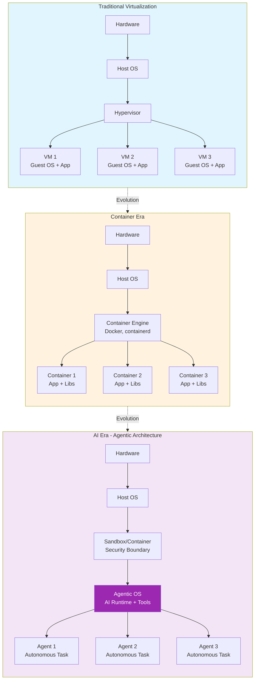
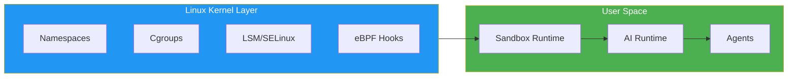
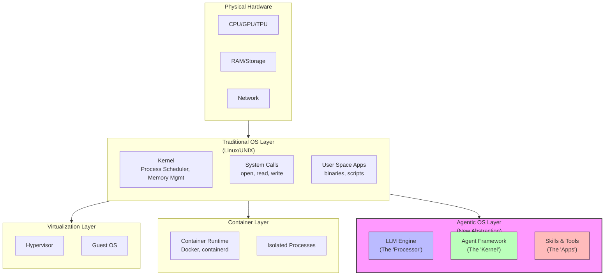

### USER
There are concepts of VMs and containers: 
OS -> VMs
OS -> containers

I add a new concept for the AI era:
OS -> container (sandbox) -> Agentic OS

Write a mermaid diagram for this scheme.

### ASSISTANT
# OS Isolation & Abstraction Evolution

Here's a Mermaid diagram illustrating the progression from traditional virtualization to the AI-era agentic architecture:



## Key Differences Table

| Aspect | VMs | Containers | Agentic OS (Sandboxed) |
|--------|-----|------------|------------------------|
| **Isolation Level** | Hardware (Hypervisor) | Process (Namespaces/Cgroups) | Process + AI Policy Layer |
| **Guest OS** | Full OS per VM | Shared Host OS Kernel | Shared Kernel + AI Runtime |
| **Overhead** | High (GBs RAM, minutes boot) | Low (MBs RAM, seconds start) | Low + AI Context Memory |
| **Security Boundary** | Strong (HW virtualization) | Moderate (Kernel shared) | Enhanced (Sandbox + AI Policies) |
| **Use Case** | Multi-tenant, different OS | Microservices, CI/CD | Autonomous AI Agents |
| **Bach Reference** | Not covered (pre-1986) | Not covered (pre-1986) | N/A (Emerging 2024+) |
| **Linux Kernel Ref** | KVM, Xen modules | namespaces, cgroups | LSM, seccomp, eBPF + AI |

## Architecture Notes



The **Agentic OS** concept adds a new abstraction layer where:
1. **Sandbox** provides security isolation (like containers)
2. **AI Runtime** manages agent lifecycle, memory, tools
3. **Agents** operate autonomously within bounded permissions

This builds on container technology but adds AI-specific concerns: tool access, memory context, decision auditing, and autonomous action boundaries.

### USER
The Agentic OS consists of its own layers:
LLM as a processor
Agent and tools as an OS
Skills as apps/packages

Expand the abstraction scheme with this additional abstraction.

### ASSISTANT
# Agentic OS Abstraction Scheme

This expansion integrates your proposed **Agentic OS** model into the evolution of computing abstraction. We treat the Large Language Model (LLM) not merely as an application, but as the fundamental execution engine, shifting the operating system's role from managing hardware resources to managing cognitive resources (intent, context, and tooling).

## 1. Evolution of Abstraction Layers

The following diagram illustrates the progression from traditional hardware virtualization to the Agentic OS layer. Note how the "Kernel" responsibility shifts from managing CPU cycles to managing reasoning steps.



## 2. Conceptual Mapping: UNIX vs. Agentic OS

Drawing from *The Design of the UNIX Operating System* (Bach) and *Linux Kernel Programming* (Billimoria), we can map traditional kernel concepts to this new Agentic paradigm. This helps ground the abstract AI concepts in familiar systems programming terminology.

| UNIX/Linux Concept (Bach/Billimoria) | Agentic OS Equivalent | Functionality Comparison |
| :--- | :--- | :--- |
| **CPU / Instruction Set** | **LLM Engine** | Executes fundamental operations (tokens/instructions) rather than binary opcodes. |
| **Kernel (Scheduler)** | **Agent Framework** | Orchestrates task flow, manages context windows, and decides when to invoke tools. |
| **System Calls** (`open`, `read`, `write`) | **Tool Invocations** | Controlled interfaces to external resources (APIs, databases, calculators). |
| **User Space Processes** | **Skills / Plugins** | Modular capabilities installed on top of the agent framework. |
| **Memory Management (VM/Paging)** | **Context Window Management** | Managing limited attention space, swapping information in/out of context (RAG). |
| **Interprocess Communication (IPC)** | **Message Passing / State** | Sharing state between different agent instances or skills. |
| **File System** | **Knowledge Base / Vector Store** | Persistent storage retrieval for long-term memory and facts. |
| **Permissions (UID/GID)** | **Policy & Safety Guards** | Controlling what tools/skills the agent is allowed to execute. |
| **Kernel Modules (LKM)** | **Dynamic Skill Loading** | Loading new capabilities without restarting the agent framework. |

## 3. Detailed Layer Breakdown

### Layer 1: LLM as a Processor
In this model, the LLM is the arithmetic logic unit (ALU) of the system.
*   **Instruction Set:** Natural language and tokens replace assembly instructions.
*   **Clock Cycle:** Inference step (token generation).
*   **State:** The hidden states and attention weights within the model.
*   **Constraint:** Unlike a deterministic CPU, the "processor" is probabilistic. The OS layer (Agent) must handle variance and potential hallucinations as "processing errors."

### Layer 2: Agent and Tools as an OS
This layer performs the duties traditionally assigned to the kernel (referencing Bach's kernel services):
*   **Scheduling:** Deciding which task to reason about next (Chain of Thought vs. Tree of Thoughts).
*   **Resource Management:** Managing the context window (RAM). When full, it must "swap out" older context to long-term storage (Vector DB) similar to paging to disk.
*   **Protection:** Ensuring the LLM does not execute unauthorized tools (similar to user/kernel mode separation).
*   **System Calls:** When the agent needs to act (e.g., `send_email`), it triggers a tool. This is analogous to a process invoking a system call to transition from user space to kernel space.

### Layer 3: Skills as Apps/Packages
These are the user-space utilities (referencing Billimoria's userspace tools):
*   **Modularity:** Skills are packaged units (e.g., "Python Interpreter," "Web Search," "SQL Query").
*   **Installation:** Similar to `apt install` or loading a Kernel Module (`insmod`), skills can be added to extend agent capabilities.
*   **Execution:** They run within the sandbox defined by the Agent Framework.

## 4. System Implications

### Memory Management (Context vs. RAM)
In *Linux Kernel Programming*, Billimoria details how the kernel manages physical pages. In an Agentic OS, the "Physical Memory" is the context window.
*   **Page Faults:** When the agent needs information not in the current context, it triggers a "Retrieval Fault," fetching data from the Vector Store (Disk) into the Context (RAM).
*   **Thrashing:** If the agent constantly retrieves irrelevant data, it suffers from context thrashing, degrading performance similar to disk thrashing in VMs.

### Scheduling (Reasoning vs. CPU Time)
In Bach's UNIX design, the scheduler allocates CPU time slices. In an Agentic OS:
*   **Time Slicing:** Allocating inference steps or token budgets to specific sub-tasks.
*   **Priority:** Critical safety checks or user overrides must preempt ongoing reasoning chains (similar to hardware interrupts preempting process execution).

### Security (Sandboxing)
Just as containers isolate processes (Chapter 1, Billimoria), the Agentic OS must sandbox skills.
*   **Risk:** A skill with access to `rm -rf` equivalent (e.g., `delete_database`) must be restricted.
*   **Mechanism:** The Agent Framework acts as the Security Module (like SELinux/AppArmor), validating tool arguments before passing them to the execution environment.

## 5. Updated Architecture Diagram

This diagram details the internal structure of the Agentic OS layer, mapping the components to their traditional OS counterparts.

```mermaid
blockDiagram
    block:Agentic_OS["Agentic OS Layer"]
        block:Skills["Skills Layer (User Space)"]
            S1[Search Skill]
            S2[Code Skill]
            S3[DB Skill]
        end
        block:Agent_Kernel["Agent Framework (Kernel)"]
            AK1[Context Manager]
            AK2[Tool Router]
            AK3[Policy Engine]
            AK4[Planner/Scheduler]
        end
        block:LLM_Processor["LLM Engine (Processor)"]
            LP1[Inference Engine]
            LP2[Token Stream]
        end
    end
    
    Skills <-.-> Agent_Kernel
    Agent_Kernel <-.-> LLM_Processor
    
    style Agentic_OS fill:#e1f5fe,stroke:#01579b
    style Skills fill:#fff3e0,stroke:#e65100
    style Agent_Kernel fill:#e8f5e9,stroke:#1b5e20
    style LLM_Processor fill:#f3e5f5,stroke:#4a148c
```

## 6. Conclusion

This abstraction treats the AI workflow as a first-class operating system citizen. By applying the rigorous design principles found in Bach (process states, system calls) and Billimoria (memory management, modules), we can engineer Agentic Systems that are robust, secure, and scalable, rather than treating them as opaque black boxes. The **Agent Framework** becomes the critical trust boundary, much like the **Kernel** in Linux.