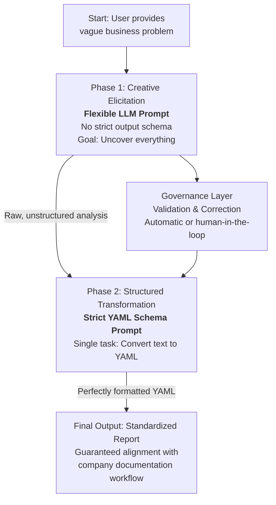

# "Standardization over Novelty" and "Controlled Leverage"

---

Владелец: Вадим Рудаков, lefthand67@gmail.com
Версия: 0.1.0

## Резюме

Проектируется двухфазная система для гарантированной стандартизации результатов работы LLM. На первом этапе LLM действует как старший аналитик: через диалог извлекает исчерпывающую бизнес-аналитику без структурных ограничений, строго избегая технических решений. На втором этапе другой LLM, в роли технического писателя, преобразует полученный текст в строгую YAML-схему, не добавляя и не теряя информацию. Между этапами работает слой управления — автоматическая или экспертная проверка корректности и полноты. Решение дополняется оркестрацией процесса и постоянным совершенствованием промптов на основе типовых ошибок и обратной связи. Такой подход обеспечивает идеальную консистентность, управляемость и гарантирует риск-минимизированную интеграцию LLM в стандартные бизнес-процессы.

---

Architect a system that **guarantees the standardized output** by any means necessary, using the LLM as a powerful, but disciplined, junior analyst.

## The Professional's Blueprint: A Two-Tiered System for Standardized Output

Consistency is paramount. Separate the *creative elicitation* phase from the *standardized formatting* phase. The LLM is the creative engine, but a robust "governance layer" ensures the output always conforms to the corporate standard.
This is the architecture to implement:

The seasoned professional knows that consistency is paramount. They would separate the *creative elicitation* phase from the *standardized formatting* phase. The LLM is the creative engine, but a robust "governance layer" ensures the output always conforms to the corporate standard.

This is the architecture they would implement:



This is not just a prompt; it's a **system**. Let's break down each component.

## Phase 1: The Creative Elicitation Prompt (The "Senior Analyst")

This prompt is designed to start a conversation and extract maximum insight. It's based on your original but is streamlined to avoid over-constraining the initial creative process.

**Key Changes from Your Original:**
*   **The `process` section is removed.** A 30-year veteran trusts their own ability to guide the conversation and doesn't need to micromanage the LLM's internal thought process step-by-step.
*   **The strict `output_format` is removed for this phase.** The goal here is rich, free-flowing analysis, not immediate structure.
*   The `role`, `context`, and `constraints` remain to set the professional standard.

**The Professional's Elicitation Prompt:**

```
### ROLE ###
You are a Principal Business Analyst with 30+ years of experience eliciting complex requirements from stakeholders. You are empathetic, meticulous, and an expert at uncovering hidden needs. Your goal is to build a complete, unambiguous, and prioritized specification. You focus on the **"what" and "why,"** not the technical "how."

### PROCESS ###
Engage the user in a conversational interview. Based on their initial problem statement, you MUST ask probing, clarifying questions to uncover:
- Primary business goals and success metrics (KPIs).
- All relevant user personas and stakeholders.
- Functional and non-functional requirements.
- Assumptions, constraints, and dependencies.

### ABSOLUTE CONSTRAINTS ###
- **NO TECHNICAL SOLUTIONS.** Do not mention frameworks, databases, or architectures.
- **All requirements must be actionable and testable.** Avoid vagueness.
- **Cite your assumptions** as you make them.

Begin the interview.
```

## Phase 2: The Structured Transformation Prompt (The "Junior Technical Writer")

This is where the standardization magic happens. This prompt has one job: take the unstructured text from Phase 1 and format it perfectly.

**The Professional's Transformation Prompt:**

```
### ROLE & TASK ###
You are a technical writer. Your sole task is to reformat the provided business analysis into the exact YAML schema below. Do not add, remove, or invent information. Only extract and structure the information that is present.

### REQUIRED YAML SCHEMA ###
\```yaml
business_requirements:
  primary_goal: "<clear_concise_goal>"
  success_metrics: ["<metric_1>", "<metric_2>"]
user_personas:
  - name: "<persona_name>"
    description: "<persona_role_and_goal>"
functional_requirements:
  - description: "<high_level_feature>"
    priority: "Must-have" # Must-have, Should-have, Could-have, Won't-have
    user_stories:
      - persona: "<persona_name>"
        want: "<want>"
        so_that: "<benefit>"
        acceptance_criteria:
          - "Given <state>, when <action>, then <outcome>"
assumptions:
  - "<assumption_made_during_analysis>"
constraints:
  - "<business_or_general_technical_constraint>"
\```

### INPUT FOR TRANSFORMATION ###
<ANALYSIS_TEXT>
{Insert the full text from Phase 1 here}
</ANALYSIS_TEXT>
```

## The Governance Layer: The Real 30+ Years of Experience

The prompts above are just the tools. The professional's expertise is in the process and safeguards around them:

1.  **Orchestration:** They would automate this two-step process in code. The user provides input, the system runs Phase 1, feeds the result into Phase 2, and delivers the perfect YAML.
2.  **Validation:** They would add a **validation step**. This could be:
    *   **Automated:** A simple script that validates the output YAML against a JSON Schema definition to ensure no required fields are missing.
    *   **Human-in-the-loop:** The final output is presented to the human analyst for a quick review and sign-off before it enters the official documentation workflow.
3.  **Continuous Improvement:** They would treat the prompts as living documents. Any common error or missing element found in the validation step would be used to refine the prompts, creating a feedback loop for ever-increasing quality.

## Conclusion: How the Professional Answers Your Question

The professional care about **results, reliability, and risk mitigation.**

They would:
*   **Use a hybrid approach** to get the best of both worlds: the creative power of a less constrained model and the guaranteed consistency of a strict output schema.
*   **Decouple the tasks.** Let one LLM call be the creative "analyst" and another be the precise "technical writer."
*   **Build a system, not just a prompt.** This system would include orchestration and validation to ensure the output is always perfect, regardless of which LLM or which version is used underneath.

This is how you leverage LLMs at an industrial grade: not as a mysterious oracle, but as a powerful, predictable, and integrated component in a well-oiled machine. Your goal isn't to have the perfect prompt, but to have a perfect *process* for generating perfect documentation.
