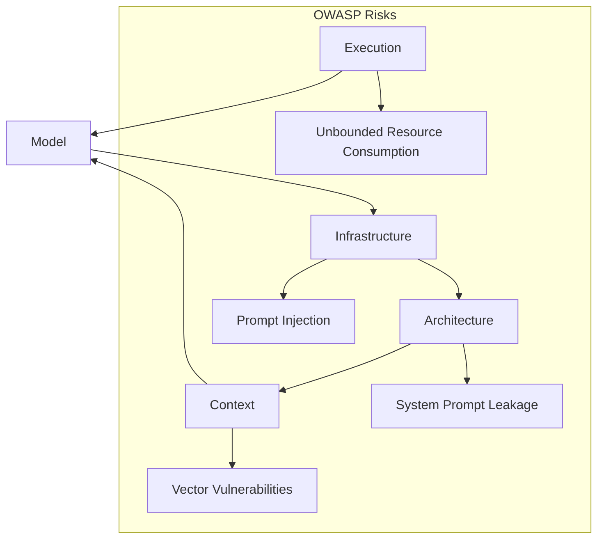

# Архитектурные слои LLM-системы

---

Owner: Vadim Rudakov, lefthand67@gmail.com  
Version: 1.1.0
Birth: 01.10.2025  
Modified: 01.10.2025  

---

Инженерия промптов и архитектура AI-систем 2025: многослойный подход с учетом DevSecOps и OWASP

## Часть I. Практический гайд для DevSecOps (быстрый старт)

Эта часть — **пошаговый гайд**. Его цель: быстро запустить и стабилизировать AI-систему с учётом DevSecOps и OWASP.

### Пять слоёв архитектуры

1. **Вычислительный слой (Execution)**: Hardware, optimization, performance
1. **Модельный слой (Model)**: Fine-tuning, datasets, model cards
1. **Инфраструктурный слой - промпт как инфраструктура (Prompt-as-Infrastructure)**: Version-controlled prompts, CI/CD, templates
1. **Слой оркестрации (Prompt Orchestration & Reasoning)**: Agents, frameworks, patterns
1. **Контекстный слой (Context)**: Vector DBs, knowledge graphs, retrieval

## Практические рекомендации

- Белый список адресов, rate limiting.
- Внедряйте OWASP-метрики в проверку промптов и pipeline (sanitization, rate-limiting).  
- Начинайте развитие с Infrastructure и Execution — фундамент для стабильной работы, затем Architecture + Context.
- Следите за latency и затратами (quantization, MoE).
- Используйте DSPy для ресурсоэффективного управления промптами, избегайте over-engineering.  
- Контролируйте энергопотребление, применяйте quantization и оптимизации моделей.
- OWASP и RBAC — must-have.
- Обучайте команду работе с DevSecOps-подходом и интеграцией с ML-операциями (например, MLflow для метрик).

### Скрытые ошибки

* **Технический долг**: быстрые прототипы на LangChain → потом тяжело поддерживать.
* **Over-engineering**: слишком сложные multi-agent схемы → рост latency и расходов.
* **Security debt**: забытые system prompts → утечки.

## <b>Часть II. Корпоративный стандарт (глубина и обоснования)</b>

### Введение

В современных AI-системах качество архитектуры и безопасность имеют решающее значение. Эта статья призвана предоставить профессиональное и в то же время доступное руководство для инженеров и DevSecOps-специалистов, работающих с локальными и open-source моделями (например, Llama 3.1 4B, Phi-3), применяющими инструменты DSPy, Pydantic, Chain-of-Thought (CoT) и Retrieval-Augmented Generation (RAG).

Уделено внимание актуальным рискам безопасности, рекомендациям OWASP 2025, а также практическим советам и примерам, применимым именно в контексте анализа логов (syslogs, SQL-запросы к базе).

### 1. Вычислительный слой (Execution Layer)

Этот слой содержит аппаратное и программное обеспечение, обеспечивающее выполнение моделей с заданной производительностью и стабильностью.

- **Ключевые задачи:** 
	- минимизация задержек (latency обычно <100 ms), 
	- эффективное использование ресурсов, 
	- стабильность при нагрузках.
	
- **Компоненты:** 
	- GPU/TPU (например, Nvidia RTX 4000), 
	- оптимизации для inference (quantization INT8, batching через TensorRT), 
	- сетевые API для потоковой обработки.

- **Важные ограничения и риски:**
  - Quantization снижает точность моделей примерно на 5–10%.
  - Уязвимость к DoS-атакам с неограниченным потреблением ресурсов (OWASP LLM10).
  - side-channel атаки на GPU.
  
- **Практические рекомендации:** 
	- изоляция inference-контейнеров, 
	- observability (Prometheus + Grafana),
	- ограничивайте количество запросов (rate limiting), чтобы защититься от атак.

- **Иллюстрация:**  

```python
import torch
from transformers import AutoModelForCausalLM
model = AutoModelForCausalLM.from_pretrained("microsoft/Phi-3-mini-4b", load_in_8bit=True)
output = model("Analyze syslog error: timeout")
```

### 2. Модельный слой (Model Architecture and Training Layer)

Слой, отвечающий за архитектуру и обучение модели с учётом специфики задачи.

- **Задачи:** 
	- адаптация модели под задачи,
	- предотвращение переобучения,
	- повысить точность и объяснимость.

- **Состав:** трансформеры типа Phi-3 4B, с MoE-компонентами для повышения эффективности, fine-tuning с LoRA для экономии ресурсов.

- **Риски:**
	- Атаки на данные (data poisoning).
	- Переобучение (overfitting).
	- Усиление смещений (bias amplification).
	- Высокие вычислительные и энергетические затраты (обучение GPT-4 эквивалентно 355 GPU-летам).
	- Невоспроизводимое обучение (non-reproducible training).

- **Практические рекомендации:** 
	- проводите аудит данных для соответствия требованиям EU AI Act,
	- data lineage → MLflow + DVC (Data Version Control),
	- валидация датасетов,
	- модельные карты (model cards - стандартизированные документы, описывающие модели машинного обучения и LLM, чтобы команда и стейкхолдеры понимали, как, для чего и с какими ограничениями их можно использовать).

- **Иллюстрация:**

```python
from peft import LoraConfig, get_peft_model

config = LoraConfig(r=8, lora_alpha=16, target_modules=["q_proj"])
model = get_peft_model(model, config)
```

### 3. Промпт как инфраструктура (Prompt-as-Infrastructure)

Промпты — это управляемые, версионируемые конфигурации, а не просто текст.

- **Цель:** 
	- воспроизводимость (reproducibility), 
	- аудит изменений (auditability), 
	- интеграция с CI/CD.

- **Практики:** хранение в структурированных файлах YAML/JSON с semantic versioning, контроль через Git, автоматическая валидация с использованием Pydantic.

- **Риски:** 
	- prompt injection (OWASP LLM01), 
	- утечка секретов при отсутствии контроля доступа.
	
- **Рекомендации:** 
	- реализуйте RBAC и аудит активности,
	- GitOps для промптов,
    - CI/CD тестирование промптов (pytest + golden prompts).

- **Пример YAML для промпта:**
  ```yaml
  prompt:
    version: "1.0.0"
    text: "Parse syslog: {log} into JSON"
    rbac: ["sec_ops"]
  ```

### 4. Слой оркестрации (Prompt Orchestration & Reasoning Layer)

Отвечает за логику, последовательность и интеграцию промптов.

- **Цель:** структурировать reasoning и повысить точность.

- **Состав:** 
	- DSPy (сосредоточен на программной авто-оптимизации и структурировании reasoning), 
	- LangChain (ориентирован на построение workflow с интеграцией данных и API; но больше латентность).

- **Функции:** 
	- Chain-of-Thought (CoT) - ориентирован на расширение prompt-а с текстовым рассуждением, 
	- Retrieval-Augmented Generation (RAG) - генерация ответа дополняется релевантной информацией из внешних баз данных или векторных индексов, расширяя контекст и снижая вероятность ошибок,
	- мультиагентные сценарии -  координация нескольких LLM или специализированных агентов с разделением ролей и совместной работой для решения комплексных задач.

- **Риски:** 
	- утечка системных промптов (OWASP LLM02 - system prompt leakage), 
	- сложность отладки в LangChain.

- **Сравнительная таблица:**

| Фреймворк | Преимущества                     | Ограничения                   | Рекомендуемое использование          |
|-----------|---------------------------------|-------------------------------|-------------------------------------|
| **DSPy**  | Автоматический tuning, высокое качество | Зависит от обучающих данных     | Продакшн и сложные пайплайны         |
| **LangChain** | Лучшие интеграции, флексибильность | Повышенная задержка, debug-сложности | Быстрые прототипы, SQL-интеграция  |

- **Рекомендации:** 
	- фильтруйте ввод для избежания injection.
	- DSPy для промышленной эксплуатации,
	- LangChain для экспериментальных прототипов,
	- red-teaming (симуляция атак на промпты).

### 5. Контекстный слой (Context Layer)

Обеспечивает систему релевантного контекста и управляет динамическими данными. Retrieving and managing data (context).

- **Задачи:** 
	- оптимизация токенового окна, 
	- повышение качества вывода,
	- точность поиска и персонализация,
	- борьба с галлюцинациями.

- **Инструменты:** FAISS, Pinecone для векторного поиска; базы данных SQL, графовые БД Neo4j для паттернов.

- **Риски:** 
	- уязвимости в векторных индексах (OWASP LLM08),
	- атаки на обращение модели (model inversion attacks) - тип атак на большие языковые модели (LLM), при которых злоумышленник пытается извлечь или восстановить конфиденциальную информацию из обучающих данных модели, анализируя её ответы на специально разработанные запросы
	- шумные retrieval-сеты - наборы данных или фрагментов информации, которые извлекаются системой поиска (например, в Retrieval-Augmented Generation, RAG) из внешних источников, но содержат значительное количество нерелевантных, избыточных или неточных данных.
	
- **Рекомендации:** 
  - hybrid retrieval (semantic + keyword) - метод поиска, который объединяет семантический (по смыслу) и ключевой (по точному совпадению слов) подходы для повышения качества извлечения релевантной информации в Retrieval-Augmented Generation (RAG). ,
  - регулярная очистка индексов,
  - контроль версий баз знаний.

- **Пример RAG:**

```python
import faiss
from sentence_transformers import SentenceTransformer

model = SentenceTransformer('all-MiniLM-L6-v2')
embeddings = model.encode(logs)
index = faiss.IndexFlatL2(384)
index.add(embeddings)
D, I = index.search(model.encode(query), k=5)
```

### Взаимосвязь и цикличность слоев

В архитектуре многослойная взаимосвязь, а не линейная иерархия.



Цикл обратной связи Context → Model обеспечивает адаптивность моделей и повышение качества.

### Структура репозитория для DevSecOps-команд

```
ai/
├── 1_execution/                          # Вычислительный слой (Execution Layer)
│   ├── inference/                        # Inference optimization & hardware
│   │   ├── optimization_guides/          # Quantization (INT8), TensorRT, batching
│   │   ├── hardware_configs/             # GPU/TPU specs, container setups
│   │   └── resource_management/          # Rate limiting, autoscaling policies
│   └── performance/                      # Performance monitoring & benchmarks
│       ├── benchmarks/                   # Latency, throughput, cost tests
│       └── dashboards/                   # Grafana dashboards, Prometheus configs
│
├── 2_model/                              # Модельный слой (Model Layer)
│   ├── selection/                        # Model evaluation & comparison
│   │   └── model_cards/                  # Cards for Phi-3, Llama, etc.
│   ├── training/                         # Fine-tuning & adaptation
│   │   ├── configurations/               # LoRA, PEFT configs
│   │   └── datasets/                     # Curated datasets, data lineage docs
│   └── validation/                       # Model validation & auditing
│       └── bias_mitigation/              # Techniques for fairness
│
├── 3_infrastructure/                     # Инфраструктурный слой (Prompt-as-Code)
│   ├── templates/                        # Git-versioned prompt assets
│   │   ├── agent_prompts/                # Reusable AI roles (the core infrastructure)
│   │   │   ├── business_analyst/         # e.g., Phase 1 Agent
│   │   │   │   ├── system_prompt.yaml
│   │   │   │   ├── user_prompt_template.yaml
│   │   │   │   └── few_shot_examples.yaml
│   │   │   └── senior_engineer/          # e.g., Phase 3 Agent
│   │   │       └── system_prompt.yaml
│   │   └── schema_validation             # Pydantic/YAML schemas for validation
│   │       ├── prompt_schema.yaml
│   │       └── output_schema.yaml
│   ├── ci_cd/                            # CI/CD for prompt management
│   │   ├── workflows/                    # GitHub Actions/GitLab CI for prompts
│   │   └── validation_tests/             # Automated security/sanity tests
│   └── access_control/                   # RBAC policies for prompt modification
│
├── 4_orchestration/                      # Слой оркестрации (Orchestration Layer)
│   ├── frameworks/                       # Evaluation & integration of frameworks
│   │   ├── dspy/                         # DSPy modules & programs (production)
│   │   └── langchain/                    # LangChain chains (prototyping)
│   ├── patterns/                         # Architectural patterns
│   │   ├── chain_of_thought/             # CoT implementations
│   │   ├── rag/                          # RAG pipelines
│   │   └── multi_agent/                  # Multi-agent design blueprints, i.e. modules
│   └── workflows/                        # Operational orchestration scripts
│       └── run_analysis_workflow.sh      # execution lever, e.g. script to chain agents
│
├── 5_context/                            # Контекстный слой (Context Engineering)
│   ├── vector_stores/                    # Vector database configurations
│   │   ├── faiss/                        # FAISS indices & configs
│   │   └── pinecone/                     # Pinecone setup
│   ├── knowledge_bases/                  # Structured knowledge sources
│   │   ├── sql/                          # SQL queries, schemas
│   │   └── neo4j/                        # Knowledge graphs
│   └── retrieval/                        # Retrieval strategies & optimization
│       ├── strategies/                   # Hybrid, semantic, keyword
│       └── optimization/                 # Token management, chunking
│
├── mlops/                                # Cross-layer MLOps & DevSecOps
│   ├── monitoring/                       # Live monitoring & alerting
│   ├── testing/                          # Red teaming, quality control
│   └── security/                         # OWASP compliance, audit logs
│
├── benchmarks/                           # Performance & accuracy tracking
│   ├── performance/                      # Latency, throughput
│   └── accuracy/                         # Quality, hallucination rates
│
├── case_studies/                         # Real-world implementations & post-mortems
│   ├── production_deployments/
│   └── lessons_learned/
│
└── resources/                            # General knowledge base
    ├── glossary.md
    ├── security_checklist.md             # OWASP Top 10 mitigation checklist
    └── architectural_decisions.md        # ADRs for key design choices
```

### Особое внимание на безопасность

```
ai/
├── 1_execution/
│   └── security/                         # Layer-specific implementation
├── 2_model/
│   └── security/
├── 3_infrastructure/                     # This is your Prompt-as-Code layer
│   └── security/                         # <<< Most critical for prompt injection
├── 4_orchestration/
│   └── security/
├── 5_context/
│   └── security/
├── security/                             # <<< NEW: Centralized hub for policies & tools
├── mlops/                                # MLOps already has monitoring/testing
├── benchmarks/
└── resources/
```

This hybrid approach creates a **Defense-in-Depth** strategy:

1.  **Central Hub (`/security/`):** Provides the **"what"** and **"why"** – the policies, standards, and shared tools.
2.  **Embedded Security (`/layer/security/`):** Provides the **"how"** – the layer-specific implementation of those policies.

This means a developer working in the `3_infrastructure` layer doesn't need to leave that context to find the relevant security guidelines. They are right there, next to the code and prompts they are securing.

Также смотри руководство по хранению руководств: `culture/HANDBOOKS.md`.
