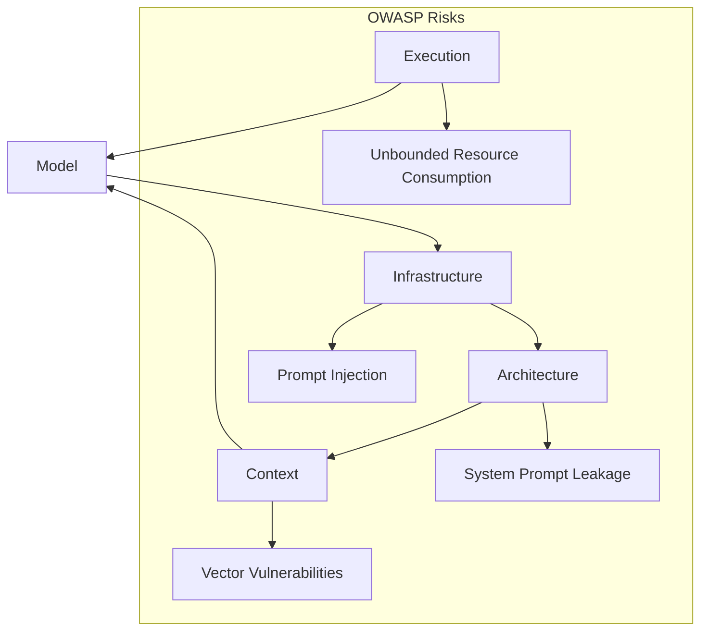

## A Multi-Layered AI System Architecture

---

Owner: Vadim Rudakov, lefthand67@gmail.com  
Version: 0.1.0
Birth: 10.09.2025  
Modified: 21.10.2025  

---

## Part I. A Practical Guide for DevSecOps (Quick Start)

This part is a step-by-step guide. Its goal is to quickly launch and stabilize an AI system with DevSecOps and OWASP considerations.

**Five Architecture Layers**

|| Layer | Key Components |
| --- | --- | --- |
|1.| **Execution Layer** | Hardware, optimization, performance |
|2.| **Model Layer** | Fine-tuning, datasets, model cards |
|3.| **Prompt-as-Infrastructure Layer** (How an agent thinks/acts)| Version-controlled prompts, CI/CD, templates |
|4.| **Prompt Orchestration & Reasoning Layer** (How the agents communicate)| Agents, frameworks, patterns |
|5.| **Context Layer** | Vector DBs, knowledge graphs, retrieval |

**Practical Recommendations**

  * **Whitelisting** addresses, **rate limiting**.
  * Implement **OWASP metrics** in prompt and pipeline checks (sanitization, rate-limiting).
  * Start development with **Infrastructure and Execution**—the foundation for stable operation—then Architecture (Model) + Context.
  * Monitor latency and costs (**quantization, MoE**).
  * Use **DSPy** for resource-efficient prompt management; avoid over-engineering.
  * Control power consumption, apply quantization and model optimizations.
  * **OWASP and RBAC** are a must-have.
  * Train the team on the **DevSecOps** approach and integration with ML operations (e.g., MLflow for metrics).

**Hidden Mistakes**

  * **Technical debt:** Quick prototypes on LangChain $\rightarrow$ difficult to maintain later.
  * **Over-engineering:** Overly complex multi-agent schemes $\rightarrow$ increased latency and costs.
  * **Security debt:** Forgotten system prompts $\rightarrow$ leaks.

-----

### Part II. Corporate Standard (Depth and Rationale)

**Introduction**

In modern AI systems, the quality of architecture and security are crucial. This article aims to provide a professional yet accessible guide for engineers and DevSecOps specialists working with local and open-source models (e.g., Llama 3.1 4B, Phi-3), applying tools like **DSPy, Pydantic, Chain-of-Thought (CoT), and Retrieval-Augmented Generation (RAG)**.

Attention is given to current security risks, **OWASP 2025 recommendations**, as well as practical advice and examples specifically applicable in the context of log analysis (syslogs, SQL queries to the database).

#### 1. Execution Layer

This layer contains the hardware and software that ensures model execution with specified performance and stability.

**Key Tasks:**

- Minimizing latency (latency usually $<100$ ms),
- Efficient resource utilization (CUDA optimization),
- Stability under load.

Here’s the table including **cost efficiency versus performance impact**, matching what an AI infrastructure design document in a production environment would look like:

| Category | Components | Constraints and Risks | Practical Recommendations | Mitigation Rationale | Cost Efficiency vs. Performance Impact |
|-----------|-------------|------------------------|-----------------------------|-----------------------|----------------------------------------|
| **Core Infrastructure** | Operating system (Linux, RTOS) | Kernel and syscall vulnerabilities affecting GPU memory isolation | Harden OS kernel, apply real-time patches only if deterministic latency is required | Limits attack surface and kernel exploit exposure | RTOS offers low latency (~10–20% better response) but increases maintenance and licensing cost |
| **Hardware Acceleration** | GPU/TPU (e.g., Nvidia RTX 4090, H100) | Side-channel leaks, unbounded GPU utilization | Enable MIG, enforce thermal and power limits via DCGM | Physical partitioning and monitoring prevent data leaks | MIG isolation lowers throughput by ~15% but saves 30–40% energy per instance |
| **Compute Optimization** | CUDA kernels, TensorRT batching, quantization (INT8/FP16) | Quantization can reduce accuracy; improper CUDA tuning causes kernel stalls | Mixed-precision policy: INT8 for embeddings, FP16 for logits | Balances accuracy with energy efficiency | INT8 gives ~3× speedup and 60% cost reduction; FP16 achieves near-original accuracy with 1.5× throughput |
| **Networking and APIs** | gRPC/WebSocket for streaming inference | DoS, request floods, model endpoint exhaustion | Use Envoy filters, tokenized rate limiting, server-side batching | Protects endpoints, maintains SLA under attack | Rate limiting costs negligible; dynamic batching improves GPU occupancy up to 25% |
| **Observability and Control** | Prometheus + Grafana stack | Metrics misexposure or information leakage | Gather metrics via dedicated proxy; segregate telemetry network | Keeps internal signals safe while providing full visibility | ~1–2% CPU overhead; prevents debug leaks that could cost downtime or compliance fines |

Each optimization here reflects field-hardened design trade-offs. For instance, INT8 quantization is ideal for large-scale recommendation models where minor losses in precision are masked by the ensemble, whereas fine-tuned biomedical or legal models typically require at least FP16 inference.

**Illustration:**

```python
import torch
from transformers import AutoModelForCausalLM

model = AutoModelForCausalLM.from_pretrained("microsoft/Phi-3-mini-4b", load_in_8bit=True)
output = model("Analyze syslog error: timeout")
```

#### 2. Model Architecture and Training Layer

The layer responsible for the model's architecture and training, considering the task's specificity.

**Tasks:**

  * Adapting the model for the tasks,
  * Preventing overfitting,
  * Increasing accuracy and explainability.

**Composition:** Transformers like Phi-3 4B, with **MoE** components to enhance efficiency, fine-tuning with **LoRA** for resource saving.

**Risks:**

  * Data poisoning attacks.
  * Overfitting.
  * Bias amplification.
  * High computational and energy costs (training GPT-4 is equivalent to 355 GPU-years).
  * Non-reproducible training.

**Practical Recommendations:**

  * Conduct a **data audit** for compliance with the EU AI Act,
  * **Data lineage** $\rightarrow$ MLflow + DVC (Data Version Control),
  * Dataset validation,
  * **Model cards** (standardized documents describing machine learning models and LLMs so that the team and stakeholders understand how, for what purpose, and with what limitations they can be used).

**Illustration:**

```python
from peft import LoraConfig, get_peft_model

config = LoraConfig(r=8, lora_alpha=16, target_modules=["q_proj"])
model = get_peft_model(model, config)
```

#### 3\. Prompt-as-Infrastructure

Prompts are managed, version-controlled configurations, not just text.

**Goal:**

  * Reproducibility,
  * Auditability of changes,
  * Integration with CI/CD.

**Practices:** Storage in structured YAML/JSON files with semantic versioning, control via **Git**, automatic validation using **Pydantic**.

**Risks:**

  * **Prompt injection (OWASP LLM01)**,
  * Secret leakage in the absence of access control.

**Recommendations:**

  * Implement **RBAC** and activity auditing,
  * **GitOps for prompts**,
  * CI/CD testing of prompts (**pytest + golden prompts**).

**YAML Example for a Prompt:**

```yaml
prompt:
  version: "1.0.0"
  text: "Parse syslog: {log} into JSON"
  rbac: ["sec_ops"]
```

#### 4\. Prompt Orchestration & Reasoning Layer

Responsible for the logic, sequence, and integration of prompts.

**Goal:** Structure reasoning and increase accuracy.

**Composition:**

  * **DSPy** (focused on programmatic auto-optimization and structuring reasoning),
  * **LangChain** (focused on building workflows with data and API integration; but higher latency).

**Functions:**

  * **Chain-of-Thought (CoT)** - focused on extending the prompt with textual reasoning,
  * **Retrieval-Augmented Generation (RAG)** - answer generation is supplemented with relevant information from external databases or vector indices, expanding the context and reducing the likelihood of errors,
  * **Multi-agent scenarios** - coordination of several LLMs or specialized agents with role separation and collaboration to solve complex tasks.

**Risks:**

  * System prompt leakage (**OWASP LLM02**),
  * Difficulty in debugging in LangChain.

**Comparison Table:**

| Framework | Advantages | Limitations | Recommended Use |
| :--- | :--- | :--- | :--- |
| **DSPy** | Automatic tuning, high quality | Depends on training data | Production and complex pipelines |
| **LangChain** | Better integrations, flexibility | Increased latency, debug complexity | Quick prototypes, SQL integration |

**Recommendations:**

  * Filter input to prevent injection.
  * **DSPy** for industrial operation,
  * **LangChain** for experimental prototypes,
  * **Red-teaming** (simulation of attacks on prompts).

#### 5\. Context Layer

Provides the system with relevant context and manages dynamic data. Retrieving and managing data (context).

**Tasks:**

  * Optimizing the token window,
  * Improving output quality,
  * Search accuracy and personalization,
  * Combating hallucinations.

**Tools:** **FAISS, Pinecone** for vector search; SQL databases, Neo4j graph DBs for patterns.

**Risks:**

  * Vulnerabilities in vector indices (**OWASP LLM08**),
  * **Model inversion attacks** - a type of attack on large language models (LLMs) in which an attacker tries to extract or reconstruct confidential information from the model's training data by analyzing its responses to specially crafted queries,
  * **Noisy retrieval sets** - datasets or information fragments that are retrieved by a search system (e.g., in Retrieval-Augmented Generation, RAG) from external sources but contain a significant amount of irrelevant, redundant, or inaccurate data.

**Recommendations:**

  * **Hybrid retrieval** (semantic + keyword) - a search method that combines semantic (by meaning) and keyword (by exact word match) approaches to improve the quality of relevant information retrieval in Retrieval-Augmented Generation (RAG),
  * Regular index cleaning,
  * Version control for knowledge bases.

**RAG Example:**

```python
import faiss
from sentence_transformers import SentenceTransformer

model = SentenceTransformer('all-MiniLM-L6-v2')
embeddings = model.encode(logs)
index = faiss.IndexFlatL2(384)
index.add(embeddings)
D, I = index.search(model.encode(query), k=5)
```

-----

### Interconnection and Cyclical Nature of Layers

In the architecture, there is a **multi-layered interconnection**, not a linear hierarchy.



The **Context $\rightarrow$ Model feedback loop** ensures model adaptability and quality improvement.

### Repository Structure for DevSecOps Teams

```
ai/
├── 1_execution/                          # Вычислительный слой (Execution Layer)
│   ├── inference/                        # Inference optimization & hardware
│   │   ├── optimization_guides/          # Quantization (INT8), TensorRT, batching
│   │   ├── hardware_configs/             # GPU/TPU specs, container setups
│   │   └── resource_management/          # Rate limiting, autoscaling policies
│   └── performance/                      # Performance monitoring & benchmarks
│       ├── benchmarks/                   # Latency, throughput, cost tests
│       └── dashboards/                   # Grafana dashboards, Prometheus configs
│
├── 2_model/                              # Модельный слой (Model Layer)
│   ├── selection/                        # Model evaluation & comparison
│   │   └── model_cards/                  # Cards for Phi-3, Llama, etc.
│   ├── training/                         # Fine-tuning & adaptation
│   │   ├── configurations/               # LoRA, PEFT configs
│   │   └── datasets/                     # Curated datasets, data lineage docs
│   └── validation/                       # Model validation & auditing
│       └── bias_mitigation/              # Techniques for fairness
│
├── 3_infrastructure/                     # Инфраструктурный слой (Prompt-as-Code)
│   ├── templates/                        # Git-versioned prompt assets
│   │   ├── agent_prompts/                # Reusable AI roles (the core infrastructure)
│   │   │   ├── business_analyst/         # e.g., Phase 1 Agent
│   │   │   │   ├── system_prompt.yaml
│   │   │   │   ├── user_prompt_template.yaml
│   │   │   │   └── few_shot_examples.yaml
│   │   │   └── senior_engineer/          # e.g., Phase 3 Agent
│   │   │       └── system_prompt.yaml
│   │   └── schema_validation             # Pydantic/YAML schemas for validation
│   │       ├── prompt_schema.yaml
│   │       └── output_schema.yaml
│   ├── ci_cd/                            # CI/CD for prompt management
│   │   ├── workflows/                    # GitHub Actions/GitLab CI for prompts
│   │   └── validation_tests/             # Automated security/sanity tests
│   └── access_control/                   # RBAC policies for prompt modification
│
├── 4_orchestration/                      # Слой оркестрации (Orchestration Layer)
│   ├── frameworks/                       # Evaluation & integration of frameworks
│   │   ├── dspy/                         # DSPy modules & programs (production)
│   │   └── langchain/                    # LangChain chains (prototyping)
│   ├── patterns/                         # Architectural patterns
│   │   ├── chain_of_thought/             # CoT implementations
│   │   ├── rag/                          # RAG pipelines
│   │   └── multi_agent/                  # Multi-agent design blueprints, i.e. modules
│   └── workflows/                        # Operational orchestration scripts
│       └── run_analysis_workflow.sh      # execution lever, e.g. script to chain agents
│
├── 5_context/                            # Контекстный слой (Context Engineering)
│   ├── vector_stores/                    # Vector database configurations
│   │   ├── faiss/                        # FAISS indices & configs
│   │   └── pinecone/                     # Pinecone setup
│   ├── knowledge_bases/                  # Structured knowledge sources
│   │   ├── sql/                          # SQL queries, schemas
│   │   └── neo4j/                        # Knowledge graphs
│   └── retrieval/                        # Retrieval strategies & optimization
│       ├── strategies/                   # Hybrid, semantic, keyword
│       └── optimization/                 # Token management, chunking
│
├── mlops/                                # Cross-layer MLOps & DevSecOps
│   ├── monitoring/                       # Live monitoring & alerting
│   ├── testing/                          # Red teaming, quality control
│   └── security/                         # OWASP compliance, audit logs
│
├── benchmarks/                           # Performance & accuracy tracking
│   ├── performance/                      # Latency, throughput
│   └── accuracy/                         # Quality, hallucination rates
│
├── case_studies/                         # Real-world implementations & post-mortems
│   ├── production_deployments/
│   └── lessons_learned/
│
└── resources/                            # General knowledge base
    ├── glossary.md
    ├── security_checklist.md             # OWASP Top 10 mitigation checklist
    └── architectural_decisions.md        # ADRs for key design choices
```

#### Special Attention to Security

```
ai/
├── 1_execution/
│   └── security/                         # Layer-specific implementation
├── 2_model/
│   └── security/
├── 3_infrastructure/                     # This is your Prompt-as-Code layer
│   └── security/                         # <<< Most critical for prompt injection
├── 4_orchestration/
│   └── security/
├── 5_context/
│   └── security/
├── security/                             # <<< NEW: Centralized hub for policies & tools
├── mlops/                                # MLOps already has monitoring/testing
├── benchmarks/
└── resources/
```

This hybrid approach creates a **Defense-in-Depth** strategy:

  * **Central Hub (`/security/`):** Provides the "what" and "why"—the policies, standards, and shared tools.
  * **Embedded Security (`/layer/security/`):** Provides the "how"—the layer-specific implementation of those policies.

This means a developer working in the `3_infrastructure` layer doesn't need to leave that context to find the relevant security guidelines. They are right there, next to the code and prompts they are securing.
