# Local LLM Inference: A Practical Handbook for Hybrid CPU/GPU Execution and KV Cache Offloading

---

Owner: Vadim Rudakov, lefthand67@gmail.com  
Version: 0.1.0  
Birth: 23.11.2025  
Modified: 23.11.2025

---

> INFO: *This handbook section is optimized for environments supporting Mermaid.js diagrams. For static export, rasterized versions are available in Appendix B.*

When a user hits "enter" after typing a prompt, the system triggers a complex collaboration between the Central Processing Unit (**CPU**) and the Graphics Processing Unit (**GPU**). This is called **Hybrid Execution**.

> **Engineering Mindset Check:**  
> Your job as an AI Engineer is to manage the trade-offs between CPU's vast memory capacity and GPU's raw speed. Where should your precious data live and be processed?

### 📘 Glossary of Acronyms (Part II)

| Acronym | Full Name                      | Context/Role                                     |
|---------|--------------------------------|------------------------------------------------|
| CPU     | Central Processing Unit         | Orchestrates processing, I/O, and pre/post tasks. |
| GPU     | Graphics Processing Unit        | Executes parallel matrix compute operations.    |
| VRAM    | Video RAM                      | High-speed memory on GPU; major capacity limit. |
| RAM     | Random Access Memory           | CPU system memory used for offloading.          |
| KV Cache| Key-Value Cache                | Stores attention vectors for past tokens.       |
| TTFT    | Time To First Token            | Latency metric for Prefill phase.                |
| TPOT    | Time Per Output Token          | Throughput metric for Decode phase.              |
| PCI-E   | Peripheral Component Interconnect Express | High-speed CPU-GPU interconnect, bottleneck for offloading. |

```{glossary}
CPU (Central Processing Unit)
    Orchestrates processing, I/O, and pre/post tasks.

GPU (Graphics Processing Unit)
    Executes parallel matrix compute operations.

VRAM (Video RAM)
    High-speed memory on GPU; major capacity limit.

RAM (Random Access Memory)
    CPU system memory used for offloading.

KV Cache (Key-Value Cache)
    Stores attention vectors for past tokens.

TTFT (Time To First Token)
    Latency metric for Prefill phase.

TPOT (Time Per Output Token)
    Throughput metric for Decode phase.

PCI-E (Peripheral Component Interconnect Express)
    High-speed CPU-GPU interconnect, bottleneck for offloading.
```

***

***

### Chapter 3: The Local Inference Pipeline: A Guided Scenario

We will follow a typical prompt journey using the scenario: running a **Mistral 7B** model locally with a high-end CPU, 32GB system RAM, and a consumer 8GB VRAM GPU.

#### 3.1 Phase 1: The Prefill (Fast, Parallel Compute)

The model processes the entire prompt in parallel during this phase, marked by high GPU utilization and measured as **Time To First Token (TTFT)**.

- **Goal:** Quickly process the input sequence to generate the first token and build the initial **Key-Value Cache (KV Cache)**.
- **Action:** The CPU tokenizes text and coordinates slow PCI-E transfers of weights/data to GPU. The GPU then executes parallel matrix multiplications.
- **Workflow Visualization:** Note the data transfer bottleneck across PCI-E and the computational dominance of the GPU cores.

```{mermaid} Diagram 1: Prefill Phase Workflow (Sequence Diagram)
sequenceDiagram
    participant SSD
    participant RAM
    participant CPU
    participant GPU
    participant VRAM

    SSD->>RAM: Load model weights (slow I/O)
    CPU->>RAM: Tokenize prompt
    CPU->>VRAM: Transfer tokens and weights (via PCI-E)
    GPU->>VRAM: Compute attention (matrix mult)
    GPU->>VRAM: Build KV Cache
    GPU-->>CPU: First token ready
```


| Step                 | Device Dominant | Action                                       | Primary Bottleneck          |
|----------------------|-----------------|----------------------------------------------|----------------------------|
| 1. Cold Start / I/O   | **CPU**         | Load weights from SSD to system RAM          | SSD speed (initial latency) |
| 2. Preprocessing     | **CPU**         | Tokenize prompt, prepare tensors, transfer   | PCI-E bandwidth            |
| 3. Compute & Cache   | **GPU**         | Matrix multiplies, builds KV Cache           | GPU FLOPS                 |

> **Key Takeaway:** Prefill phase is **compute-bound**. Faster GPU processing reduces TTFT.

***

#### 3.2 Phase 2: The Decode (Sequential Memory Access)

After the first token is generated, subsequent tokens are created one at a time referencing the expanding KV Cache. The loop is bandwidth-bound and measured by **Time Per Output Token (TPOT)**.

- **Goal:** Efficiently generate tokens referencing the conversation's entire history in the KV Cache.
- **Action:** GPU fetches weights and KV Cache repeatedly from VRAM as the cache grows linearly.
- **KV Cache Growth & Offload Trigger:**

```mermaid
flowchart TB
    subgraph GPU_VRAM["GPU VRAM (8GB)"]
        KV_Cache["KV Cache (grows with tokens)"]
        Weights["Model Weights (static)"]
    end

    GPU_VRAM -->|Linear growth| MemoryAlert{"VRAM > 95% full?"}
    MemoryAlert -->|Yes| Offload["Offload oldest KV blocks → CPU RAM"]
    MemoryAlert -->|No| Continue["Continue in VRAM"]

    subgraph CPU_RAM["CPU RAM (32GB)"]
        OffloadedBlocks["Offloaded KV Blocks (compressed)"]
    end

    Offload --> CPU_RAM

    style GPU_VRAM stroke:#FF5722,stroke-width:2px
    style CPU_RAM stroke:#2196F3,stroke-width:2px
```



***

### Chapter 4: The VRAM/RAM Trap: Bottlenecks and Hybrid Execution

#### 4.1 The Key-Value (KV) Cache: The VRAM Killer

The KV Cache stores attention vectors for past tokens, significantly reducing computations but consuming high-speed GPU VRAM.

| KV Cache Characteristic | Engineering Challenge                          |
|------------------------|------------------------------------------------|
| **Linear Growth**      | Cache size grows linearly with conversation length. |
| **VRAM Limit**         | Cache saturation (e.g., 8GB VRAM) causes stalls or crashes. |

**Memory Pressure Timeline:**


> **🔥 Critical Pitfall:** Exceeding 4,000 tokens on 8GB VRAM stalls or crashes inference.

***

#### 4.2 KV Cache Offloading: The Hybrid Solution

Hybrid execution frameworks like `llama.cpp` offload KV Cache blocks to CPU RAM when VRAM fills.

- **The Solution:** Page older KV Cache parts from GPU VRAM to CPU RAM (32GB).
- **Trade-off:** Access latency increases due to PCI-E transfers causing 5x–10x slower TPOT.

**Offloading Event Workflow:**


| Bottleneck       | Symptom/Error                 | Cause                          | **Actionable Troubleshooting**               |
|------------------|------------------------------|-------------------------------|----------------------------------------------|
| Prefill Latency  | High **TTFT**                 | Slow SSD or CPU kernel launch | Upgrade SSD; set CPU affinity [→ OS Tuning] |
| Decode Speed     | Low **TPS**                  | VRAM bandwidth saturation     | Use 4-bit quantized models [→ Quantization] |
| Memory Crash    | Fatal VRAM error or stall     | KV Cache > VRAM capacity       | Enable KV Cache Offloading; reduce context [→ Memory Mgmt] |

> **💡 Interactive Checkpoint:**  
> Logs show:  
> 1. TTFT excellent (0.5s)  
> 2. After 3 mins, TPS drops from 20 to 3.  
> Can you identify the cause? (*Answer below.*)

***

### Key Takeaways for the AI Engineer

1. **TTFT vs. TPOT:** TTFT is CPU/SSD latency; TPOT is GPU/VRAM bandwidth.
2. **Bandwidth over FLOPs:** Decode speed depends more on memory bandwidth than raw compute.
3. **Hybrid Execution is Necessary:** Must configure KV Cache offloading for large models or long contexts on consumer hardware.

> **✅ Checkpoint Answer:** TTFT confirms Prefill ran well. TPS drop signals KV Cache Offloading is active, with slow PCI-E reads causing up to 10x latency.
