# Local LLM Inference: A Practical Handbook for Hybrid CPU/GPU Execution and KV Cache Offloading

---

Owner: Vadim Rudakov, lefthand67@gmail.com  
Version: 0.2.0  
Birth: 23.11.2025  
Modified: 24.11.2025

---

> INFO: *The handbook is optimized for environments supporting Mermaid.js diagrams. For static export, rasterized versions are available in Appendix B.*

When a user hits "enter" after typing a prompt, the system triggers a complex collaboration between the Central Processing Unit (**CPU**) and the Graphics Processing Unit (**GPU**). This is called **Hybrid Execution**.

Your job as an AI Engineer is to manage the trade-offs between CPU's vast memory capacity and GPU's raw speed. Where should your precious data live and be processed?

## 📘 Glossary of Acronyms

| Acronym | Full Name                      | Context/Role                                     |
|---------|--------------------------------|------------------------------------------------|
| CPU     | Central Processing Unit        | Orchestrates processing, I/O, and pre/post tasks. |
| GPU     | Graphics Processing Unit       | Executes parallel matrix compute operations.    |
| VRAM    | Video RAM                      | High-speed memory on GPU; major capacity limit. |
| RAM     | Random Access Memory           | CPU system memory used for offloading.          |
| KV Cache| Key-Value Cache                | Stores attention vectors for past tokens.       |
| FLOPS   | Floating Point Operations Per Second | Theoretical peak compute throughput of a GPU. Rarely achieved in LLM inference due to memory bottlenecks.|
| TTFT    | Time To First Token            | Latency metric for Prefill phase, measures how long after supplying a prompt the first output token appears               |
| TPOT    | Time Per Output Token          | Latency metric for Decoding phase, quantifies how long it takes to generate each token after the first.           |
| TPS     | Tokens Per Second              | Throughput metric during Decode phase. TPS = 1 / TPOT.|
| PCI-E   | Peripheral Component Interconnect Express | High-speed CPU-GPU interconnect, bottleneck for offloading. |
| VRAM Bandwidth  | GB/s data transfer rate between GPU cores and VRAM | Primary constraint for *both* Prefill (TTFT) and Decode (TPS) phases|
| PagedAttention™  | vLLM's unified memory management technique (requires datacenter GPUs)` |
| Q4_K_M | 4-bit quantization with per-channel scaling and K-means clustering`|

## 0. Expanding Vocabulary: Throughput vs. Latency Metrics  

Performance metrics are often confused, yet understanding their distinctions is critical to optimizing Local LLM inference. Let's clarify the key terms engineers use to measure model responsiveness and speed.

### Key Metrics Overview

| Metric                 | What It Measures                         | Dominant Phase       | Hardware Bottleneck                      | Relationship          |
|------------------------|-----------------------------------------|---------------------|-----------------------------------------|-----------------------|
| **Time To First Token (TTFT)**| Latency: time to generate the first token | Prefill             | SSD speed, PCI-E bus bandwidth           | Independent of TPS     |
| **Time Per Output Token (TPOT)** | Latency: time to generate each subsequent token | Decode          | GPU VRAM bandwidth                      | $$ \text{TPOT} = \frac{1}{\text{TPS}} $$ |
| **Tokens Per Second (TPS)**  | Throughput: tokens generated per second  | Decode              | GPU VRAM bandwidth                      | $$ \text{TPS} = \frac{1}{\text{TPOT}} $$ |

### Definitions and Context

- **Latency (TTFT and TPOT)** measures the **delay experienced per event**:  
  - **TTFT** quantifies the delay from input prompt submission to the very first output token, heavily influenced by SSD read speeds and data transfer bottlenecks.  
  - **TPOT** captures the time it takes to generate each *additional* token, driven by VRAM memory bandwidth during sequential decoding.
  
- **Throughput (TPS)** measures how many tokens your model generates per second *after* the initial response starts. This reflects the model’s **sustained generation speed** during the **Decode Phase**. Higher TPS indicates faster completion and better scalability.

### Why This Distinction Matters

Optimizing local LLM inference is fundamentally a balancing act between **minimizing latency** and **maximizing throughput**:

- A **low TTFT** means the model starts responding quickly, which is crucial for user experience. But aggressively optimizing prompt loading (SSD/CPU) may waste GPU bandwidth later.

- A **high TPS** means the model can churn through tokens fast during long outputs, key for scalability and throughput. However, this often requires ample VRAM bandwidth and efficient memory management.

> **Insight for Engineers:**  
> When colleagues say “optimize TPS,” they mean reducing bandwidth bottlenecks during token generation. This is often achieved by managing the **KV Cache** effectively or applying **quantization** to reduce data size.

### Latency-Throughput Relationship Diagram

This diagram illustrates how TTFT and TPOT relate to prompt length, KV cache growth, and hybrid CPU/GPU offloading trade-offs.


### Practical Example

Consider the **Mistral 7B model on an 8GB VRAM GPU with 32GB RAM**:

- A **TTFT of 0.5 seconds** means the initial prompt is processed rapidly — user sees a quick first response.
- A **TPS of ~20 tokens/sec** means the model generates subsequent tokens quickly, allowing smooth continuation.

However, these two goals can compete for resource allocation — optimizing for one may degrade the other, so thoughtful system tuning is necessary.

## 1. The Local Inference Pipeline: A Guided Scenario

We will follow a typical prompt journey using the scenario: running a **Mistral 7B** model locally with a high-end CPU, 32GB system RAM, and a consumer 8GB VRAM GPU.

### 1.1 Phase 1: The Prefill (Fast, Parallel Compute)

The model processes the entire prompt in parallel during this phase, marked by high GPU utilization and measured as **Time To First Token (TTFT)**.

- **Goal:** Quickly process the input sequence to generate the first token and build the initial **Key-Value Cache (KV Cache)**.
- **Action:** The CPU tokenizes text and coordinates slow PCI-E transfers of weights/data to GPU. The GPU then executes parallel matrix multiplications.
- **Workflow Visualization:** Note the data transfer bottleneck across PCI-E and the computational dominance of the GPU cores.


| Step                 | Device Dominant | Action                                       | Primary Bottleneck               |
|----------------------|-----------------|----------------------------------------------|----------------------------------|
| 1. Cold Start / I/O  | **CPU**         | Load weights from SSD to system RAM          | SSD sequential read speed   |
| 2. Preprocessing     | **CPU**         | Tokenize prompt, prepare tensors, transfer   | PCI-E bandwidth (Host→GPU)  |
| 3. Compute & Cache   | **GPU**         | Matrix multiplies, builds KV Cache           | VRAM bandwidth, GPU FLOPS <sup>†</sup>  |

<sup>†</sup> *GPU compute (FLOPS) is rarely the true bottleneck. Real-world Prefill is **memory-bound** by VRAM bandwidth feeding data to cores. See FLOPS deep dive below.*

#### GPU FLOPS Decoded: Theoretical Peak vs. Real World**  

**FLOPS** (Floating Point Operations Per Second) measures a GPU’s *theoretical peak* compute throughput for matrix math. **However, LLM inference rarely saturates FLOPS** due to memory constraints.  

**⚠️ Critical Reality Check:**

In *actual* Prefill workloads:
- **VRAM bandwidth** (not FLOPS) limits speed 95% of the time (even on high-end GPUs)
- FLOPS utilization rarely exceeds 30-40% due to memory stalls ([NVIDIA Benchmarks](https://developer.nvidia.com/blog/optimizing-llm-inference-performance-on-gpus/))
- Quantized models (INT4) further reduce FLOPS utilization by 60-70%

**💡 When FLOPS *Actually* Matters:**

Only when **all** these conditions are met:
1. Weights **fully pre-loaded** in VRAM (no PCI-E transfers during prefill)
2. Prompt length **> 1,024 tokens** (sufficient parallelism)
3. Using **FP16/BF16 precision** (no quantization)
4. **Optimized kernels** (e.g., FlashAttention-2)

#### Example

RTX 4090: 83 TFLOPS FP16

- **RTX 4090**: A high-end consumer GPU released by NVIDIA in 2022, based on the **Ada Lovelace** architecture.
- **TFLOPS**: *Tera* Floating-Point Operations Per Second = **trillions** of floating-point calculations per second.
- **83 TFLOPS**: The RTX 4090 can theoretically perform **83 trillion FP16 operations per second** under ideal conditions.
- **FP16**: 16-bit floating-point format (also called *half-precision*), commonly used in deep learning because it:
  - Requires **less memory** than FP32 (32-bit),
  - Enables **faster computation**,
  - Is well-supported by NVIDIA’s **Tensor Cores** (specialized hardware for AI workloads).

> **Important**: This is a *peak theoretical number*—not what you’ll see in real-world LLM inference.

NVIDIA computes (simplified) FP16 TFLOPS using:
```
TFLOPS = (Number of CUDA Cores) × (Clock Speed in GHz) × (Operations per Cycle per Core × 2 due to Tensor Cores)
```

For the RTX 4090:
- 16,384 CUDA cores
- ~2.52 GHz boost clock
- With **Tensor Cores**, FP16 throughput is dramatically amplified (via structured sparsity and matrix math acceleration)

So: **83 TFLOPS FP16** ≈ peak throughput **with Tensor Cores enabled** under perfect conditions (dense matrices, no memory stalls, etc.).

In practice, LLM workloads **rarely come close** to this number because:

| Limiting Factor        | Impact |
|------------------------|--------|
| **VRAM bandwidth** (1 TB/s on 4090) | GPU cores starve waiting for data |
| **Irregular memory access** (in attention layers) | Poor memory coalescing |
| **Kernel launch overhead** | Small batch sizes reduce utilization |
| **Quantization** (e.g., INT4) | Bypasses FP16 units entirely |
| **PCI-E transfers** (if weights not pre-loaded) | GPU idle while waiting |

**Real-world LLM inference** on an RTX 4090 typically achieves **< 25 TFLOPS effective throughput**—often much lower during decode due to memory-bound behavior.

When This Number *Matters*

- **Large-batch prefill** (e.g., 1,024+ token prompts with batch size > 8)
- **Fine-tuning or training** (dense, regular compute)
- **Comparing GPU architectures** (e.g., 4090 vs. 3090 vs. H100)

But for **real-time, single-user LLM inference VRAM bandwidth and memory hierarchy matter far more than peak FLOPS.**

Official Source
- [NVIDIA RTX 4090 Specs](https://www.nvidia.com/en-us/geforce/graphics-cards/40-series/rtx-4090/)
- [NVIDIA Whitepaper: Tensor Core Performance](https://developer.nvidia.com/blog/accelerating-ai-performance-with-tensor-cores/)

So in short: **83 TFLOPS FP16** is a *marketing and architectural peak*, useful for comparing raw potential—but **not a predictor of LLM inference speed** in real deployments.

#### Key Takeaway

The Prefill phase is **memory-bound (VRAM bandwidth)**, *not* compute-bound. Optimizing TTFT requires:
- Maximizing VRAM bandwidth utilization (e.g., tensor cores)
- Ensuring weights are **pre-loaded** before inference starts
- *Only then* does GPU FLOPS become relevant

### 1.2 Phase 2: The Decode (Sequential Memory Access)

#### Latency: Time Per Output Token (TPOT)

After the first token is generated, subsequent tokens are created one at a time referencing the expanding KV Cache. The loop is bandwidth-bound and measured by **Time Per Output Token (TPOT)**.

- **Goal:** Efficiently generate tokens referencing the conversation's entire history in the KV Cache.
- **Action:** GPU fetches weights and KV Cache repeatedly from VRAM as the cache grows linearly.
- **KV Cache Growth & Offload Trigger:**

```mermaid
flowchart TB
    subgraph GPU_VRAM["GPU VRAM (8GB)"]
        KV_Cache["KV Cache (grows with tokens)"]
        Weights["Model Weights (static)"]
    end

    GPU_VRAM -->|Linear growth| MemoryAlert{"VRAM > 95% full?"}
    MemoryAlert -->|Yes| Offload["Offload oldest KV blocks → CPU RAM"]
    MemoryAlert -->|No| Continue["Continue in VRAM"]

    subgraph CPU_RAM["CPU RAM (32GB)"]
        OffloadedBlocks["Offloaded KV Blocks (compressed)"]
    end

    Offload --> CPU_RAM

    style GPU_VRAM stroke:#FF5722,stroke-width:2px
    style CPU_RAM stroke:#2196F3,stroke-width:2px
```



#### Throughput: Tokens Per Second (TPS)

**Tokens Per Second (TPS)** is the standard performance metric used to measure the **throughput** or **speed** of an LLM serving engine.

Essentially, TPS tells you how quickly the model can generate new pieces of text. A higher TPS means the model is faster.

**TPS vs. Latency**:

It's crucial to understand that TPS measures *throughput* (rate of work) and is related to, but distinct from, *latency* (time delay).

| Metric | Measures | Phase/Goal | How to Increase (Generally) |
| :--- | :--- | :--- | :--- |
| **TPS** | **Throughput** (tokens generated per unit time). | Sustained generation speed after the prompt is processed. | Batching requests, using efficient kernels, better hardware. |
| **Latency** | **Delay** (time taken for a specific action). | Time delay before the first token appears (TTFT) or between tokens (TPOT). | Faster interconnects (PCI-E, NVLink), faster VRAM/CPU. |

In our handbook, TPS is used in two ways, specifically broken down by the two main phases of LLM generation:

1.  **TTFT (Time To First Token):** This is the latency of the initial **Prefill Phase**, where the entire input prompt is processed. A high TTFT means a user waits a long time before *anything* appears.
2.  **TPOT (Time Per Output Token):** This is the inverse of the decode phase's TPS. A lower TPOT means a higher TPS during the **Decode Phase** (the actual generation of the response).

## 2. The VRAM/RAM Trap: Bottlenecks and Hybrid Execution

### 2.1 The Key-Value (KV) Cache: The VRAM Killer

The KV Cache stores attention vectors for past tokens, significantly reducing computations but consuming high-speed GPU VRAM.

| KV Cache Characteristic | Engineering Challenge                          |
|-------------------------|------------------------------------------------|
| **Linear Growth**       | Cache size grows linearly with conversation length. |
| **VRAM Limit**          | Cache saturation (e.g., 8GB VRAM) causes stalls or crashes. |

**Memory Pressure Timeline:**


> **🔥 Critical Pitfall:** Exceeding 4,000 tokens on 8GB VRAM stalls or crashes inference.

***

### 2.2 KV Cache Offloading: The Hybrid Solution

Hybrid execution frameworks like `llama.cpp` offload KV Cache blocks to CPU RAM when VRAM fills.

- **The Solution:** Page older KV Cache parts from GPU VRAM to CPU RAM (32GB).
- **Trade-off:** Access latency increases due to PCI-E transfers causing 5x–10x slower TPOT.

**Offloading Event Workflow:**


| Bottleneck          | Symptom/Error                          | Cause                                                                 | **Actionable Troubleshooting**                                                                 |
|---------------------|----------------------------------------|-----------------------------------------------------------------------|------------------------------------------------------------------------------------------------|
| **Prefill Latency** | High **TTFT** (>1.5s for 512-token prompt) | Slow SSD I/O **or** PCI-E bottleneck during weight transfer          | 1. Upgrade to NVMe Gen4 SSD<br>2. Ensure GPU in x16 PCI-E slot<br>3. Pin process to isolated CPU cores [→ Deep Dive: OS Tuning] |
| **Decode Throughput** | Low **TPS** (<15 tokens/sec for Mistral-7B) | **VRAM bandwidth saturation** during KV Cache access (memory-bound ops) | 1. Apply **Q4_K_M quantization**<br>2. Reduce context window to 2K tokens<br>3. Enable *partial* KV cache offloading [→ Deep Dive: Quantization Trade-offs] |
| **Memory Crash**    | Fatal VRAM error at ~4K tokens         | **KV Cache > VRAM capacity** (e.g., 4.2GB cache on 8GB VRAM GPU)     | 1. **Enable KV cache offloading**<br>2. Set `--cache-offload-percentage 70`<br>3. Monitor VRAM usage pre-crash [→ Deep Dive: Memory Management] |

> **💡 Interactive Checkpoint:**  
> Logs show:  
> 1. TTFT excellent (0.5s)  
> 2. After 3 mins, TPS drops from 20 to 3.  
> Can you identify the cause? (*Answer below.*)

## 3. Frameworks: The Hybrid Execution Engines  

Real-world hybrid execution depends on **inference kernels** that optimize CPU/GPU coordination. Key players in 2025:

| Framework       | Hybrid Execution Superpower                         | Critical Limitation               | Mistral-7B (8GB VRAM) Tip              |
|-----------------|-----------------------------------------------------|-----------------------------------|----------------------------------------|
| **llama.cpp**   | **KV cache offloading** + CPU/GPU layer splitting  | High CPU overhead during paging   | `n_gpu_layers=40` + `--split-mode row` |
| **vLLM**        | PagedAttention™ (unified VRAM/RAM cache)           | Requires NVIDIA datacenter GPUs   | ❌ Not consumer-GPU compatible         |
| **HuggingFace TGI** | Speculative decoding + pipeline parallelism      | No CPU offload support            | Use only with 16GB+ VRAM GPUs          |

**💡 Battle-Tested Insight**:

For **local deployments** (our scenario), **llama.cpp** is the *only* framework that reliably handles KV cache offloading on consumer GPUs. Its **gguf quantization support** (Q4_K_M) and **CUDA graph capture** make it the de facto standard for sub-24GB VRAM setups.

## Key Takeaways for the AI Engineer

1. **TTFT vs. TPOT:** TTFT is CPU/SSD latency; TPOT is GPU/VRAM bandwidth.
2. **Bandwidth over FLOPs:** Decode speed depends more on memory bandwidth than raw compute.
3. **Hybrid Execution is Necessary:** Must configure KV Cache offloading for large models or long contexts on consumer hardware.

> **✅ Checkpoint Answer:** TTFT confirms Prefill ran well. TPS drop signals KV Cache Offloading is active, with slow PCI-E reads causing up to 10x latency.
