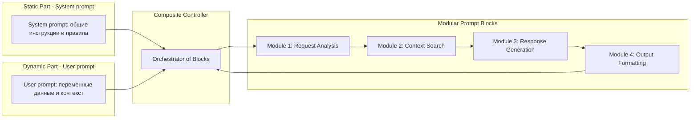

# Схема архитектуры модульных блоков промптов и их комбинирование

> Владелец: Вадим Рудаков, lefthand67@gmail.com

## Компоненты

1. **Модульные блоки промптов**  
   - Каждый блок выполняет отдельную атомарную функцию или роль: например, сбор вводных данных, предварительная обработка, генерация ответа, формирование вывода в нужном формате.  
   - Блоки описываются декларативно с метаданными (идентификатор, версия, назначение, параметры).

2. **Статическая часть (System prompt)**  
   - Содержит общие инструкции и правила для всей системы, задаёт роль агентов и глобальные параметры.  
   - Поддерживает единообразие и стабильность поведения.

3. **Динамическая часть (User prompt)**  
   - Включает переменные данные, пользовательский вход и контекст конкретного запроса.  
   - Передаётся как параметр в соответствующие модули.

4. **Композиционный контроллер**  
   - Оркестрирует вызовы модульных блоков, строит цепочки исполнения (chaining) согласно логике бизнес-процесса или сценария.  
   - Обеспечивает передачу данных между блоками, управление ошибками и асинхронность при необходимости.

## Пример последовательности

```
[System prompt] → [Модуль 1: анализ запроса] → [Модуль 2: поиск контекста] → [Модуль 3: генерация ответа] → [Модуль 4: форматирование вывода]
```

Каждый модуль получает вход, выполняет задачу и передаёт результат следующему.



Эта диаграмма показывает:
- Отдельное хранение статической и динамической частей промпта;
- Взаимодействие через композиционный контроллер (менеджер цепочки);
- Последовательный вызов модульных блоков обработки и генерации;
- Возврат результата к контроллеру.


## Выгоды архитектуры

- **Гибкость** – легко заменить, доработать или добавить новый блок без ломки всей системы.  
- **Повторное использование** – блоки могут использоваться в разных сценариях.  
- **Прозрачность и тестируемость** – каждый блок можно валидировать и тестировать независимо.  
- **Масштабируемость** – сложные системы строятся из простых частей, обеспечивая поддержку мультиагентного взаимодействия.

Вот простой реальный пример, как могут быть написаны модульные промпты, разбитые на отдельные части (блоки) с чётко определёнными ролями и параметрами.

***

## Пример модульного промпта для задачи суммаризации с дополнительным контекстом и форматированием

### Блок 1: Статические системные инструкции (system prompt)
```yaml
id: system_instructions_v1
content: |
  Вы — помощник AI, который кратко суммирует текст, выделяя ключевые факты.
  Отвечайте строго в формате JSON с полями: summary (строка).
  Не добавляйте лишних комментариев.
```

### Блок 2: Динамический пользовательский ввод (user prompt)
```yaml
id: user_input_v1
template: |
  Пожалуйста, сделайте краткое резюме следующего текста:
  {text}
parameters:
  max_tokens: 300
  temperature: 0.2
```

### Блок 3: Вспомогательный контекст (context retrieval)
```yaml
id: context_block_v1
template: |
  Здесь находится дополнительный релевантный контекст для обогащения информации:
  {retrieved_context}
```

### Итоговое комбинирование промптов (в порядке вызова)
1. Загрузить **system_instructions_v1** — задать роль, формат ответа, правила.
2. Подставить в **context_block_v1** актуальный дополнительный контекст.  
3. Подставить в **user_input_v1** основной текст для суммаризации.
4. Объединить все части в финальный запрос к модели.

### Почему так эффективно  
- Каждый блок имеет ясные обязанности и интерфейс (входные параметры).  
- Легко изменять/обновлять любой блок без нарушения всей цепочки.  
- Облегчается тестирование и отладка, так как можно изолированно проверять отдельные части.  
- Упрощается масштабирование на более сложные сценарии (например, с несколькими вспомогательными контекстами или вариантами форматирования).