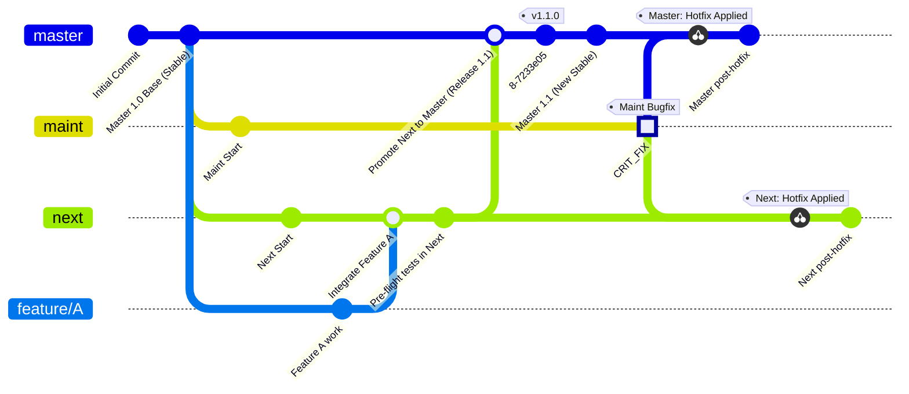
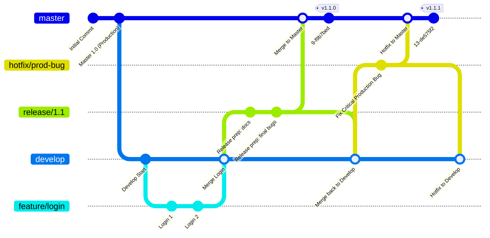
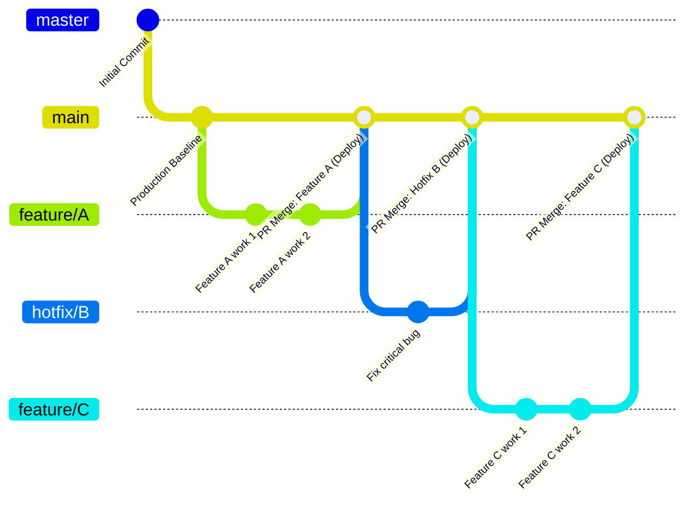

# Git Workflow Handbook: Comparing Three Major Models

---

Owner: Vadim Rudakov, lefthand67@gmail.com  
Version: 0.1.1  
Birth: 15.11.2025  
Modified: 15.11.2025

---

This document outlines three common and effective Git branching strategies. The goal is to compare their structure, use cases, and complexity to help your team select the workflow that best aligns with your project's requirements.

## 1. The Integration Manager Workflow (Man Gitworkflows) - Updated

This workflow, often associated with the Linux kernel development model (Linus Torvalds' process), is highly hierarchical and relies on specific branch roles for quality control and stability. It is ideal for projects that value **extreme stability** in the main branch and have a clear distinction between experimental and stable code.

### Core Structure and Roles

| Branch | Role | Stability |
| :--- | :--- | :--- |
| `master` (or `main`) | The canonical, **stable, production-ready** branch. | Stable |
| `next` | The **integration branch** where all new, pre-tested features are merged before being considered for `master`. | Unstable/Testing |
| `maint` | Used for critical bug fixes against **older, supported stable releases**. | Stable (for a specific old version) |
| **Topic Branches** | Short-lived branches for new features or bug fixes. | Development |

### The Flow and Nuances

1.  **Topic Branch Origin:** Topic branches should generally be **branched from `master`** (the stable base). This ensures the new work is based on the most recent known-good state, preventing instability from the potentially broken `next` branch.
2.  **Integration:** Topic Branches are merged or rebased into `next` (the integration branch) **NOTE**: In highly dynamic projects like the Linux kernel, next may occasionally be reset or rebased if it becomes too unstable to fix..
3.  **Promotion:** Once `next` is stable and thoroughly tested, it is merged into **`master`** and tagged as a new release.
4.  **Hotfix Flow:**
    * **Forward-Porting:** For bugs found in the current stable release (`master`), the fix should **originate on `master`**. It is then cherry-picked to `next` to carry the fix forward.
    * **Back-Porting (The** `maint` **Scenario):** The diagram below illustrates the special case where a bug exists *only* in an older, supported release. The fix is applied to the `maint` branch and then cherry-picked forward to `master` and `next` to ensure the bug cannot reappear.

### Mermaid `gitGraph` Diagram

The diagram below specifically shows the **back-porting** scenario where the fix originates on `maint` (for an older, supported release) and is cherry-picked forward.

## 2. The Gitflow Workflow (Vincent Driessen)

Gitflow is a rigid, powerful, and comprehensive branching model designed for projects that require **multiple versions in production** or have a planned, cyclical release schedule (e.g., major releases every 3-6 months).

### Core Structure

* **Two Long-Running Branches:** `master` (Production) and `develop` (Integration for next release).
* **Three Supporting Branches (Short-Lived):** `feature/`, `release/`, and `hotfix/`.

| Branch Name | Role | Created Off | Merged Into | Lifetime |
| :--- | :--- | :--- | :--- | :--- |
| `master` (or `main`) | **Production History** (Stores official, tagged release history). | N/A | N/A | Permanent |
| `develop` | **Integration Branch** (Stores state of code for the next release cycle). | N/A | N/A | Permanent |
| `feature/` | **New Development** (Adding a new feature or major change). | `develop` | `develop` | Short-Lived |
| `release/` | **Release Preparation** (Stabilizing, testing, and documentation for an upcoming release). | `develop` | `master` and `develop` | Short-Lived |
| `hotfix/` | **Urgent Patch** (Fixing critical production bugs immediately). | `master` | `master` and `develop` | Short-Lived |

### The Flow Summary (Release Cycle)

1.  Start all development from `develop`.
2.  When ready, create a `release` branch from `develop` for final testing and fixes.
3.  The `release/` branch is **merged into** `master` (and tagged) and **merged back into** `develop`.
4.  A critical production bug requires a `hotfix/` branch off `master`, which is merged back into both `master` (immediate fix) and `develop` (future proofing).

### Mermaid `gitGraph` Diagram

## 3. The GitHub Flow

The GitHub Flow is a highly popular, streamlined, and lightweight workflow designed for teams practicing **Continuous Integration and Continuous Delivery (CI/CD)**. It is centered around the concept of **Pull Requests (PRs)** and high automation.

### Core Structure

| Branch | Role | Stability |
| :--- | :--- | :--- |
| `main` (or `master`) | The single, permanent branch. It must **always be deployable**. | Production-Ready |
| **Topic Branches** | Short-lived branches for **all work** (features, fixes, experiments). | Development |

### The Flow Summary

1.  **Work Isolation:** Create a descriptive **Topic Branch** off `main` for *any* work.
2.  **Pull Request (PR):** When work is complete, open a PR to merge the Topic Branch into `main`.
3.  **Protection is Key:** The `main` branch is typically **protected**, requiring the PR to pass automated tests and receive at least one team member's approval before merging.
4.  **Automated Deployment:** Once approved and merged, the change is **automatically deployed to production** (usually via a CI/CD pipeline). This high level of automation is what enables the high velocity of this workflow.
5.  **Cleanup:** The Topic Branch is deleted after the merge. There are no separate `develop`, `release`, or `hotfix` branches.

### Mermaid `gitGraph` Diagram

## Conclusion and Recommendation Tables

### Choosing the Right Git Workflow: Use Cases and Characteristics

*Which workflow should you choose for your project?*

| Workflow | Best For | Key Branches | Release Cadence | Complexity |
| :--- | :--- | :--- | :--- | :--- |
| **Integration Manager** | Highly stable software (kernels, libraries) where the main branch must be pristine. | `master`, `next`, `maint` | Slow, cyclical releases after extended integration time. | Medium |
| **Gitflow** | Projects with fixed, large, and infrequent releases (e.g., enterprise software, mobile apps). | `master`, `develop`, `release/`, `hotfix/` | Fixed, planned cycles (e.g., Quarterly, Yearly). | High |
| **GitHub Flow** | Web applications, SaaS, and teams focused on rapid CI/CD and deployment. | `main` (or `master`), Topic Branches | Frequent, often daily, continuous deployment. | Low |

### The trade-offs between **complexity** and **release velocity**

*What are the inherent tensions between stability, speed, and process overhead?*

How fast you can deploy changes for the three Git workflows.

| Feature | Integration Manager Workflow | Gitflow Workflow | GitHub Flow |
| :--- | :--- | :--- | :--- |
| **Complexity** | **Medium** | **High** | **Low** |
| | Clear branch hierarchy, but relies on **cherry-picking** fixes (harder to track). | Many long- and short-lived branches; requires tooling and strict rules for merging. | Extremely simple; only two branch types (`main` and topic). |
| **Release Velocity** | **Slow/Cyclical** 🐌 | **Medium/Cyclical** 🔄 | **Fast/Continuous** 🚀 |
| | Features wait for `next` to stabilize, then for `master` merge. Focus is on stability over speed. | Releases are tied to a fixed schedule (e.g., quarterly); long stabilization phase on `release/` branch. | Changes merged to `main` are deployed **immediately**; ideal for CI/CD and high-velocity teams. |
| **Stability Focus** | `master` **stability** is guaranteed by the buffer of the `next` branch. | **Release stability** is guaranteed by a dedicated, pre-production `release/` branch. | **Feature stability** is guaranteed by robust automated testing and mandatory code review (PRs). |
| **Use Case Fit** | Core libraries, infrastructure, or projects where the main branch must *never* break. | Mobile apps, enterprise software with fixed versions, projects supporting older releases. | Web services, SaaS products, teams focused on DevOps and rapid iteration. |

### Summary

The choice often comes down to this:

* If your priority is **speed and frequent deployment**, choose the **GitHub Flow**.
* If your priority is **managing multiple simultaneous releases and versions**, choose **Gitflow**.
* If your priority is **maximum stability** and hierarchical contribution, choose the **Integration Manager Flow**.
