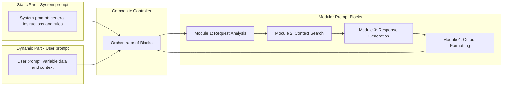

# Architecture Scheme for Modular Prompt Blocks and Their Combination

-----

Owner: Vadim Rudakov, lefthand67@gmail.com  
Version: 0.1.0  
Birth: 2025-10-10  
Modified: 2025-12-05

-----

## Components

1.  **Modular Prompt Blocks**

      - Each block performs a separate atomic function or role: for example, collecting input data, pre-processing, generating a response, or formatting the output in the required format.
      - Blocks are described declaratively with metadata (identifier, version, purpose, parameters).

2.  **Static Part (System Prompt)**

      - Contains general instructions and rules for the entire system, sets the role of agents and global parameters.
      - Maintains uniformity and stability of behavior.

3.  **Dynamic Part (User Prompt)**

      - Includes variable data, user input, and the context of a specific request.
      - Passed as a parameter to the relevant modules.

4.  **Compositional Controller**

      - Orchestrates the calls to modular blocks, builds execution chains (chaining) according to the logic of the business process or scenario.
      - Ensures data transfer between blocks, error handling, and asynchronous operation if necessary.

## Example Sequence

```
[System prompt] → [Module 1: Request analysis] → [Module 2: Context search] → [Module 3: Response generation] → [Module 4: Output formatting]
```

Each module receives input, performs a task, and passes the result to the next one.



This diagram shows:

  - Separate storage of the static and dynamic parts of the prompt;
  - Interaction via a compositional controller (chain manager);
  - Sequential calling of modular processing and generation blocks;
  - Return of the result to the controller.

## Benefits of the Architecture

  - **Flexibility** – easy to replace, modify, or add a new block without breaking the entire system.
  - **Reusability** – blocks can be used in different scenarios.
  - **Transparency and Testability** – each block can be validated and tested independently.
  - **Scalability** – complex systems are built from simple parts, ensuring support for multi-agent interaction.

Here is a simple, real-world example of how modular prompts can be written, broken down into separate parts (blocks) with clearly defined roles and parameters.

-----

## Example Modular Prompt for a Summarization Task with Additional Context and Formatting

### Block 1: Static System Instructions (system prompt)

```json
// system_instructions_v1.json
{
  "id": "system_instructions_v1",
  "content": "You are an AI assistant that briefly summarizes text, highlighting key facts.\nRespond strictly in JSON format with fields: summary (string).\nDo not add unnecessary comments."
}
```

### Block 2: Dynamic User Input (user prompt)

```json
// user_input_v1.json
{
  "id": "user_input_v1",
  "template": "Please provide a brief summary of the following text:\n{text}",
  "parameters": {
    "max_tokens": 300,
    "temperature": 0.2
  }
}
```

### Block 3: Auxiliary Context (context retrieval)

```json
// context_block_v1.json
{
  "id": "context_block_v1",
  "template": "Here is additional relevant context to enrich the information:\n{retrieved_context}"
}
```

### Final Prompt Combination (in order of invocation)

1.  Load **system\_instructions\_v1** — set the role, response format, rules.
2.  Substitute the relevant additional context into **context\_block\_v1**.
3.  Substitute the main text for summarization into **user\_input\_v1**.
4.  Combine all parts into the final request to the model.

### Why this is effective

  - Each block has clear responsibilities and an interface (input parameters).
  - Easy to change/update any block without disrupting the entire chain.
  - Testing and debugging are facilitated, as individual parts can be checked in isolation.
  - Scaling to more complex scenarios (e.g., with multiple auxiliary contexts or formatting options) is simplified.
