```mermaid
---
config:
  layout: dagre
  theme: redux
---
flowchart TB
    A["Commit w/ Tag"] --> B["ArchTag:"]
    B -- PERF-OPTIMIZATION --> C["Perf Tests"]
    B -- REFACTOR-MIGRATION --> D["Architect Review"]
    B -- DEPRECATION-PLANNED --> E["API Docs Update"]
    B -- TECHDEBT-PAYMENT --> F["Debt Score Δ"]
    C --> G["Changelog Section"]
    D --> G
    E --> G
    F --> G
```

# Production Git Workflow Standards

-----

Owner: Vadim Rudakov, lefthand67@gmail.com
Version: 0.6.0
Birth: 2025-11-29
Last Modified: 2025-12-15

-----

This handbook establishes mandatory, professional-grade conventions for Git branching and committing. Adherence to these standards is essential for achieving traceability, enabling automated MLOps gates, ensuring accurate changelogs, and streamlining architectural reviews.

The workflow is enforced through a Three-Tier Naming Structure and a strict Conventional Commits policy, culminating in an Atomic Commit merge strategy.

## 1. Three-Tier Naming Structure

All changes must follow this strictly enforced hierarchy for complete lifecycle context.

| Tier | Component | Purpose | Requirement |
| :--- | :--- | :--- | :--- |
| **TIER 1 (SCOPE)** | Branch Prefix + Ticket ID | Defines the **scope** of work (e.g., `feature/`) and its associated **work item**. | **MANDATORY** for all branches. |
| **TIER 2 (INTENT)** | Commit Title Prefix | Defines **what changed** (Conventional Commits type, e.g., `feat:`, `fix:`). | **MANDATORY** for all commits. |
| **TIER 3 (JUSTIFICATION)** | Architectural Tag (ArchTag) | Defines **why** a structural change was made. Placed in the commit body. | **CONDITIONAL** (Mandatory for `refactor:`, `perf:`, `BREAKING CHANGE` Footer). |

## 2. Tier 1: Scope & Traceability - Branch Prefixing Policy

Branch names **MUST** use the format:

`<prefix>: <TICKET-ID>-<short-kebab-description>`

*Names must be lowercase with hyphens. This format enables automatic linking to issues and Pull Requests.*

| Prefix | Work Scope | Example |
| :--- | :--- | :--- |
| `feature/` | New features or significant enhancements/additions. | `feature/MLOPS-456-add-metrics-endpoint` |
| `bugfix/` | Correcting a user-impacting defect/bug. | `bugfix/JIRA-123-login-404-error` |
| `hotfix/` | Urgent fixes applied directly to the production branch. | `hotfix/CRIT-001-payment-gateway-bug` |
| `release/` | Preparation for a formal release (e.g., final testing, version bumps). | `release/v1.2.0-final-prep` |
| `chore/` | Routine maintenance that doesn't fix a bug or add a feature (e.g., documentation, dependency updates). | `chore/TICKET-789-update-deps` |

## 3. Tiers 2 & 3: Intent & Justification - Conventional Commit Policy

### 3.1 Tier 2: **What** Changed - Commit Title Prefix

The commit title **MUST** start with `<type>: <description>`. The description must be **50 characters maximum** and written in the **imperative mood**.

| Group | Type | Intent | ArchTag Required? | SemVer Impact |
| :--- | :--- | :--- | :--- | :--- |
| **Core** | `feat:` | A new feature or enhancement. | NO | **Minor** |
| | `fix:` | A bug fix. | NO | **Patch** |
| **Breaking** | *(any type)* + `BREAKING CHANGE` footer | Introduces an incompatible API/behavior change. | **YES** | **Major** |
| **Architectural** | `refactor:` | Code restructuring that neither fixes a bug nor adds a feature; can change public API. | **YES** | Patch/Minor/Major |
| | `perf:` | Code change that measurably improves performance; can change public API. | **YES** | Patch/Minor/Major |
| **Routine** | `docs:` | Changes to documentation only. | NO | None |
| | `test:` | Adding or correcting tests. | NO | None |
| | `chore:` | Routine maintenance, dependency updates, minor clean-up. | NO | None |
| **Internal/Temporary** | `WIP:` | **Incomplete work. Must be squashed/rebased before merging.** | NO | None |

> NOTE: Commit types inform SemVer, but do not dictate it. Final SemVer must be validated against API/behavior contracts.

#### **BREAKING CHANGE** Footer

The official way to signal changes that **break compatibility** is:

```
<type>(<optional scope>): <description>

BREAKING CHANGE: <description of breaking impact>
```

| Intent | Correct Conventional Commit Form |
|----------------------|----------------------------------|
| **Removing a feature** (user-facing) | `feat: remove legacy auth API`<br>`BREAKING CHANGE: The /v1/login endpoint is deleted. Use /v2/auth.` |
| **Removing internal code** (no external impact) | `refactor: delete unused cache module`<br>*(No `BREAKING CHANGE` needed)* |
| **Removing a config option or API** (breaking) | `fix: drop support for deprecated TLS 1.0`<br>`BREAKING CHANGE: TLS 1.0 connections are now rejected.` |

> 💡 **Key principle**: A **breaking change** is defined by **observable behavior change for consumers** — not by the act of change itself.

> Read more: **Conventional Commits – Breaking Changes**  
>    *Conventional Commits Specification, Section "Commit Message with Description and Breaking Change Footer"* [Conventional Commits WG], 2019  
>     https://www.conventionalcommits.org/en/v1.0.0/#commit-message-with-description-and-breaking-change-footer

### 3.2 Tier 3: **Why** Changed - Architectural Tagging

For commits of type `refactor:`, `perf:`, or `BREAKING CHANGE` Footer, the architectural intent **MUST** be provided as an ArchTag (Architectural Tag).

  * **Format:** The tag **MUST** be the **first line** of the commit body: `ArchTag:TAG-NAME` (one tag only).
  * **Syntax Rules:** The tag **MUST NOT** include the `#` symbol or any spaces.
  * **Validation:** CI/CD automation tools will validate the tag's presence and correctness.

| Tag Name | Intent | Heuristic / Automation Gate |
| :--- | :--- | :--- |
| `DEPRECATION-PLANNED` | Sunset code, APIs, or features scheduled for removal. | PR requires Architect Approval (Hard Gate). |
| `TECHDEBT-PAYMENT` | Reducing complexity, upgrading dependencies, or simplifying code. | Signals maintenance work. |
| `REFACTOR-MIGRATION` | Major architecture shift or pattern change (e.g., monolith to microservice). | PR requires Architect Approval (Hard Gate). |
| `PERF-OPTIMIZATION` | Code change explicitly addressing a performance bottleneck. | Benchmarks must be provided in the commit body. |

### Example of a full commit with `ArchTag`

```
refactor: simplify model loading logic

ArchTag:TECHDEBT-PAYMENT
Reduced cyclomatic complexity from 15 to 8, improving maintainability.
```



-----

## 4. 🚨 Mandatory Procedure: Handling `WIP:` Commits

A `WIP:` type is useful only if its temporary nature is strictly enforced. Allowing `WIP:` commits to pollute the final, merged history defeats the purpose of Conventional Commits and introduces unnecessary noise and technical debt.

The `WIP:` commit type is strictly for **personal backup and context switching** on feature branches. It **MUST NOT** be present in the final commit history of any main branch (e.g., `main`, `develop`).

### A. **The Enforcement Gate: Interactive Rebase**

Before opening a Pull Request (PR), all $\text{WIP:}$ commits **MUST** be consolidated (squashed) into one or more **atomic commits** using a valid semantic type ($\text{feat:}$, $\text{fix:}$, etc.).

1.  **Start Interactive Rebase:** Execute `git rebase -i <target-branch>` (e.g., `git rebase -i develop`).
2.  **Edit Commit List:** Change the action for every $\text{WIP:}$ commit from `pick` to **`squash` ($\text{s}$)** or **`fixup` ($\text{f}$)**.
3.  **Finalize Message:** Ensure the final, consolidated commit message is a single, valid, semantic commit title and body.

### B. **PR System Guardrails (Hard Gates)**

  * **CI/CD Block:** The CI/CD pipeline is configured to automatically **fail a Pull Request** if any commit in the branch's history contains the prefix $\text{WIP:}$. This is a **hard technical gate**.
  * **Mandatory Merge Strategy:** The repository is configured to **enforce "Squash and Merge"** for all feature branches into mainline branches. This guarantees that the final history is composed of single, clean, semantic commits.

The most effective enforcement mechanism is at the code review and merge gate.

| Policy | Implementation | Rationale |
| :--- | :--- | :--- |
| **PR Status Check** | Configure your CI/CD system (e.g., GitHub Actions, GitLab CI, Azure DevOps Pipelines) to run a script that **fails the build** if any commit in the PR history (prior to merge) contains the regex pattern `^WIP:` in its title. | This is a **hard gate**. It prevents developer oversight from reaching the main codebase, forcing the immediate correction of the branch history. |
| **Reviewer Responsibility** | Peer reviewers are explicitly tasked with a **quick history audit**. The reviewer must verbally confirm that the history is clean and semantic before approving the PR. | Provides a human layer of quality control, ensuring the final commit message correctly reflects the change's semantic intent and is well-written. |
| **Enforce Squash Merge** | Set the default merge strategy on your repository to **"Squash and Merge"** or **"Rebase and Merge"**. | This ensures that the final commit object added to the target branch is a single, clean commit, overriding potentially messy individual commits from the feature branch. (Note: "Rebase and Merge" still brings individual commits but makes the history linear; "Squash and Merge" is the cleaner option for enforcing a single semantic message.) |

### C. **Guidance: When to Use `WIP:` vs. Standard Commit Types**

New engineers must understand the difference to avoid misusing `WIP:`.

| Scenario | Recommended Type | Rationale |
| :--- | :--- | :--- |
| **Saving work** at the end of the day or switching machines. | `WIP: short summary of current state` | Work is incomplete, not ready for review, and exists purely for personal continuity. Must be squashed later. |
| **Completing a logical unit** of work (e.g., finishing the utility function signature, adding a new test). | `test: add unit test for X service` or `refactor: extract Z function from module A` | The change is coherent, stable, and useful, even if the overall feature is unfinished. It improves branch history readability *before* the final squash. |
| **Fixing a minor bug** discovered while working on a feature. | `fix: prevent divide by zero in function Y` | This is a small, atomic fix that is technically correct and may be valuable on its own. It can be squashed later or kept as a separate atomic commit. |

**Key Takeaway:** If the commit is stable, complete, and describes an atomic, logical change that could stand on its own in the history, use a standard type. If the code is broken, half-finished, or purely a checkpoint, use `WIP:`.

-----

## 5. 🧠 The Guiding Principle: Atomic Commits

The goal of every feature branch's final history is **logical atomicity**. An **Atomic Commit** is a self-contained, complete, and logically isolated unit of work.

### Rules of Atomicity

  * **Rule 1: One Goal Per Commit.** A commit must achieve one objective only (e.g., *refactor logic*, *add unit tests*, *fix a bug*).
  * **Rule 2: Commits Must Be Stable.** Every commit in the final, merged history **MUST** be buildable and pass all tests. This is mandatory for advanced diagnostic tools like $\text{git bisect}$. **Broken commits are technical debt.**
  * **Rule 3: Cohesive Narrative.** The sequence of commits in a Pull Request (PR) must tell a clear story of how the feature was developed, making it easy for reviewers to follow the logic.

### The "Commit by Logic" Workflow

To create atomic commits, **DO NOT** use `git add .` indiscriminately.

| Step | Action | Tool | Goal |
| :--- | :--- | :--- | :--- |
| **Stage Selectively** | Use the patch utility to stage only changes relevant to a single logical task. | `git add -p` | **Group changes by function and purpose,** not by file or timing. |
| **Review and Commit** | Review the staged changes (`git diff --staged`). If they represent one complete, stable, logical step, commit them with a semantic type. | `git commit -m "feat: implement X interface"` | Ensure the commit is **atomic**. |
| **Iterate and Clean** | Perform the rebase and squashing procedure (Section 4). | `git rebase -i` | Produce a clean, coherent history ready for review and final merge. |

This disciplined approach ensures that your contributions are professionally structured, easily maintainable, and maximally effective for the long-term health of our engineering systems.

> Read more:
>   - "Pro Git", Chapter 7: Git Tools - Rewriting History' [Scott Chacon and Ben Straub] https://git-scm.com/book/en/v2/Git-Tools-Rewriting-History

## 5. Merge Strategy: Atomic Change Submission

All changes merged into mainline branches (`main`, `develop`, etc.) **MUST** be integrated as a **single, atomic, logical unit**. This is a **fundamental engineering discipline** used in scaled production environments (Google, Meta, Microsoft) to ensure **reviewability, revertability, and traceability**.

### A. The BigTech Standard: One Change, One Commit

In professional code review systems:
* A Pull Request (PR) or Change List (CL) represents **one logical modification** to the system.
* Intermediate development steps (e.g., test scaffolding, incremental refactors) are **development artifacts**, not production history.
    * Preserving them in `main` adds **noise without operational value** and **dilutes accountability**.


> **Key Principle**:
> *“If it can’t be reviewed, reverted, or reasoned about as a single unit, it’s not production-ready.”*

### B. Implementation: Enforced "Squash and Merge" (Default)

- **Unless otherwise specified in 5.D, all PRs must be merged using "Squash and Merge"**.
- The **final commit message** must be:
    - A valid **Conventional Commit** (`feat:`, `fix:`, etc.),
    - **≤50 characters** in title,
    - Include a **body** containing:
        - Architectural rationale (with `ArchTag` if required),
        - `BREAKING CHANGE:` footer if applicable,
        - Link to ticket or design document.

> **Why not "Rebase and Merge"?**
> While linear, it preserves intermediate development commits that **were never reviewed as independent units**. In BigTech, **only the integrated state is production-grade**—everything else is a draft.

### C. Debugging Without `git bisect` Granularity

Fine-grained bisect on noisy history is **not the primary debugging tool** in production systems. Instead, rely on:
- **Structured logging** (with trace IDs),
- **Metrics and alerting** (e.g., latency, error rates),
- **Atomic revert** (if a change breaks, revert the **entire unit**—not part of it).

If a change is **too large to debug or revert safely**, it **violates atomicity** and should have been split **before submission**.

### D. Advanced Strategy: The Stacked Diff Exception

The **Stacked Diff** workflow is permitted as an **advanced implementation** of Atomic Change Submission, enabling high velocity and rapid peer review. This methodology involves breaking a large feature into a **series of small, dependent, atomic CLs** (Change Lists or Diffs) .

1.  **Scope:** The entire feature remains **one logical change** to the system.
2.  **Integration Method:** The default **Squash and Merge** is overridden. The stack is integrated using a specialized tool (e.g., Sapling, Graphite) that executes an atomic **Rebase and Merge** or **Fast-Forward Merge** for each sequential diff.
3.  **Strict Condition:** This exception is **only** permitted if:
    * The work is managed through an approved Stacked Diff platform.
    * **Every single commit in the stack** must be independently reviewed, CI-verified, and comply with all Tier 1, 2, and 3 policies.
4.  **Benefit:** The resulting mainline history is linear, atomic, and preserves the clean narrative of the feature's development, thus **restoring the utility of $\text{git bisect}$** for diagnostics.

### Enforcement

| Guardrail | Implementation |
|:---|:---|
| **CI/CD Block (Default)** | PRs with >1 commit **fail pre-merge check** (unless approved for Stacked Diff or large migrations). |
| **Reviewer Gate** | Reviewers **reject PRs** that are not logically atomic (e.g., mix refactor + feature). |
| **Merge Policy** | Repository settings **enforce "Squash and Merge"** as the only allowed method, **unless using an approved Stacked Diff tool**. |

> **Exception**: PRs tagged with `ArchTag:REFACTOR-MIGRATION` may use **"Rebase and Merge"** **only if** approved by an Architect and **each commit is independently CI-verified**. Stacked Diffs are the preferred method for such large-scale changes.

## 6. Quick Reference, Enforcement, and Pitfalls

### 6.1 Quick Reference Table

| Branch Prefix | Commit Prefix Examples | ArchTag Required? | Key Automation Trigger / Gate |
| :--- | :--- | :--- | :--- |
| `feature/`, `bugfix/`, ` chore/  `| `feat:`, `fix:`, `docs:`, `chore:` | NO | Changelog generation; CI pipeline. |
| **Any** | `refactor:`, `perf:`, `BREAKING CHANGE` Footer | **YES** | **Architectural Review Gate** (CI/CD block). |
| **Any** | `WIP:` | NO | **CI BLOCK** (Failure to pass the Pre-Merge History Check). |

### 6.2 Enforcement

  * **CI/CD Pipeline:** The pipeline **MUST** block a merge if:
    1.  A commit of type `refactor:`, `perf:`, or `BREAKING CHANGE` Footer  is missing a valid `ArchTag`.
    2.  Any commit in the PR history contains the prefix `WIP:`.
  * **Architectural Review Gate:** PRs containing `ArchTag:REFACTOR-MIGRATION` or `ArchTag:DEPRECATION-PLANNED` **MUST** receive explicit approval from an Architect/Principal Engineer *before* merging.

### 6.3 Common Pitfalls

| Pitfall | Consequence | Mitigation |
| :--- | :--- | :--- |
| Forgetting the **Ticket ID** in the branch name. | No automatic issue linking; traceability loss. | Use templates; set branch protection rules. |
| Commit titles exceeding **50 characters**. | Poor changelog readability; automation tools truncate. | Use pre-commit hooks to check length. |
| Invalid or missing **ArchTag** on required commit types. | **CI BLOCK** (Failure to pass the Architectural Review Gate). | Check the tag list and ensure it's the first line in the commit body. |
