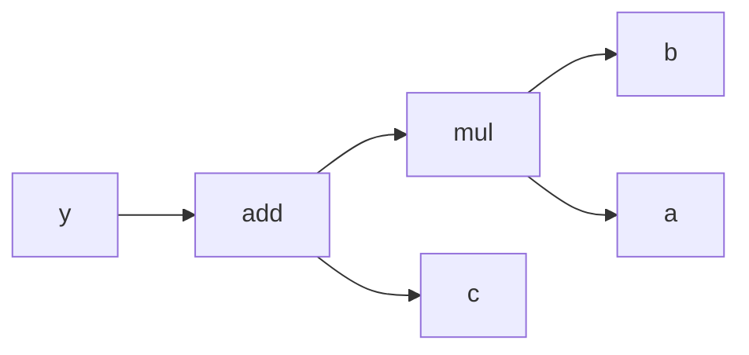

---
jupytext:
  text_representation:
    extension: .md
    format_name: myst
    format_version: 0.13
    jupytext_version: 1.18.1
kernelspec:
  display_name: C
  language: c
  name: c
---

# Phase 1: Computational Primitives and Gradients

+++

# **1. The Computational Graph**

+++

We'll build auto-differentiation from scratch, similar to the micrograd approach. The core concept is representing mathematical operations as a directed acyclic graph (DAG) where nodes are values and edges are operations.

+++

## Computational Graphs

+++

Micrograd is a minimal autograd engine - a tiny library that implements automatic differentiation (backpropagation) from scratch. It's about 100 lines of code that demonstrates the core mechanics behind PyTorch's autograd system.

**Core Concept: Computational Graphs**

Think of every mathematical operation as building a graph:

Simple expression: $y = (a \times b) + c$

+++

```{mermaid}
graph LR
    a --> mul
    b --> mul
    c --> add
    mul --> add
    add --> y
```

+++

Each node in this graph:
- Stores its current numerical value
- Knows how to compute its gradient during backward pass
- Remembers which operation created it and what its inputs were

Even though you'll use PyTorch later, building micrograd teaches you:
1. How backpropagation actually works under the hood
2. The chain rule in practice
3. What PyTorch tensors are doing automatically
4. Foundation for CUDA optimization (understanding the computation flow)

+++

## Chain Rule Application

+++

Let's say we have:
- `a = 2.0`, `b = 3.0`, `c = 1.0`
- `y = (a * b) + c = (2 * 3) + 1 = 7`

During backward pass, we compute how `y` changes when we tweak `a`, `b`, or `c`.

+++

For the expression:

$$
y = (a \times b) + c
$$

We can compute the gradients (partial derivatives) step by step:

**Forward Pass:**
1. $mult = a \times b$
2. $y = mult + c$

**Backward Pass (Chain Rule):**

Starting from the output $y$:
- $\displaystyle \frac {\partial y}{\partial y} = 1.0$ (gradient of output with respect to itself)

Now, for the addition operation $y = mult + c$:
- $\displaystyle \frac {\partial y}{ \partial mult} = 1.0$ (derivative of addition w.r.t first operand)
- $\displaystyle \frac {\partial y}{ \partial c} = 1.0$ (derivative of addition w.r.t second operand)

For the multiplication operation $mult = a \times b$:
- $\displaystyle \frac {\partial mult}{ \partial a} = b$ (derivative of multiplication w.r.t first operand)
- $\displaystyle \frac {\partial mult}{ \partial b} = a$ (derivative of multiplication w.r.t second operand)

+++



+++

**Applying Chain Rule:**

- ∂y/∂a = (∂y/∂mult) * (∂mult/∂a) = 1.0 * b = b
- ∂y/∂b = (∂y/∂mult) * (∂mult/∂b) = 1.0 * a = a  
- ∂y/∂c = 1.0

So with our values $a=2.0, b=3.0, c=1.0$:
- ∂y/∂a = 3.0
- ∂y/∂b = 2.0
- ∂y/∂c = 1.0

This means if we increase $a$ by a small amount $\epsilon$, $y$ increases by approximately $3 \epsilon$.

```{code-cell}

```
