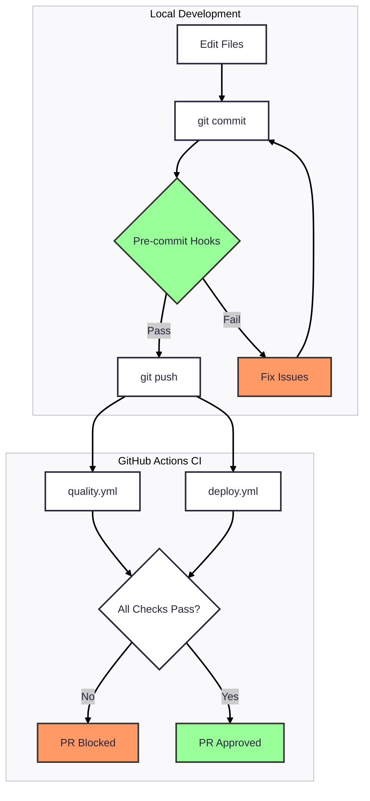

---
jupytext:
  text_representation:
    extension: .md
    format_name: myst
    format_version: 0.13
    jupytext_version: 1.19.0
kernelspec:
  name: bash
  display_name: Bash
  language: bash
---

# Pre-commit Hooks and CI Validation System

+++

---

Owner: Vadim Rudakov, lefthand67@gmail.com
Version: 1.0.0
Birth: 2026-01-22
Last Modified: 2026-01-22

---

+++

## **1. Philosophy: Defense in Depth**

+++

This repository implements a **two-layer validation architecture** that ensures code quality through complementary local and remote checks. The design philosophy is rooted in a simple principle:

:::{important} **Trust, but Verify**
Pre-commit hooks provide fast, immediate feedback during development. CI workflows act as the final safety net, ensuring nothing bypasses validation—even when developers use `git commit --no-verify`.
:::

### Why Two Layers?

| Layer | Purpose | When It Runs | Can Be Bypassed? |
|-------|---------|--------------|------------------|
| **Pre-commit Hooks** | Fast developer feedback | Before each commit | Yes (`--no-verify`) |
| **GitHub Actions CI** | Authoritative validation | On every push/PR | No |

This architecture provides:

1. **Developer Experience**: Fast local feedback prevents wasted CI cycles
2. **Repository Protection**: CI catches anything that slips through
3. **Consistency**: Both layers use the same scripts with the same logic

+++

## **2. Architectural Overview**

+++

### Pre-commit Hooks Summary

The `.pre-commit-config.yaml` defines these validation hooks:

| Hook | Script | File Pattern | Purpose |
|------|--------|--------------|---------|
| `check-broken-links` | `check_broken_links.py` | `\.md$` | Validate markdown links |
| `jupytext-sync` | `jupytext_sync.py` | `\.(md\|ipynb)$` | Sync paired notebooks |
| `jupytext-verify-pair` | `jupytext_verify_pair.py` | `\.(md\|ipynb)$` | Ensure both files staged |
| `check-api-keys` | `check_api_keys.py` | all files | Detect leaked API keys |
| `check-json-files` | `check_json_files.py` | `\.json$` | Validate JSON syntax |

Additionally, **five test hooks** run pytest when their corresponding scripts change, ensuring the validation tools themselves remain correct.

+++

### GitHub Actions Summary

Two workflows provide CI protection:

**`quality.yml`** - Runs on all pushes and PRs:

| Job | Trigger Condition | Checks |
|-----|-------------------|--------|
| `broken-links` | `.md` changes OR script changes | pytest + link validation |
| `jupytext` | Script changes OR `.md`/`.ipynb` changes | pytest + sync validation |
| `api-keys` | Any file changes OR script changes | pytest + API key scan |
| `json-validation` | `.json` changes OR script changes | pytest + JSON validation |

**`deploy.yml`** - Runs on all pushes:

| Step | Condition | Check |
|------|-----------|-------|
| Notebook sync verify | **All branches** | `jupytext_sync.py --all --test` |
| Build + Deploy | Main only | MyST build + RSYNC |

+++

## **3. Security Analysis: Remote Protection**

+++

:::{admonition} Critical Question
:class: warning
If a user runs `git commit --no-verify`, is the remote repository protected?
:::

### Answer: Yes

Every critical pre-commit check has a corresponding CI check:

| Check | Pre-commit Hook | CI Protection | Coverage |
|-------|-----------------|---------------|----------|
| Broken links | `check-broken-links` | `quality.yml` broken-links job | On `.md` changes |
| API keys | `check-api-keys` | `quality.yml` api-keys job | On any file changes |
| JSON syntax | `check-json-files` | `quality.yml` json-validation job | On `.json` changes |
| Notebook sync | `jupytext-sync` | `quality.yml` jupytext job + `deploy.yml` | **Every push** |

### The Jupytext Safety Net

The `jupytext-verify-pair` hook verifies that both `.md` and `.ipynb` files are staged together. This is a **git staging check** that doesn't translate to CI context. However, the CI provides equivalent protection:

1. **`quality.yml`**: Runs `jupytext_sync.py --test` on changed notebook files
2. **`deploy.yml`**: Runs `jupytext_sync.py --all --test` on **every push, all branches**

This means out-of-sync notebooks are caught before they can be deployed, regardless of how they entered the repository.

+++

## **4. Implementation Details**

+++

### File Structure

```
.
├── .pre-commit-config.yaml          # Hook definitions
├── .github/workflows/
│   ├── quality.yml                  # Content validation CI
│   └── deploy.yml                   # Sync validation + deployment
├── tools/scripts/
│   ├── paths.py                     # Shared exclusion patterns
│   ├── check_broken_links.py        # Link validator
│   ├── check_api_keys.py            # Secret detector
│   ├── check_json_files.py          # JSON validator
│   ├── jupytext_sync.py             # Notebook synchronizer
│   └── jupytext_verify_pair.py      # Staging verifier
└── tools/tests/
    ├── test_check_broken_links.py
    ├── test_check_api_keys.py
    ├── test_check_json_files.py
    ├── test_jupytext_sync.py
    └── test_jupytext_verify_pair.py
```

+++

### Shared Configuration: `paths.py`

All scripts import exclusion patterns from `tools/scripts/paths.py`, ensuring consistent behavior:

```python
from tools.scripts.paths import is_excluded, BROKEN_LINKS_EXCLUDE_DIRS
```

This centralization means:
- Adding a new exclusion directory updates all tools
- Tests can mock the paths module for isolation
- CI and pre-commit use identical logic

+++

### CI Environment Setup

Both workflows set `PYTHONPATH` to enable module imports:

```yaml
env:
  PYTHONPATH: ${{ github.workspace }}
run: uv run tools/scripts/check_broken_links.py
```

For local development, `pyproject.toml` configures pytest:

```toml
[tool.pytest.ini_options]
pythonpath = ["."]
```

+++

### Differential Checking Pattern

CI jobs use `tj-actions/changed-files` to validate only modified files:

```yaml
- name: Get changed files
  id: changed
  uses: tj-actions/changed-files@v45
  with:
    files_yaml: |
      logic:
        - tools/scripts/check_broken_links.py
        - tools/tests/test_check_broken_links.py
        - tools/scripts/paths.py
      docs:
        - "**/*.md"
    safe_output: true

- name: Run Link Check on Changed Files
  if: steps.changed.outputs.docs_any_changed == 'true'
  run: |
    uv run tools/scripts/check_broken_links.py \
      --paths ${{ steps.changed.outputs.docs_all_changed_files }}
```

This pattern provides:
- **Fast CI runs**: Only validates what changed
- **Fair blame**: Developers aren't held responsible for legacy issues
- **Incremental improvement**: Each PR improves the codebase without blocking on unrelated problems

+++

## **5. Hook-to-CI Mapping**

+++

### check-broken-links

**Pre-commit** (`.pre-commit-config.yaml:5-11`):
```yaml
- id: check-broken-links
  name: Check Broken Links
  entry: uv run --active tools/scripts/check_broken_links.py --pattern "*.md"
  language: python
  files: \.md$
  pass_filenames: false
  stages: [pre-commit, manual]
```

**CI** (`quality.yml:10-44`):
```yaml
broken-links:
  runs-on: ubuntu-latest
  steps:
    # ... setup steps ...
    - name: Run Link Check on Changed Files
      if: steps.changed.outputs.docs_any_changed == 'true'
      run: |
        uv run tools/scripts/check_broken_links.py \
          --paths ${{ steps.changed.outputs.docs_all_changed_files }} \
          --pattern "*.md" --verbose
```

+++

### jupytext-sync

**Pre-commit** (`.pre-commit-config.yaml:13-20`):
```yaml
- id: jupytext-sync
  name: Jupytext Sync
  entry: uv run tools/scripts/jupytext_sync.py
  language: python
  files: \.(md|ipynb)$
  pass_filenames: true
  require_serial: true
  stages: [pre-commit]
```

**CI Quality** (`quality.yml:46-81`):
```yaml
jupytext:
  runs-on: ubuntu-latest
  steps:
    # ... setup steps ...
    - name: Verify Notebook Sync on Changed Files
      if: steps.changed.outputs.notebooks_any_changed == 'true'
      run: |
        uv run tools/scripts/jupytext_sync.py --test \
          ${{ steps.changed.outputs.notebooks_all_changed_files }}
```

**CI Deploy** (`deploy.yml`):
```yaml
- name: Verify all notebooks are in sync
  run: uv run tools/scripts/jupytext_sync.py --all --test
```

+++

### check-api-keys

**Pre-commit** (`.pre-commit-config.yaml:31-37`):
```yaml
- id: check-api-keys
  name: Check API Keys
  entry: uv run --active tools/scripts/check_api_keys.py
  language: python
  pass_filenames: true
  exclude: ^(tools/tests/test_check_api_keys\.py|...)$
  stages: [pre-commit]
```

**CI** (`quality.yml:73-110`):
```yaml
api-keys:
  runs-on: ubuntu-latest
  steps:
    # ... setup steps ...
    - name: Run API Key Check on Changed Files
      if: steps.changed.outputs.scan_any_changed == 'true'
      run: |
        uv run tools/scripts/check_api_keys.py \
          ${{ steps.changed.outputs.scan_all_changed_files }} --verbose
```

+++

### check-json-files

**Pre-commit** (`.pre-commit-config.yaml:39-46`):
```yaml
- id: check-json-files
  name: Check JSON Files
  entry: uv run --active tools/scripts/check_json_files.py
  language: python
  files: \.json$
  pass_filenames: true
  exclude: ^(tools/tests/|\.vscode/)
  stages: [pre-commit]
```

**CI** (`quality.yml:112-146`):
```yaml
json-validation:
  runs-on: ubuntu-latest
  steps:
    # ... setup steps ...
    - name: Run JSON Validation on Changed Files
      if: steps.changed.outputs.json_any_changed == 'true'
      run: |
        uv run tools/scripts/check_json_files.py \
          ${{ steps.changed.outputs.json_all_changed_files }} --verbose
```

+++

## **6. Workflow Diagram**

+++



+++

## **7. Operational Guide**

+++

### Installing Pre-commit Hooks

```bash
# Install pre-commit (if not already installed)
uv add pre-commit

# Install the hooks
uv run pre-commit install
```

+++

### Running Hooks Manually

```bash
# Run all hooks on staged files
uv run pre-commit run

# Run all hooks on all files
uv run pre-commit run --all-files

# Run a specific hook
uv run pre-commit run check-broken-links --all-files
uv run pre-commit run jupytext-sync
```

+++

### Bypassing Hooks (Use Sparingly)

```bash
# Skip all hooks for this commit
git commit --no-verify -m "WIP: incomplete changes"
```

:::{warning}
Bypassed commits will still be validated by CI. Use this only for work-in-progress commits on feature branches, never on main.
:::

+++

### Debugging CI Failures

When CI fails but local hooks pass:

1. **Check for unstaged files**: CI sees the repository state, not your working directory
2. **Verify PYTHONPATH**: Local may have different environment setup
3. **Run with verbose**: `uv run tools/scripts/check_broken_links.py --verbose`
4. **Check changed files**: CI only validates changed files; run the same subset locally

+++

## **8. Adding New Validation**

+++

To add a new validation check that follows this architecture:

### Step 1: Create the Script

```python
# tools/scripts/check_new_thing.py
from tools.scripts.paths import is_excluded

def main() -> int:
    # Validation logic
    return 0 if success else 1

if __name__ == "__main__":
    sys.exit(main())
```

### Step 2: Add Tests

```python
# tools/tests/test_check_new_thing.py
from tools.scripts.check_new_thing import main

def test_valid_case():
    assert main() == 0
```

### Step 3: Add Pre-commit Hook

```yaml
# .pre-commit-config.yaml
- id: check-new-thing
  name: Check New Thing
  entry: uv run --active tools/scripts/check_new_thing.py
  language: python
  files: \.ext$
  pass_filenames: true
  stages: [pre-commit]

- id: test-check-new-thing
  name: Test New Thing script
  entry: uv run --active pytest tools/tests/test_check_new_thing.py
  language: python
  files: ^tools/(scripts/check_new_thing\.py|scripts/paths\.py|tests/test_check_new_thing\.py)$
  pass_filenames: false
```

### Step 4: Add CI Job

```yaml
# .github/workflows/quality.yml
new-thing:
  runs-on: ubuntu-latest
  steps:
    - uses: actions/checkout@v4
    - uses: astral-sh/setup-uv@v3
      with:
        enable-cache: true
    - name: Get changed files
      id: changed
      uses: tj-actions/changed-files@v45
      with:
        files_yaml: |
          logic:
            - tools/scripts/check_new_thing.py
            - tools/tests/test_check_new_thing.py
            - tools/scripts/paths.py
          content:
            - "**/*.ext"
        safe_output: true
    - name: Run Logic Tests
      if: steps.changed.outputs.logic_any_changed == 'true'
      env:
        PYTHONPATH: ${{ github.workspace }}
      run: uv run pytest tools/tests/test_check_new_thing.py
    - name: Run Validation
      if: steps.changed.outputs.content_any_changed == 'true'
      env:
        PYTHONPATH: ${{ github.workspace }}
      run: |
        uv run tools/scripts/check_new_thing.py ${{ steps.changed.outputs.content_all_changed_files }}
```

+++

## **9. References**

+++

| Resource | Location |
|----------|----------|
| Pre-commit config | `.pre-commit-config.yaml` |
| Quality workflow | `.github/workflows/quality.yml` |
| Deploy workflow | `.github/workflows/deploy.yml` |
| Validation scripts | `tools/scripts/check_*.py`, `tools/scripts/jupytext_*.py` |
| Shared paths config | `tools/scripts/paths.py` |
| Test suite | `tools/tests/test_*.py` |
| Pytest config | `pyproject.toml` `[tool.pytest.ini_options]` |
