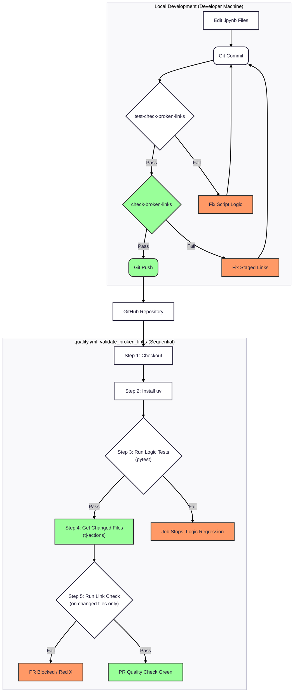

---
jupytext:
  text_representation:
    extension: .md
    format_name: myst
    format_version: 0.13
    jupytext_version: 1.18.1
kernelspec:
  name: bash
  display_name: Bash
  language: bash
---

# Instruction on check_broken_links.py script

+++

---

Owner: Vadim Rudakov, lefthand67@gmail.com  
Version: 0.3.0  
Birth: 2026-01-07  
Last Modified: 2026-01-09

---

+++

## **1. Architectural Overview: The SVA Principle**

+++

This [script](/tools/scripts/check_broken_links.py) performs fast validation of relative file links within a directory and its subdirectories. While optimized for Jupyter Notebooks (`.ipynb`), it can scan any Markdown-style links. 

This tool is designed to serve as a high-quality diagnostic step in CI/CD, providing clear, parsable feedback to automate documentation maintenance.

It adheres to the **Smallest Viable Architecture (SVA)** principle.

:::{hint} **SVA = right tool for the job**
SVA isn’t about minimal *code* — it’s about **minimal *cognitive and operational overhead***.

* **Zero Dependencies**: Uses only the Python standard library (`pathlib`, `re`, `sys`, `argparse`, `tempfile`), ensuring it runs on any system with Python installed.
* **Idempotency**: Operates on a "Check vs. Fix" logic—validating state without modifying existing files.
* **High Portability**: Designed for local-only validation of relative filesystem links, making it ideal for air-gapped or high-security environments.
:::

+++

### Key Architectural Improvements in v0.3.0

+++

* **Explicit Interface**: Transitioned from positional to named arguments (`--paths`) to eliminate ambiguity in CI/CD pipelines.
* * **Injectable Argument Parsing**: The `LinkCheckerCLI.run()` method now accepts an optional `argv` list, allowing for direct integration testing without global state manipulation (`monkeypatch`).

+++

## **2. Validation Layers**

+++

### Layer 1: Local Pre-commit Hook (Delta Validation)

+++

The first line of defense runs automatically during the `git commit` process to prevent broken links from entering the history.

* **Scope**: Validates only the `.md` files currently staged for commit.
    - Every `.ipynb` file has its pair, but not every `.md` file has its pair, but we need to be sure all the doc files in the repo have healthy links.
    - If there is a `md - ipynb` pair, the link should point to its `.ipynb` pair because our `myst.yaml` config renders only `.ipynb` files for the website, thus `.md` links will cause files to download, not to open as the web page. 
* **Efficiency**: Fast execution ensures no significant delay in the developer's workflow.
* **Logic Tests**: Includes a meta-check (`test-check-broken-links`) that triggers whenever the script itself or its tests change, ensuring the tool's logic remains sound.

+++

### Layer 2: GitHub Action (Continuous Integration)

+++

The CI pipeline in `quality.yml` is optimized to validate only modified files in Pull Requests, preventing the accumulation of technical debt.

* **Differential Checking**: Uses `tj-actions/changed-files` to scan only the notebooks modified in a specific PR, avoiding "blaming" developers for legacy technical debt.
* **Environment Parity**: Utilizes `uv` for high-performance dependency and environment management, mirroring the local development stack.
* **Failure Isolation**: Separates logic tests from link validation to pinpoint exactly where a failure occurs.

:::{tip} `quality.yml` Implementation:
```yaml

      - name: Get changed files
        id: changed-files
        uses: tj-actions/changed-files@v45
        with:
          # Only check .md files for broken links
          files: "**/*.md"
          # Ensures spaces in filenames are handled via a safe delimiter if needed
          safe_output: true

      - name: Run Link Check on PR Files Only
        if: steps.changed-files.outputs.any_changed == 'true'
        run: |
          uv run tools/scripts/check_broken_links.py --paths ${{ steps.changed-files.outputs.all_changed_files }} --verbose
```

*Note: `files: "**/*.md"` used to pass only `.md` files.*

*Note: Using the `--paths` flag is critical to handle multiple files provided by the `changed-files` action.*
:::

+++

### Layer 3: Manual Infrastructure Checks

+++

Used for deep repository audits or post-refactoring cleanup.

* **Full Scan**: Can be executed manually to scan the entire repository or specific directories.
* **Custom Patterns**: Supports custom file patterns (e.g., scanning `.md` or `.rst` files) and exclusion lists.

+++

### CI Workflow Diagram

+++



+++

## **3. Operational Guide**

+++

### Configuration Reference

+++

* **Primary Script**: `tools/scripts/check_broken_links.py`
* **Exclusion Logic**: Managed via `tools/scripts/paths.py` (e.g., ignoring `.venv`, `in_progress/`, and `.ipynb_checkpoints`).
* **Pre-commit Config**: `.pre-commit-config.yaml`
* **CI Config**: `.github/workflows/quality.yml`

+++

### Command Line Interface

+++

```bash
check_broken_links.py [paths] [--pattern PATTERN] [options]

```

| Argument | Description | Default |
| --- | --- | --- |
| `--paths` | One or more directories or specific file paths to scan. | `.` (Current Dir) |
| `--pattern` | Glob pattern for files to scan. | `*.ipynb` |
| `--exclude-dirs` | List of directory names to ignore. | `in_progress`, `pr`, `.venv` |
| `--exclude-files` | List of specific filenames to ignore. | `.aider.chat.history.ipynb` |
| `--verbose` | Shows detailed logs of skipped URLs and valid links. | `False` |

+++

### Manual Execution Commands

+++

Run these from the repository root using `uv` for consistent environment resolution:

| Task | Command |
| --- | --- |
| **Full Repo Audit** | `uv run tools/scripts/check_broken_links.py` |
| **Scan Specific Directories** | `uv run tools/scripts/check_broken_links.py --paths tools/docs/ architecture/` |
| **Scan Multiple Files** | `uv run tools/scripts/check_broken_links.py --paths file1.ipynb file2.ipynb` |
| **Markdown Audit** | `uv run tools/scripts/check_broken_links.py --pattern "*.md"` |

+++

## **4. Key Capabilities & Logic**

+++

* **Link Detection**: Identifies Markdown-style links: `[text](link)` and ``.
* **Git Root Awareness**: The script attempts to find the Git project root using `git rev-parse --show-toplevel`. This allows it to correctly resolve "root-absolute" links (e.g., `/docs/images/logo.png`) relative to the repository base.
* **Resolution Logic**:
    * **Relative Paths**: Resolved relative to the source file.
    * **Root-Relative Paths**: Resolved starting from the Git root directory.
* **Directory Links**: Validates that a directory exists and contains an index file (e.g., `README.ipynb`).
* **Skips**: Automatically ignores external URLs (`https://...`), email links (`mailto:`), and internal document fragments (`#anchor`).
* **Directory & File Exclusion:** Automatically skips common noise directories like `.venv` and `.ipynb_checkpoints`.

+++

## **5. Technical Architecture**

+++

The script is organized into specialized classes to maintain clarity:

* **`FileFinder`**: Traverses the filesystem to collect files while respecting exclusion rules.
* **`LinkExtractor`**: Uses regular expressions (`r"\[[^\]]*\]\(([^)]+)\)"`) to identify Markdown links within file content.
* **`LinkValidator`**: Resolves link paths relative to the source file or the Git root and verifies their existence.
* **`Reporter`**: Aggregates findings and generates a final report, exiting with status code `1` if any broken links are found.

+++

## **Examples**

```{code-cell}
cd ../../../
ls
```

1. Check all `*.md` files in the current directory and subdirectories:

```{code-cell}
check_broken_links.py
```

2. Check all `*.md` files recursively from the `tools/docs` directory:

```{code-cell}
check_broken_links.py tools/docs --pattern "*.md"
```

3. Use exclusions (default exclusion are overidden):

```{code-cell}
check_broken_links.py --exclude-dirs 4_orchestration in_porgress --exclude-files README.ipynb
```

4. Check the given file:

```{code-cell}
check_broken_links.py 0_intro/00_onboarding.ipynb
```

4. Use verbose mode:

    ```bash
    check_broken_links.py --verbose
    ```

+++

## **Test Suite**

+++

The script is accompanied by a comprehensive test suite (`test_check_broken_links.py`) that ensures reliability across different file structures and link types.

The test suite for `check_broken_links.py` is a robust validation layer designed to ensure the script accurately identifies broken local references while ignoring external URLs and specific environment-related directories. It uses **pytest** and focuses on unit testing core logic and end-to-end CLI behavior.

+++

### Core Components Tested

+++

* **Link Extraction:** Verifies that Markdown-style links `[text](link)` and image links `` are correctly identified, including edge cases like empty files or files with encoding issues.
* **Validation Logic:**
* **Relative & Absolute Paths:** Ensures links like `file.ipynb` and `/project/root/file.ipynb` resolve correctly.
* **Directory Indexing:** Validates that links to a directory (e.g., `docs/`) are considered valid only if an `index.ipynb` or `README.ipynb` exists within it.
* **Exclusions:** Confirms that external URLs (`https://...`) and internal fragments (`#section`) are safely skipped.

* **File Discovery:**
* Tests the recursive search functionality.
* Ensures excluded directories (like `.venv` or `in_progress`) and auto-save folders (like `.ipynb_checkpoints`) are ignored.

* **CLI & Environment:**
* **Git Integration:** Mocks Git environments to test how the script determines the project root.
* **Cross-Platform Behavior:** Tests case-sensitivity (critical for Linux environments).
* **Exit Codes:** Ensures the script returns `0` for success and `1` when broken links are found, making it CI/CD friendly.

+++

### Running the Tests

+++

To run the full suite, ensure you have `pytest` installed and execute the following in your terminal from the repo's root dir:

```bash
$ uv run pytest path/to/test_check_broken_links.py
```

```{code-cell}
env -u VIRTUAL_ENV uv run pytest tools/tests/test_check_broken_links.py -q
```
